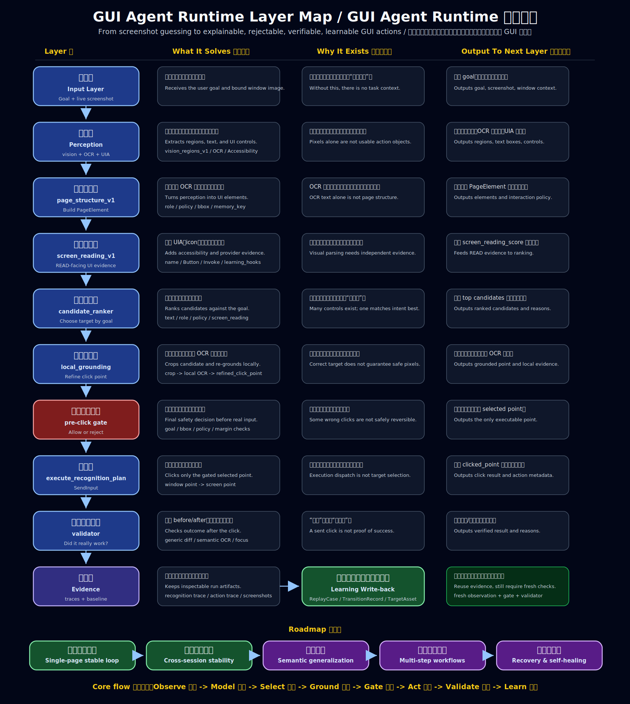

# agent-gui-runtime

A local Windows-only GUI automation runtime for AI agents.

`agent-gui-runtime` is **not** a full agent. It is an execution layer that exposes stable visual and action APIs over local HTTP so an upper-layer LLM/agent can interact with desktop applications in a more controlled way.

## Maintenance workflow

When code changes affect runtime behavior, API shape, architecture, or current progress, update the docs in the same work session.

Expected sync targets in this repo:

- `README.md`
- `PROJECT_SUMMARY.md`
- `CURRENT_STATE.md`
- `NEXT_STEPS.md`
- `PROJECT_STRUCTURE.md`
- `PROJECT_CONTEXT.md`
- `RULES.md`
- `KNOWLEDGE_BASE.md`
- `ACCURACY_EVALUATION_STANDARD.md`
- `RUNTIME_STATE_GRAPH.md`
- `RUNTIME_STATE_GRAPH.zh-CN.md`

When implementing code, follow the execution loop in `skills/code-implementation-loop/SKILL.md`: make the smallest useful change, run the narrowest meaningful verification, inspect results, fix failures, and rerun until the path is verified or a real blocker remains.

---

## Project positioning

This project is designed as a **GUI execution runtime** rather than a planning or reasoning system.

It is responsible for:

- binding to a target window/session
- capturing the bound window
- running vision operations such as template matching and OCR
- dispatching controlled GUI actions
- validating execution results
- returning structured JSON responses to an upper-layer agent

It is **not** responsible for:

- natural language task planning
- becoming a full desktop agent by itself
- unrestricted autonomous exploration of unknown software

It now also includes an early **software-specific state memory layer** for known apps/pages, but that layer is still subordinate to the runtime role: it helps the execution layer recognize known states, reuse known action targets, and record transitions. It is not a general reasoning or planning system.

In short:

> Agent -> local HTTP API -> GUI runtime -> target window

---

## Runtime model

This runtime now has **two complementary execution modes**.

### 1. Generic visual execution

The original runtime model:

- bind a window
- capture the window or ROI
- run OCR/template matching
- click or verify
- return structured results

This is still the compatibility baseline.

### 2. Software-specific state-aware execution (V1)

A new V1 layer has been added for known software/layouts.

This layer can:

- recognize whether the current screen matches a known `AppState`
- load known `ActionTarget` definitions for that state
- prefer historically successful click strategies
- record `TransitionRecord` and `ReplayCase` artifacts after execution
- preserve validator-based closed-loop verification
- fall back to existing `region_click` behavior if state-aware reuse is not enough

Important V1 scope boundaries:

- it does **not** do blind exploration in unknown states
- it does **not** try to autonomously learn every clickable target in arbitrary software
- it does **not** use LLM visual reasoning inside the runtime
- it is intentionally conservative: unknown recognition should return `unknown`, not a forced guess

---

## MVP / V1 scope

### Baseline runtime goals

1. bind to a target window
2. inspect runtime state
3. capture the bound window
4. find templates inside the bound window
5. run OCR in a region of interest
6. click based on template or text
7. wait for a named scene/state

### Current state-aware V1 goals

1. recognize a known app state for a known software/layout
2. load known action targets for that state
3. prefer history-backed click reuse
4. preserve validator closed loop
5. record state transition experience
6. keep generic `region_click` as fallback

For the current phase, the project is intentionally:

- Windows only
- local-only HTTP API
- vision-first
- single-session
- no frontend
- file-based persistence under `logs/` and `artifacts/`
- software-specific before software-general

---

## Current Progress Snapshot

Last updated: 2026-05-19.

The project has moved from raw full-page visual coordinates toward an inspectable staged recognition MVP plus a gated execution bridge:

`screenshot -> OCR anchors -> vision_regions_v1 + OCR -> page_structure_v1 -> screen_reading_v1 -> candidate_rank_v1 -> narrow_search_v1 -> pre_click_decision_v1`

Execution bridge:

`live bound-window capture -> recognition_plan_v1 -> pre_click_decision_v1 gate -> selected refined click point -> generic post-click verifier`

Architecture map:



Current verified status:

- Local InternVL3.5/Qwen-style vision endpoints are reachable through the OpenAI-compatible local provider.
- `POST /vision/recognition_plan` runs the full no-click recognition plan.
- `POST /vision/recognition_plan` now builds `ocr_anchors_v1` before the vision call and passes all OCR text boxes to the local provider as spatial anchors for icon/button/card grounding unless `metadata.ocr_anchors.max_anchors` explicitly limits them.
- OCR-anchor prompting is conservative: anchors are scaled into the provider inference coordinate space and compacted in the prompt as `id/t/b/c/s/g` fields, and if the anchored provider call fails the route retries once without anchors. The local multimodal server scripts use `-c 8192 --parallel 1` so full-page OCR anchors fit in one request.
- `vision_regions_v1` now preserves `anchor_relations` and `grounding_constraints` per region, so the model must connect OCR anchors to bbox edges, center alignment, size expectations, and exclusion zones before finalizing coordinates.
- `POST /vision/screen_reading` exposes a READ-facing UI layer with OCR-backed elements, visual-only UI candidates, module grouping, a connected Windows UIA scanner, a connected Microsoft Fluent System Icons catalog matcher, and reserved slots for future browser accessibility and learned-UI providers.
- The Windows UIA scanner has passed a live Edge/MouseTester smoke and now tolerates unavailable pywinauto pattern descriptors during control enumeration.
- `scripts/record_uia_smoke.py` can now record repeatable `uia_smoke_trace_v1` evidence and score expected UIA controls.
- `POST /vision/recognition_plan` now builds `screen_reading_v1` inside the planning path and passes its UIA/icon evidence into `candidate_rank_v1`.
- `POST /vision/render_recognition_plan_overlay` produces human-review overlays for candidate boxes, OCR-refined boxes, local OCR matches, and refined click points.
- `POST /action/execute_recognition_plan` executes only a `pre_click_decision_v1`-approved selected point from a live bound-window capture.
- `page_structure_v1` now guards against far/short OCR text binding so repeated fragments such as single-letter labels do not inflate element boxes.
- Candidate ranking preserves original element geometry, adds optional `refined_bbox` from goal-matching OCR text when that evidence is tighter, and uses `screen_reading_v1` accessible-name/provider evidence as a bounded ranking signal.
- Local grounding crops the refined candidate ROI, reruns OCR, and maps the matched text center back to full-screen coordinates.
- Pre-click verification rejects blocked, ad-like, goal-mismatched, locally mismatched, ambiguous-margin, or out-of-bounds candidates before any action execution is attached.

Latest real MouseTester evidence:

- Date: 2026-05-13.
- Golden baseline: `artifacts/golden-traces/mousetester-live-execute-20260513-182111-unicode-goal/`
- Recognition trace: `logs/traces/vision/20260513-182111-330997__recognition-plan__mousetesterweb.json`
- Action trace: `logs/traces/actions/20260513-182115-605129__execute-recognition-plan__mousetesterweb.json`
- Execute response: `logs/live-execute-unicode-goal/execute-response.json`
- Baseline contents: copied recognition/action traces, execute response, before/after screenshots, diff image, validation summary, and manual regression checklist.
- Bound window: MouseTester.cn in Microsoft Edge.
- Selected click point: `{x: 1434, y: 433}`
- Result: live click executed from the gated recognition plan, the internal recognition trace preserved goal `点击此处测试`, the top candidate carried UIA name/Invoke evidence, and validation passed through generic screenshot/focus evidence plus MouseTester target-area semantic OCR verification.

Latest live UIA evidence:

- Date: 2026-05-13.
- Bound window: MouseTester.cn in Microsoft Edge.
- Result: UIA smoke evaluation passed `1/1` cases; the scan returned `249` controls and `26` buttons, including browser Back/Refresh, address edit `https://www.mousetester.cn`, `RootWebArea`, and page controls such as `点击此处测试`.
- Trace: `logs/traces/evaluation/20260513-162852-157632__uia-smoke__mousetester.json`
- Report: `logs/evaluations/uia-smoke-eval-20260513-162852.json`

Previous no-click recognition evidence:

- Trace: `logs/traces/vision/20260509-191124-406879__recognition-plan__mousetesterweb.json`
- Overlay: `artifacts/review-overlays/20260509-191124-406879-recognition-plan-mousetesterweb__recognition-plan-overlay__20260509-191124-668878.png`
- Target goal: `点击此处测试`
- Top candidate: double-click test card with `text_similarity=0.9`
- `refined_bbox`: narrowed to the goal text line through `goal_text_ids_union:1`
- Local OCR matched text: `点击此处测试`
- Pre-click decision: allowed, no click executed
- Test suite: `77 passed`

Current limitation:

- The system has a gated execution route, a golden live MouseTester click baseline, MouseTester-specific target-area semantic verification, bounded retry for retry-safe verification failures, and a 5-case trace-based MouseTester smoke set. It is not a production autonomous click loop yet: it needs a broader evaluation set across more states and negative cases.

Primary next step:

- Build the Single-page stable loop for MouseTester: fixed website, fixed task, repeated stable execution across sessions.

Longer roadmap:

1. Single-page stable loop: fixed website, fixed task, stable execution. MouseTester is the current baseline and proves structured reasoning rather than random coordinate success. Next, successful validated runs should be written back as reusable learning records, not only traces.
2. Cross-session stability: prove the same task and its learned records still work across days, window sizes, DPI/display scaling, OCR fluctuation, and visual-model fluctuation.
3. Semantic generalization: map equivalent task intent across labels such as `点击此处测试`, `开始测速`, `Launch Test`, `Run Benchmark`, and `Start`.
4. Multi-step stateful workflows: handle login, navigation, popups, menus, forms, and result validation with durable state and planning.
5. Recovery and self-healing: re-observe, explain failure, re-plan, and retry safely when buttons are missing, pages stall, OCR fails, popups block targets, clicks have no effect, or validation fails.

---

## Environment

### Target platform

- **OS:** Windows only
- **Python:** 3.11
- **Runtime style:** local FastAPI service
- **Package/dependency management:** `uv`

### Recommended development environment

- Windows 10 / Windows 11
- Python 3.11 installed
- `uv` installed
- a desktop application window available for local testing

### Current working assumptions

- only one active bound window/session is needed for the MVP/V1
- all GUI operations should go through this runtime
- no ad-hoc scripts should bypass the runtime once APIs are in place
- software-specific memory is file-based and local-first in the current phase

---

## Tech stack

### Core framework

- **FastAPI** - local HTTP API service
- **Pydantic v2** - structured request/response models
- **Uvicorn** - ASGI server
- **loguru** - runtime logging

### Windows GUI automation

- **pywinauto** - window discovery and control primitives
- **pywin32** - lower-level Windows API integration

### Vision and image processing

- **mss** - screenshot capture
- **opencv-python** - template matching and image utilities
- **numpy** - image array operations
- **Pillow** - image helpers and conversions
- **RapidOCR + PaddleOCR fallback** - OCR backends for text recognition
- **paddlepaddle 3.2.2** - PaddleOCR runtime pinned to avoid known CPU inference issues in newer 3.3.x builds

### Tooling

- **uv** - virtual environment and dependency management

---

## High-level architecture

The runtime is now organized into these layers:

### 1. API layer
Exposes local HTTP endpoints that upper-layer agents can call.

### 2. Session / window binding layer
Tracks which window is currently bound and stores runtime session state.

### 3. Screenshot layer
Captures the currently bound window or ROI.

### 4. Vision layer
Performs template matching, OCR, page fingerprinting, ROI comparison, and normalized screenshot-region analysis for local learning.

### 5. Input / action layer
Dispatches GUI actions such as clicks based on structured requests.

### 6. Verification layer
Confirms whether an action produced the expected change.

### 7. State-aware memory layer (V1)
Stores known states, known action targets, validator profiles, replay cases, and transition history for specific software/layouts.

This separation is intentional so the runtime can stay small while still being extensible.

---

## Current project structure

```text
agent-gui-runtime/
|-- app/
|   |-- actions/
|   |   `-- known_action_runner.py
|   |-- api/
|   |   |-- action.py
|   |   |-- session.py
|   |   |-- state.py
|   |   `-- vision.py
|   |-- core/
|   |   |-- action_registry.py
|   |   |-- input_controller.py
|   |   |-- ocr_service.py
|   |   |-- replay_case_store.py
|   |   |-- screenshot.py
|   |   |-- transition_memory.py
|   |   |-- verifier.py
|   |   `-- window_manager.py
|   |-- models/
|   |   |-- request.py
|   |   `-- response.py
|   |-- page_structure/
|   |-- schemas/
|   |-- vision/
|   |-- vision_protocol/
|   `-- main.py
|-- configs/
|   `-- vision.json
|-- artifacts/
|   |-- recognition-crops/
|   |-- screenshots/
|   |-- verification/
|   `-- vision-regions/
|-- logs/
|   `-- traces/
|-- modules/
|   |-- click/
|   |-- ocr/
|   |-- region/
|   `-- validation/
|-- scripts/
|-- tests/
|-- AGENTS.md
|-- KNOWLEDGE_BASE.md
|-- PROJECT_CONTEXT.md
|-- PROJECT_STRUCTURE.md
|-- README.md
|-- RULES.md
|-- RUNTIME_STATE_GRAPH.md
|-- RUNTIME_STATE_GRAPH.zh-CN.md
`-- pyproject.toml
```

For a detailed folder-by-folder map, feature-to-file ownership, config locations, and persistence paths, see `PROJECT_STRUCTURE.md`.

For a stage-by-stage completion and accuracy scoring rubric, see `ACCURACY_EVALUATION_STANDARD.md`.

For the detailed runtime logic covering state graph growth, target patch persistence, field definitions, and runtime reuse, see:

- English: `RUNTIME_STATE_GRAPH.md`
- Chinese: `RUNTIME_STATE_GRAPH.zh-CN.md`

These two files should be kept in sync.


---

## API design principles

The runtime uses a unified JSON envelope for endpoint responses:

```json
{
  "success": true,
  "message": "...",
  "data": {},
  "error": null
}
```

Design principles:

- stable interfaces over raw scripts
- structured JSON over unstructured console output
- vision-first interaction model
- closed-loop verification over blind clicking
- conservative state recognition over forced guesses
- keep generic execution working while layering state-aware reuse on top

For action and vision routes, runtime evidence now follows this split:

- image artifacts such as screenshots, pre/post captures, verification diffs, and vision region crops go under `artifacts/`
- local recognition candidate crops go under `artifacts/recognition-crops/`
- human review overlays such as red region boxes and blue OCR boxes go under `artifacts/review-overlays/`
- text logs and structured JSON traces go under `logs/`

Most action and vision results now also include:

- `execution_path`
  - says whether a vision model was used
  - says whether `page_structure_v1` participated
  - says what coordinate source was used
- `trace_path`
  - points to a structured JSON trace file under `logs/traces/`

## Vision region contract

`POST /vision/analyze` now centers on a standard region contract named `vision_regions_v1`.

The goal of this contract is to let an upper-layer model return screen understanding in a format that can be matched by the local runtime and later reused by the local learning layer.

Key rules:

- the response includes the screenshot resolution in `image_size`
- every semantic region is defined by a diagonal:
  - top-left `(x1, y1)`
  - bottom-right `(x2, y2)`
- the runtime computes normalized diagonal coordinates so matching can survive resolution changes
- every region should include:
  - visible content description
  - OCR text and text lines
  - likely destination/page/panel transition after interaction
  - deterministic `layout_key`, `content_key`, and `match_key`

The prompt template that enforces this output format now lives in `app/vision/prompting.py`.

### Local multimodal backend

`app/vision/local_provider.py` can now call a local OpenAI-compatible multimodal chat endpoint instead of always returning stub data.

For large screenshots, the local provider now adds a stability pass before giving up:

- it scales the inference image down for the model when the page is large
- it remaps returned coordinates back to the original screenshot size
- if the first model response is truncated or malformed, it retries once or twice with a more compact prompt and fewer regions
- the winning attempt is recorded in `raw_response.attempts`, and scaling evidence is added to `notes`

The default local configuration in `configs/vision.json` targets:

```json
{
  "timeout_seconds": 180,
  "model_name": "InternVL3_5-8B-Q4_K_M.gguf",
  "endpoint": "http://127.0.0.1:1234/v1/chat/completions"
}
```

This matches the common OpenAI-compatible local server shape. The active default is now `InternVL3_5-8B-Q4_K_M.gguf` through the existing llama.cpp server path. The previous Qwen3.6 27B files were removed after proving too slow for this local interactive GUI-recognition loop; the older Qwen3-VL 8B files remain as rollback assets.

The checked local deployment uses:

- `models/internvl3_5-8b-gguf/InternVL3_5-8B-Q4_K_M.gguf`
- `models/internvl3_5-8b-gguf/mmproj-model-f16.gguf`
- rollback model: `models/qwen3-vl-8b-instruct-gguf/Qwen3VL-8B-Instruct-Q4_K_M.gguf`
- rollback mmproj: `models/qwen3-vl-8b-instruct-gguf/mmproj-Qwen3VL-8B-Instruct-Q8_0.gguf`
- `tools/llama.cpp-b8892-cuda13/llama-server.exe`

Start and stop helpers:

```powershell
.\scripts\serve_internvl3_5_server.ps1
.\scripts\stop_local_vision_server.ps1
```

`serve_internvl3_5_server.ps1` runs in the foreground when launched directly. Keep that terminal open while using `/vision/analyze`, or launch it in a hidden/background process and stop it with `stop_local_vision_server.ps1`.
The local provider also requests JSON-object output and caps model output at 2048 tokens for the same reason.
To test another OpenAI-compatible vision model or roll back to the old 8B model, pass explicit paths and keep `configs/vision.json` pointed at the same endpoint:

```powershell
.\scripts\serve_qwen3_vl_server.ps1 -ModelPath .\models\qwen3-vl-8b-instruct-gguf\Qwen3VL-8B-Instruct-Q4_K_M.gguf -MmprojPath .\models\qwen3-vl-8b-instruct-gguf\mmproj-Qwen3VL-8B-Instruct-Q8_0.gguf -ContextSize 8192
```

Latest local InternVL3.5 smoke status: the server loads and `/v1/models` reports `InternVL3_5-8B-Q4_K_M.gguf`. A synthetic Start-button smoke returned one boxed region in about 6 seconds, but the bbox was vertically shifted. A MouseTester mouse-ROI smoke returned the mouse illustration in about 22 seconds, but the bbox captured the right half of the mouse rather than the full icon; adding OCR anchors did not improve that ROI box. Treat InternVL3.5 8B as runnable but not yet coordinate-trusted for execution.

If no local vision server is running, `/vision/analyze` will fail with a connection error when this endpoint is configured. Set the endpoint back to `null` to use stub mode.

After `/vision/analyze` normalizes the response, the runtime now persists local region artifacts under `artifacts/vision-regions/`:

- one full annotated screenshot with region boxes
- one crop per region
- one annotated crop per region
- one `regions.json` manifest that maps `region_id`, `bbox`, `match_key`, and saved file paths

---

## Page structure contract

The long-term consumer of learned screenshot knowledge should not be the raw `regions` list directly.

Instead, the intended decision flow is:

1. capture a screenshot
2. analyze it into `vision_regions_v1`
3. run OCR on the same image
4. build a higher-level `page_structure_v1`
5. give that `page_structure` to the upper-layer agent
6. let the agent choose the next action based on page semantics rather than raw OCR or raw coordinates

The design intent is:

- `vision_regions_v1`
  - detailed learning layer
  - used for screenshot grounding, cropping, annotation, OCR text retention, and region matching
- `ocr_anchors_v1`
  - provider-prompt grounding hint layer
  - gives the vision model OCR text boxes and centers as relative-position anchors for nearby visual controls
- `page_structure_v1`
  - decision layer for the agent
  - used to describe executable elements, OCR-backed click points, verification hints, and memory keys

The runtime should therefore separate:

- learning output
  - image evidence
  - region coordinates
  - OCR text
  - `match_key`
  - saved crops / annotations
- agent-facing structure
  - `screen_summary`
  - `elements[]`
  - `texts[]`
  - `links[]`
  - `interaction_type`
  - `interaction_policy`
  - `verification_hints`
  - `memory_key`
  - `learning_summary`

In other words:

> collect evidence first, fuse it into executable elements, then let the agent decide

The agent should not be forced to infer the next step from raw region geometry alone.

### Screen reading contract

`POST /vision/screen_reading` returns `screen_reading_v1`, the current READ-facing contract. It sits above `page_structure_v1` and keeps the UI-specific layer separate from action execution.

The contract includes:

- `texts`: normalized OCR text boxes
- `ui.elements`: executable or potentially executable UI objects
- `ui.modules`: grouped screen areas inferred from semantic regions
- `ui.icon_candidates`: no-text or icon-like controls, including Microsoft Fluent catalog matches when label/context is strong enough, that require stronger grounding before execution
- `ui.provider_slots`: integration points for the connected Windows UIA scanner, browser accessibility, the connected Microsoft Fluent icon catalog, and learned UI memory
- `source_layers.windows_uia`: UIA scan status and control count for the current bound window, when available
- `ui.learning_hooks`: candidate records that can later be written into UI memory after manual review or verified actions
- `execution_relevance`: safe, risky, and unknown UI candidate ids

This route is intentionally conservative. OCR-backed/page-structure elements can be considered by later grounding, while visual-only icon candidates are exposed for review, Windows UIA matching, and Microsoft Fluent catalog matching instead of being treated as immediately safe click targets.

### Page structure shape

`POST /vision/page_structure` returns:

```json
{
  "contract_version": "page_structure_v1",
  "image_size": {"width": 420, "height": 220},
  "screen_summary": "Main menu with Start and Settings controls.",
  "state_guess": "home",
  "regions": [],
  "elements": [
    {
      "element_id": "element_start_12345678",
      "label": "Start",
      "role": "button",
      "interaction_type": "click",
      "description": "Start button that opens the main screen.",
      "text": "Start",
      "bbox": {"x": 77, "y": 68, "w": 24, "h": 13},
      "semantic_bbox": {"x": 80, "y": 120, "w": 140, "h": 100},
      "click_point": {"x": 89, "y": 74},
      "click_strategy": "ocr_text_center",
      "possible_destinations": ["main"],
      "verification_hints": {
        "expected_changes": ["state_change", "new_region", "content_change"],
        "target_scope": "page"
      },
      "interaction_policy": {
        "allowed": true,
        "zone_type": "test_module",
        "priority": "high",
        "ad_risk": 0.0,
        "reasons": ["test_like_keyword"]
      },
      "fusion_confidence": 0.93,
      "coordinate_confidence": "high",
      "memory_key": "role:button|label:start|text:start|layout:layout_start",
      "sources": ["qwen3_vl", "rapidocr_onnxruntime"],
      "source_region_ids": ["region_start"],
      "source_text_ids": ["text_1"],
      "evidence": {}
    }
  ],
  "texts": [],
  "links": [],
  "learning_summary": {
    "profile": "rule_based_interaction_learning_v1",
    "safe_element_ids": ["element_start_12345678"],
    "blocked_element_ids": [],
    "ad_like_element_ids": [],
    "allowed_element_count": 1,
    "blocked_element_count": 0
  },
  "raw_ocr": {},
  "raw_vision_regions": []
}
```

Important element fields:

- `interaction_type`: how to operate the element, such as `click` or `focus`
- `interaction_policy`: whether the element should currently be considered safe to click, what zone type it belongs to, and why
- `verification_hints`: expected post-action evidence for the validator
- `memory_key`: stable learning key for successful click strategy and validation outcomes
- `bbox`: execution bbox chosen by fusion, OCR-backed when possible
- `semantic_bbox`: original Qwen region bbox, kept for evidence and layout memory
- `click_point`: selected interaction coordinate
- `click_strategy`: why that coordinate was selected
- `fusion_confidence`: confidence in the semantic/text binding
- `coordinate_confidence`: confidence in the coordinate source
- `learning_summary`: page-level rule output that groups safe elements, blocked elements, and ad-like candidates

For test and inspection, `POST /vision/layer_trace` returns `vision_layer_trace_v1`.

It includes one ordered record per layer:

- `input_image`
- `vision_provider_raw`
- `vision_regions_v1`
- `ocr_result`
- `page_structure_v1`

Each record includes:

- `summary`: compact counters such as region count, OCR text count, and element count
- `validation`: missing fields, item-level field errors, warnings, and runtime errors
- `result`: the full returned payload for that layer

Use `/vision/layer_trace` when validating a new webpage screenshot before letting action code consume the result.

For local-model runs, `vision_provider_raw.result.raw_response.attempts` now shows whether the provider used scaled inference, whether a compact retry was needed, and whether coordinates were remapped back to the original image.

For bbox-precision experiments, `/vision/analyze`, `/vision/page_structure`, and `/vision/layer_trace` also accept `metadata.grid_overlay`.
Supported values:

- `true` to enable a default `100px` light grid
- an integer such as `120` to use that pixel spacing
- an object such as `{"enabled": true, "spacing": 100}`

When enabled, the local provider renders a light pixel grid and tick-label reference image for inference, using denser minor guide lines between major marks, records `grid_overlay_spacing=...` in `vision_provider_raw.result.notes`, and stores the saved reference image path under `vision_provider_raw.result.raw_response.attempts[*].grid_overlay.artifact_path`.

For OCR-assisted bbox correction experiments, the same routes also accept `metadata.ocr_region_refine`.
Supported values:

- `true` to enable the default OCR-anchor refinement pass
- an object such as `{"enabled": true, "min_text_score": 0.58, "padding": 16}`

When enabled, the runtime keeps the original model regions intact, adds an OCR-assisted refinement pass, and records `ocr_region_refine=...` in the refined notes.
`/vision/layer_trace` also adds an extra `vision_regions_refined_v1` layer so raw model boxes and OCR-adjusted boxes can be compared side by side.

To visually audit a saved trace, call `POST /vision/render_review_overlay`.
It reads a `vision_layer_trace_v1` JSON file, redraws region boxes and OCR boxes on the original screenshot, and writes the review image under `artifacts/review-overlays/`.
Use `region_layer = "vision_provider_raw"` when checking the visual model's raw returned regions.
Use `region_layer = "vision_regions_refined_v1"` when checking the OCR-assisted experiment output.

To visually audit a staged recognition plan, call `POST /vision/render_recognition_plan_overlay`.
It reads a `recognition_plan_v1` trace, redraws ranked candidates, OCR-refined candidate boxes, pre-click allow/reject state, local OCR matches, and refined click points on the original screenshot.

Current status:

- `vision_regions_v1` is implemented
- region artifact persistence is implemented
- `page_structure_v1` is implemented as deterministic fusion over normalized Qwen regions and OCR boxes
- `page_structure_v1` uses stricter OCR binding guards for far/short text so repeated UI fragments such as single-letter labels do not inflate executable element boxes
- `page_structure_v1` now includes rule-based interaction learning that marks test modules, navigation controls, and ad-like action candidates

### Recommended recognition flow

For higher-accuracy GUI targeting, the preferred direction is no longer "one full screenshot -> one final coordinate".
The recommended flow is:

1. `parse`
   - turn one screenshot into structured regions, OCR text, and executable elements
   - current evidence sources: `vision_regions_v1`, `ocr_result`, `page_structure_v1`
2. `candidate`
   - score only the small set of elements that could satisfy the current task
   - use text match, zone trust, actionability, and ad-blocking rules
3. `narrow search`
   - crop the top candidates and run a second local analysis on the smaller ROI
   - prefer local re-grounding over trusting one full-screen bbox
4. `verify`
   - confirm before click that the chosen candidate is sufficiently ahead of alternatives
   - confirm after click that page state, OCR, focus, or URL changed as expected

This architecture is the preferred path for improving recognition accuracy because it reduces full-screen ambiguity instead of asking one model call to solve parsing, selection, and pixel-accurate grounding all at once.

The project design now treats this as the planned MVP direction:

- first build a no-click `recognition_plan`
- then rank `top-k` candidates
- then rerun local grounding on cropped ROIs
- only attach real click execution after verification is measurable

The first candidate-ranking contract is available internally as `candidate_rank_v1` under `app/recognition/`.
The no-click planning endpoint is now available as `POST /vision/recognition_plan`.
It returns `recognition_plan_v1` with `parse_result`, `candidate_result`, `narrow_search_result`, `pre_click_decision`, `verification_plan`, and `recommended_target`.
Before calling the vision provider, this endpoint can run OCR and attach `ocr_anchors_v1` to the provider prompt. The anchor payload includes all OCR text boxes by default, plus centers, confidence, and goal similarity, so the visual model can reason about nearby icons and surrounding controls by relative position. The prompt represents those anchors compactly as `id`, `t`, `b=[x,y,w,h]`, `c=[center_x,center_y]`, `s`, and `g` to keep full-page text coordinates affordable. If the provider rejects or fails the anchored prompt, the route falls back to the same request without anchors. Use `metadata.ocr_anchors.max_anchors` only when a smaller prompt is needed.
The provider prompt also requires each returned region to include `anchor_relations` and `grounding_constraints`. `anchor_relations` records the OCR anchors and geometry involved, while `grounding_constraints` explains the reference frame, text-anchor frame, relative frame position, text inclusion policy, bbox edge constraints, center alignment, size expectations, negative/exclusion constraints, and final bbox reason. This makes drift easier to debug because a wrong box now carries inspectable coordinate evidence instead of only raw coordinates.

The OCR-assisted grounding contract treats text boxes as boundary-line rulers:

- For visual icons or illustrations without text inside, the model must set `text_inclusion_policy` to `exclude_text`, use nearby OCR boxes only as edge/alignment/negative constraints, report the icon's approximate fraction and position inside the text-anchor frame, and keep the final bbox away from OCR text boxes.
- For controls where the visible target includes text, the model must set `text_inclusion_policy` to `include_referenced_text`, cite the OCR anchors, and return a bbox that includes those text boxes plus the visible control/icon pixels.

`POST /vision/recognition_plan` now evaluates these constraints after provider normalization. It writes `grounding_constraints.grounding_evaluation` with referenced anchor ids, included/excluded anchor ids, any policy violations, the anchor-frame bbox, and an `anchor_corrected_bbox` suggestion when referenced text should have been included but was missed.
Candidate ranking now preserves the original fused element bbox and may add `refined_bbox` when the element is tied to OCR `source_text_ids` and the OCR union produces a tighter box; when possible, refinement first uses the source OCR text that matches the current goal instead of unioning every line in the card. It also consumes `screen_reading_v1` evidence: UIA accessible names can improve goal text matching, and UIA/icon matches add `screen_reading_score` plus explicit candidate reasons. Blocked/ad-like interaction policy still wins, so screen-reading evidence cannot make a blocked target executable by itself.
The first local search contract is available as `narrow_search_v1`; it crops the candidate `refined_bbox` when available, otherwise the original element bbox, runs local OCR on each crop, and maps matching local text centers back to full-image coordinates.
The first pre-click verifier contract is available as `pre_click_decision_v1`; it rejects weak, blocked, ad-like, goal-mismatched, locally mismatched, or out-of-bounds candidates before any click is allowed, and uses `refined_bbox` for the bounds check when present.

See [PROJECT_STRUCTURE.md](./PROJECT_STRUCTURE.md) for the concrete MVP module plan and endpoint outline.

---

## Region click model

The current non-text click path is no longer purely OCR-anchor driven.

The runtime now supports a **region-anchored click** flow for known UI layouts:

1. locate a panel
2. resolve a target zone inside that panel
3. generate candidate points (grid / preferred memory-backed point)
4. dispatch click via `SendInput`
5. observe before/after state
6. evaluate strict / weak success
7. cache successful click point geometry
8. persist replay/debug case artifacts

This path remains the baseline execution primitive underneath the new state-aware V1 layer.

---

## State-aware memory model (V1)

The new V1 memory layer introduces five persisted object types.

### AppState
Represents a known screen/page/state for a specific app and window-size bucket.

### ActionTarget
Represents a known action target inside a known state.

### ValidatorProfile
Defines how a target should be verified, including target ROI, OCR ROI, and scoring rules.

### TransitionRecord
Stores a recorded transition such as:

> state A + action B -> state C

### ReplayCase
Stores replay/debug artifacts for a concrete execution attempt.

Persistence is currently file-based under `logs/`.

---

## Recognition strategy (current V1)

The current recognizer is intentionally conservative.

It uses a lightweight three-stage strategy:

1. `window_size_bucket` filtering
2. `thumbnail_hash` coarse matching
3. anchor patch hit scoring

If confidence is insufficient, the recognizer should return `unknown` rather than force a match.

This is deliberate: a false positive state match is often worse than no match.

---

## Validation strategy (current V1)

Validation is moving from large noisy OCR-only checks toward **local target validation**.

Current direction:

- separate `target_roi` from `ocr_roi`
- run OCR only on a smaller localized ROI when configured
- include ROI diff evidence
- compute `strict_score` in addition to `strict_success` / `weak_success`

The long-term goal is a more stable validator based on:

- target ROI
- localized OCR
- local diff
- structured success scoring

This is especially important for noisy numeric counters such as MouseTester.

---

## Current implementation status

### Working / verified in the current codebase

- FastAPI app imports successfully in the project `.venv`
- routers are registered
- `modules/` boundaries now exist for `ocr`, `click`, `region`, and `validation`
- pytest coverage now exists for OCR matching, click geometry, region geometry, validator logic, `click_text`, and state-hint persistence
- `/vision/ocr_region` is restored on top of a RapidOCR-first adapter with PaddleOCR fallback
- `/action/click_text` is restored with OCR matching, ROI-aware coordinate translation, and retry-based fallback
- `/action/click_mouse_tester_left_region` remains the main action entrypoint
- `/vision/analyze` now normalizes provider output into `vision_regions_v1` with diagonal coordinates and stable region match keys
- the local vision provider can call an OpenAI-compatible local multimodal endpoint for Qwen3-VL-style screenshot analysis
- `/vision/page_structure` fuses Qwen semantic regions with OCR text boxes into `page_structure_v1`
- `/vision/layer_trace` returns every layer's result and validation report for screenshot testing
- schema + storage layer objects can be written and read back
- state-aware action wiring exists for MouseTester

### State-aware components already added

- `AppState`
- `ActionTarget`
- `ValidatorProfile`
- `TransitionRecord`
- `ReplayCase`
- `state_memory`
- `action_registry`
- `transition_memory`
- `replay_case_store`
- `page_fingerprint`
- `state_recognizer`
- `known_action_runner`

### MouseTester integration status

The first state-aware action path has been wired into:

- `POST /action/click_mouse_tester_left_region`

Current behavior:

- ensure known MouseTester state/action/validator assets exist
- recognize state before action
- run known action using region click
- recognize state after action
- persist replay case and transition artifacts
- keep fallback strategy available

A second alternate action target has also been added for the same known state so the V1 system can try a fallback target profile rather than only a single hardcoded region.

### Not complete yet

The remaining high-value work is end-to-end runtime verification with a real bound target window:

1. bind real MouseTester window
2. execute both `click_text` and state-aware region-click against a live target
3. confirm automatic bootstrap of persisted state/action/validator files
4. confirm transition and replay-case persistence after real execution
5. continue strengthening validator stability
6. run `/vision/page_structure` against an actual bound-window screenshot and compare fused click points with live UI behavior

---

## Runtime endpoints

### Core runtime endpoints

- `POST /session/bind_window`
- `GET /session/windows`
- `GET /state`
- `POST /state/capture_window`
- `POST /vision/ocr_region`
- `POST /vision/analyze`
- `POST /vision/page_structure`
- `POST /vision/screen_reading`
- `POST /vision/recognition_plan`
- `POST /vision/layer_trace`
- `POST /vision/render_review_overlay`
- `POST /vision/render_recognition_plan_overlay`
- `POST /action/execute_recognition_plan`
- `POST /action/click_text`
- `POST /action/click_mouse_tester_left_region`
- `GET /health`

---

## Development roadmap

### Phase 1 - first real capability

1. real `bind_window`
2. real `get_state`
3. real `capture_window`

Milestone:

> Agent -> bind_window -> capture_window -> can see the target window

### Phase 2 - first closed loop

4. `ocr_region`
5. `click_text`

Milestone:

> Agent can locate text in a target window and perform a validated click

### Phase 3 - region-aware interaction

6. reusable `region_click`
7. point memory cache
8. replay/debug case persistence

Milestone:

> Agent can act on non-text UI targets using panel-relative geometry and closed-loop validation

### Phase 4 - software-specific state-aware V1

9. known `AppState` recognition
10. known `ActionTarget` reuse
11. `TransitionRecord` persistence
12. `ReplayCase` persistence
13. validator-profile-driven local verification
14. fallback from known target profile to compatible region-click behavior

Milestone:

> Agent can recognize a known software state, reuse learned action targets, remember transitions, and keep action verification in the loop

---

## How to run

### 1. Create venv and install dependencies

```bash
uv venv
uv sync
```

PaddleOCR stores its warmed model cache under the local `.paddlex/` directory by default, and Paddle's own runtime cache is redirected to `.paddle-home/` during OCR initialization. The first PaddleOCR run may download the detection and recognition models; later runs reuse the cached files.

For a quick dependency and OCR smoke check:

```powershell
$env:PYTHONPATH="."
uv run pytest
```

### 2. Start the server

```bash
uv run uvicorn app.main:app --host 127.0.0.1 --port 8000 --reload
```

For cleaner single-instance debugging, a non-`--reload` run is often preferable once the code path under test is known.

### 3. Open docs

- Swagger UI: <http://127.0.0.1:8000/docs>
- Health: <http://127.0.0.1:8000/health>

---

## Minimal state-aware test flow

A practical current test flow for MouseTester is:

1. open the target app/window
2. call `GET /session/windows`
3. bind the correct target with `POST /session/bind_window`
4. call `POST /vision/ocr_region` or `POST /action/click_text`
5. call `POST /action/click_mouse_tester_left_region`
6. inspect persisted artifacts under `logs/`

---

## Development notes

- Keep the runtime small and working.
- Do not over-engineer software-general learning before state-specific reuse works.
- Prefer verified vertical slices over speculative abstraction.
- Preserve compatibility with the existing screenshot/OCR/region-click execution model while layering software-specific state memory on top.
- Continue evolving this README together with the implementation.


