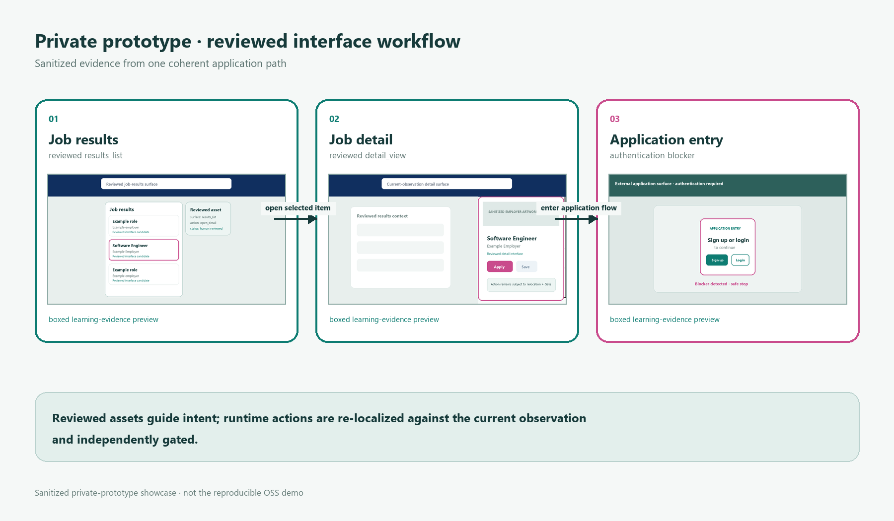
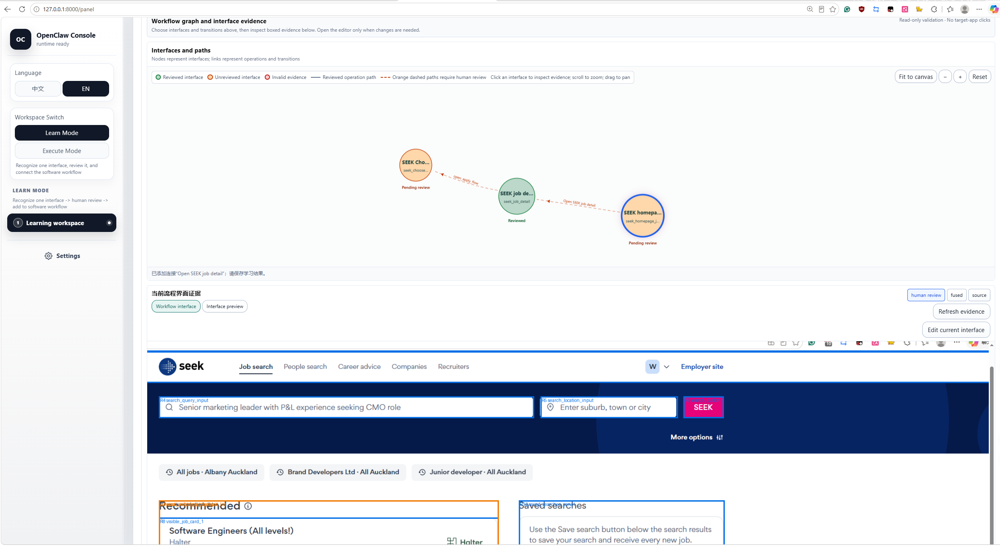
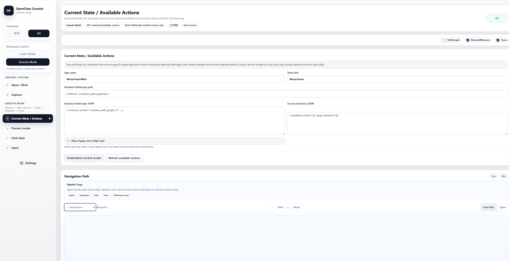
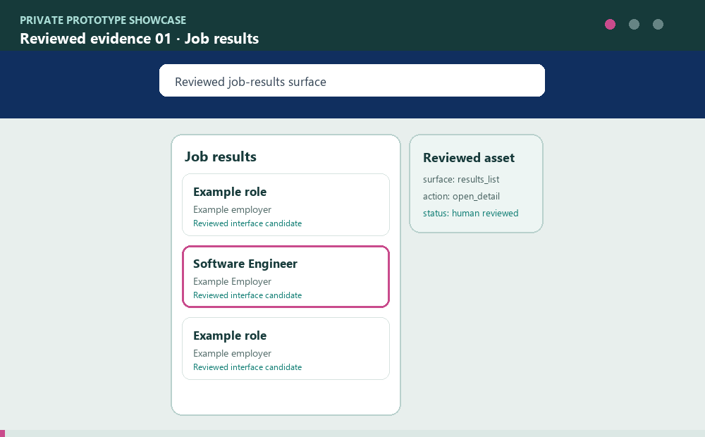
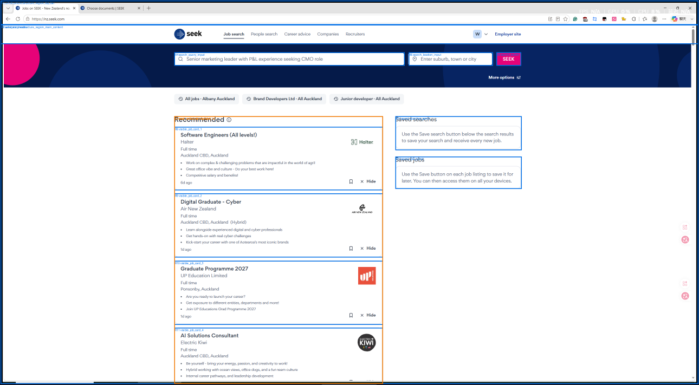
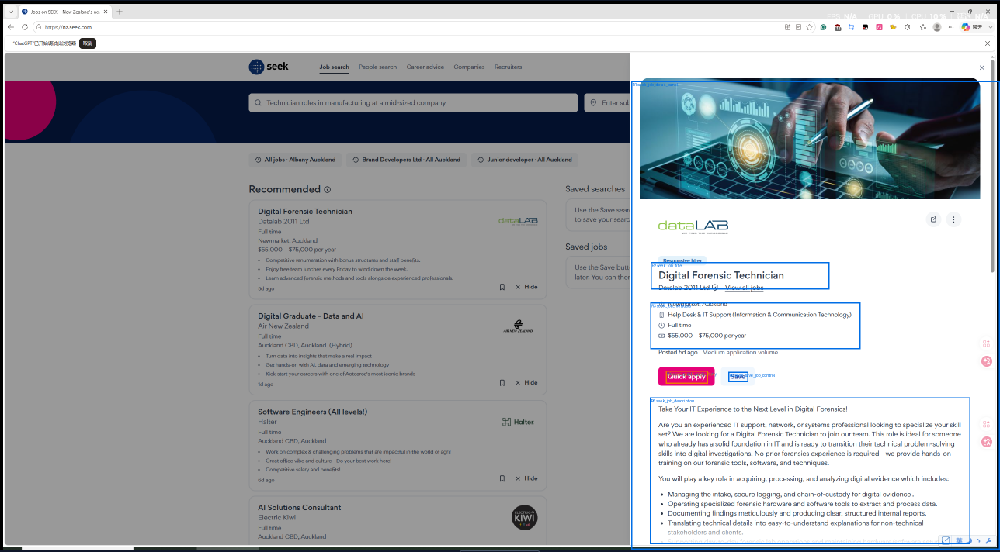
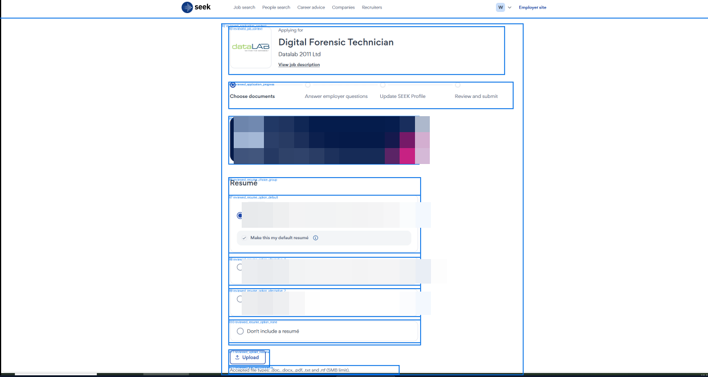
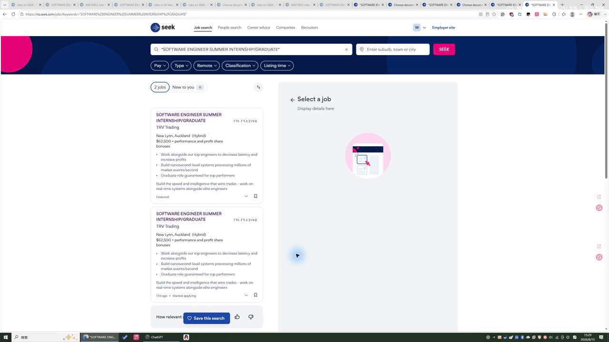

# agent-gui-runtime

**Version 0.3.0 · Windows GUI Agent Runtime · Portfolio v1 in progress**

[简体中文](README.zh-CN.md)

## A reliability runtime target between computer-use agents and Windows GUI actions

An in-progress Windows GUI runtime designed to turn uncertain exploration into human-reviewed operational knowledge, then re-locate, gate, execute, and verify semantic actions against the current interface.

**Perception is replaceable. Reviewed knowledge is durable.**

**Target invariant:** Runtime Authority must be non-bypassable. **The exact released workflow asset now has both deterministic callsite proof and one bounded controlled-live proof: a fresh Job Detail observation led to one Runtime-authorized Windows `open_apply_flow` dispatch, a fresh `Choose documents` stop-boundary observation, and a durable `SAFE_STOP/stop_boundary` receipt.**

> **Target authority model:** Providers propose evidence. Agents propose semantic intent. The runtime alone grants bounded execution authority.

[](docs/media/private-prototype-workflow.png)

*Sanitized workflow overview from the [earlier public showcase repository](https://github.com/Desolate-Jix/windows-gui-agent-runtime): reviewed interface knowledge guides intent, while the runtime must re-locate against the current observation and independently gate each action. This is a product-story illustration, not current Portfolio v1 live proof.*

### Product surfaces from the earlier public showcase

> **Historical showcase UI.** These panels make the Learn → Human Review → Runtime handoff visible. They show product and design lineage—not current Portfolio v1 live proof—and the current interface may differ.

<table>
  <tr>
    <td width="50%" align="center"><a href="docs/media/private-prototype-learn-mode.png"></a></td>
    <td width="50%" align="center"><a href="docs/media/private-prototype-execute-mode.png"></a></td>
  </tr>
  <tr>
    <td valign="top"><strong>Learn / Review</strong><br>A reviewer inspects boxed interface evidence, corrects semantic states, and connects a reusable workflow graph. The panel does not authorize execution.</td>
    <td valign="top"><strong>Execute / Runtime</strong><br>The intended current-state, available-action, Locate, Gate, and Trace surfaces. This image does not prove a current dispatch, observed semantic effect, or live replay.</td>
  </tr>
</table>



*Sanitized historical illustration: results → detail → application-entry blocker / Safe Stop. It is not a recorded Agent run and does not prove any click, form mutation, or submission.*

- **Today:** offline contract foundations; a human-reviewed and CAS-published Job Detail workflow with two reviewed regions and canonical save/reload confirmation; an exact deterministic release-callsite proof; and one bounded controlled-live Windows proof through server-owned confirmation, fresh Apply Entry verification, and durable `SAFE_STOP/stop_boundary`.
- **Implemented internally:** exact released asset → loopback `LocalAgentRuntimeCallsite` → production current-evidence adapter → strict Observation/Intent → current re-ground → Gate → one-time authority → exactly one deterministic fake dispatch → fresh C2 observation → semantic Safe Stop → durable terminal receipt.
- **Not yet:** general SEEK navigation, form filling, file upload, Continue/Next, submission, unattended reliability, production readiness, public/external Agent integration, external/remote Provider integration, or live external Agent adapters.

## Why this runtime exists

The common computer-use loop is short:

```text
screenshot → model → coordinate → click
```

It can fail when responses become stale, windows change, labels repeat, or dispatch is mistaken for verified effect. A stronger model alone creates neither durable knowledge nor authority.

This project adds the missing reliability layer:

```text
uncertain exploration → evidence → human review → durable semantic workflow
→ current-interface relocation → Gate → bounded execution → Verify / Safe Stop
```

This project does **not** race the perception releases of Qwen, OpenAI, Anthropic, OmniParser, or similar teams. New perception belongs behind the evidence boundary. Bundled screenshot, UIA, OCR, and recognition are a baseline/fallback—not the moat or proof of general visual understanding.

## How it differs

| Screenshot-to-click systems | Target runtime behavior |
| --- | --- |
| Model output can become a coordinate. | Provider output remains evidence through trusted adaptation and review. |
| Past geometry may be replayed. | Reviewed semantics are reused; geometry must be relocated on the current capture. |
| The model or Agent owns the action decision. | The Agent proposes semantic intent; Runtime Authority decides whether one bounded attempt is allowed. |
| A sent click may be reported as success. | The observed effect must be verified, otherwise the result is unverified or a safe stop. |
| Changing models can change everything. | Four contracts separate evidence, assets, Agent intent, and receipts. |

## Target lifecycle

Required end state—one narrow controlled-live slice now proves this loop, but broader or production use remains incomplete:

1. **Explore** an uncertain path.
2. **Capture evidence** with identity, coordinates, provenance, and freshness.
3. **Review** semantics, actions, transitions, effects, and risk.
   - The Panel now uses one interface-asset library with explicit reusable, pending-review, safe-stop, and stale-review states. **Correct and confirm** opens one full-image workbench over an explicitly declared clean or sanitized-clean capture. Review boxes are independent overlays, never pixels baked into that editable base. Clicking a box must resolve one exact workflow control, action candidate, and outgoing transition before the semantic fields appear or **Confirm and store** becomes available; unknown image provenance or ambiguous/unmapped boxes fail closed with a visible error. The final gesture validates every outgoing operation and records four independently revision-bound facts—the target control/region, exact action candidate, transition edge, and source node—before persistence. A standalone source can save evidence corrections only; it cannot approve a workflow. Compilation plus CAS publication remains a separate non-authorizing **Generate workflow version** action.
4. **Compile** an immutable semantic asset that grants no authority.
5. **Observe again** for an Agent intent.
6. **Relocate** on the current interface; old coordinates are hints only.
7. **Gate** one attempt using current evidence and danger checks.
8. **Execute** through the internal Desktop I/O backend seam beneath Runtime Authority. W3b composes the reviewed asset, passive bound-window capture, real UIA origin, pinned recognition, strict intent, current re-ground, Gate, reviewed-target-region pre-dispatch freshness, one-shot Windows backend, and durable receipt.
9. **Verify** or Safe Stop. Deterministic proof loads the exact released CAS asset and verifies fresh C2 with zero duplicate redispatch. One bounded controlled-live run additionally dispatched exactly one real Windows `open_apply_flow`, resolved fresh `Choose documents` evidence, and persisted `SAFE_STOP/stop_boundary`.

## Target authority architecture

The public architecture freezes four contracts:

1. **Perception Provider Contract** — native output becomes trusted canonical UEI evidence.
2. **Reviewed Workflow Asset Contract** — reviewed evidence becomes durable semantic states, transitions, verification policy, provenance, and revision/hash.
3. **Agent Runtime Contract** — Runtime exposes Observation/actions; Agent returns observation-bound semantic intent.
4. **Runtime Result & Verification Receipt Contract** — distinguishes Gate, dispatch, effect, next state, and Safe Stop.

The pinned `WorkflowRef` keeps the exact reviewed source `workflow_id` separate from the compiled `asset_id`. The compiler carries that registry/path/SHA-verified identity into immutable lineage, and Runtime/adapter/controller boundaries reject substitution instead of inferring an ID from an asset name. Older v2 objects without this lineage field fail closed and must be recompiled; no historical geometry gains authority.

Internal W3b/W4/W5 controller slices and the exact release-callsite composition are deterministic-test verified. Commit `b9309005` binds CAS asset `a9eb42d9439568770735f69ff109e6d93b86085507414d62ee49cfef33bb1d1b` through the loopback `LocalAgentRuntimeCallsite`, production `ExistingWindowsCurrentEvidenceAdapter`, default `LiveController`, Gate, claim, server-owned confirmation, and receipt path. Pre-approval dispatch is zero; reconstructed execution produces exactly one `DeterministicFakeBackend` dispatch, fresh C2 Apply Entry, durable `SAFE_STOP/stop_boundary`, and duplicate approval/Intent zero redispatch. The bounded controlled-live receipt below is a separate evidence layer, not a general reliability claim:

```text
Built-in fallback or trusted perception provider
                    │
        trusted adapter → Canonical UEI Evidence
                    │              (non-authorizing)
                    ▼
          Learning + Human Review
                    │
                    ▼
       Reviewed Workflow Asset + lineage
                    │              (non-authorizing)
                    ▼
Computer-Use Agent ◄── Observation / Receipt
        │
        └── semantic intent only ──► Runtime Authority
                                      │
                         current capture + relocation
                                      │
                               Gate + bounded attempt
                                      │
                       [internal Desktop I/O backend seam]
                                      │
                            Verify / Safe Stop / Receipt
```

Any Provider can target the architecture through a **trusted adapter** into Universal Evidence Interface v1 (UEI). Current proof covers local/static/Shadow paths, not a remote marketplace.

The current OmniParser path is a **review-only provider/shadow** prototype; it cannot authorize clicks.

<!-- UEI M2 conformance: 不是主叙事，也不是生产 Learn、GUI、replay 或 Execute 集成；不能成为点击授权。 -->

Future external Agents receive observations/actions and return observation-bound semantic intent. They cannot submit old coordinates, bypass Gate, or verify effects. No external/remote Provider or external Agent adapter is live-integrated today.

The Desktop I/O Backend SPI is an **internal implementation seam**, not a fifth public contract. W3b binds it only after passive bound-window capture, observed UIA origin, pinned recognition, current re-ground, Gate, and reviewed-target-region pre-dispatch freshness; the Windows backend is one-shot and durable duplicate receipts prevent re-dispatch. The deterministic fake backend remains available for tests. Replacement must not expand authority.

## Honest status

| Capability | Status | What the claim means |
| --- | --- | --- |
| UEI schemas, refs, registration, static projections | **Current — Contract Proof** | Canonical, provenance-preserving, non-authorizing evidence boundary. |
| Reviewed Workflow v2 compiler and persistence | **Current — Contract Proof** | Offline compile/store/reload; publication grants no authority. |
| Agent Observation / Intent / Receipt schemas and internal controller composition | **Current — deterministic release-callsite proof** | The loopback-only `/runtime/agent` callsite binds the exact released asset, projects server-owned active asset/window state, accepts only geometry-free intent IDs, and returns the durable Receipt contract. Deterministic external-boundary doubles and a fake output backend replace physical Windows/SEEK I/O. |
| Server-owned one-shot confirmation and safe resume | **Current — deterministic + one bounded live proof** | Immutable request/decision/resume/closed markers bind the exact claim, workflow revision/hashes, transition/action, capture/state evidence, HWND/PID, and fixed expiry. The local approval route accepts only a server confirmation ID and decision. The bounded live proof used this same route before exactly one dispatch. |
| Bounded SEEK browser navigation recording | **Partial** | Bounded historical live GUI recording; not Portfolio v1 Controlled Live Workflow Proof. It does not prove saved-workflow replay or semantic verification. |
| Built-in perception baseline/fallback | **Partial** | Screenshot, UIA, OCR, and recognition exist; unfamiliar-interface reliability is unproven. |
| Built-in and recorded OmniParser Shadow output entering one provider-neutral review model | **Current — Contract Proof** | A server-owned fixed Built-in OCR capture and recorded OmniParser-shaped worker success/failure are sealed into UEI and render through the same non-authorizing Review summary. This is not live OmniParser inference, provider-accuracy proof, or execution authorization. |
| Human review and workflow creation | **Current — Portfolio v1 release asset** | The visible Panel flow repaired Quick Apply, added a non-executable Save evidence box, and now rebinds to backend-canonical saved_review before accepting human_approved; real reload verified the Job Detail state. Active asset workflow_portfolio_v1_seek_apply_entry_fe297b5738f8c17790429e925ceab6f0 is registry revision 2, content SHA 8284e1729409aa0a4f6a751a1a03d85fc51db1c7d53d473bd012455a3fc391b7. The asset remains non-authorizing; Apply Entry remains the safe-stop boundary. |
| Current relocation, Gate, and unique dispatch authority (W4) | **Current — internal + one bounded live proof** | Only `LiveController` mints authority; `ExistingWindowsBackendAdapter` is the sole authority-scope consumer; guarded raw sinks fail closed. The scoped live run passed current target-region freshness and dispatched once; this does not prove general reliability or public integration. |
| Post-action semantic verification and verified receipt promotion (W5) | **Current — deterministic + one bounded live proof** | The active released asset reached one real `open_apply_flow` dispatch, fresh `Choose documents` resolution, verified effect/destination, and durable `SAFE_STOP/stop_boundary`; `attempt_count=1` and there was no form fill, upload, Continue/Next, submission, or redispatch. |
| Desktop I/O Backend SPI | **Partial** | Internal SPI, deterministic fake backend, and guarded one-shot Windows backend exist. It is not a public HTTP route, agent/demo callsite, or production-readiness claim. |
| Provider routing and remote providers | **Planned** | No automatic Provider fallback today. |
| Live external Computer-Use Agent adapters | **Planned** | None live-integrated today. |
| Production or unfamiliar-site reliability | **Not claimed** | No all-site or unattended claim. |

### Bounded controlled-live receipt

One scoped run started from an already-open SEEK Job Detail and used the same reviewed asset, loopback Agent Runtime contract, server-owned confirmation, current re-grounding, Gate, Windows backend, post-action observation, and durable receipt path:

- workflow: `portfolio_v1_seek_apply_entry`
- active asset SHA: `8284e1729409aa0a4f6a751a1a03d85fc51db1c7d53d473bd012455a3fc391b7`
- receipt: `receipt.38d529e464f94dbf858ec4d18de90c7c`
- receipt object SHA: `8d5f94cebbbb7b6de6b2a144390fbbb37fa6c018f51e82789af0f797266c485e`
- result: one `open_apply_flow` dispatch → fresh `Choose documents` state → `SAFE_STOP/stop_boundary`
- negative controls: zero form fill, typing, upload, Continue/Next, final submit, or redispatch

This proves one bounded runtime path only. It does **not** prove Provider accuracy, general SEEK navigation, unfamiliar-site reliability, unattended operation, application completion, or production readiness. PII-bearing application screenshots and raw fields are intentionally excluded from public evidence.

## Historical prototype evidence

> **Historical showcase evidence.** The screenshots below were published by the earlier public showcase repository and are included to show design lineage. They are **not current Portfolio v1 live proof**, and the current interface may differ. SEEK and all employer names and marks belong to their respective owners; no affiliation or endorsement is implied.

### SEEK reference states · Historical screenshots

<table>
  <tr>
    <td width="33%" align="center"><a href="docs/media/private-prototype-seek-results.png"></a></td>
    <td width="33%" align="center"><a href="docs/media/private-prototype-seek-job-detail.png"></a></td>
    <td width="33%" align="center"><a href="docs/media/private-prototype-seek-application.png"></a></td>
  </tr>
  <tr>
    <td align="center"><strong>Results</strong><br>Search controls, result regions, and job-card evidence.</td>
    <td align="center"><strong>Job Detail</strong><br>Detail drawer, metadata, description, and separate Quick apply entry.</td>
    <td align="center"><strong>Application Entry</strong><br>Personal content is redacted. This shows document-selection entry only—not form completion, Continue/Next, or submission.</td>
  </tr>
</table>

### SEEK reference recording · Partial historical visual corroboration



This 16-second historical recording covers SEEK home/list, job detail, and same-site Apply entry; application content is redacted, with no fill, typing, upload, Continue/Next, or submission. It is bounded visual corroboration—not Portfolio v1 Controlled Live Workflow Proof. Without a matching current runtime trace and receipt, it does **not** establish which component produced each click or prove restart/reload, relocation, Gate lineage, semantic verification, receipts, or autonomous replay.

SEEK is a **reference workflow**, not the product. The v1 target is **Job Detail → `open_apply_flow` → Apply Entry → Safe Stop**. `open_detail` is a separate target proof, not homepage traversal.

## Engineering highlights

- **Freshness and lineage:** candidates bind capture, viewport, source, geometry, and freshness.
- **Revision-bound review:** evidence or semantic changes revoke stale approval.
- **Non-authorizing assets:** revisions preserve knowledge without becoming permission.
- **Semantic actions:** `open_detail` and `open_apply_flow` are distinct from field mutation, continuation, and terminal submission.
- **Fail-closed ambiguity:** stale/wrong/unknown/ambiguous states are zero-click outcomes.
- **Durable verification receipts:** the internal controller persists dispatch, verification checkpoint, C2 evidence, and the exactly paired terminal receipt; duplicate/restart lookup cannot blindly redispatch. Recovery may passively recapture C2 after a crash before terminal persistence, but it never redispatches the action. This is deterministic internal evidence, not live proof.

## Run locally

Requirements: Windows 10/11, Python `>=3.11,<3.12`, and `uv`.

```powershell
git clone https://github.com/Desolate-Jix/agent-gui-runtime.git
cd agent-gui-runtime
uv sync
.\start_test_panel.bat
```

Or start the local API directly:

```powershell
uv run uvicorn app.main:app --host 127.0.0.1 --port 8000
```

The bounded local Agent Runtime callsite is exposed at `POST /runtime/agent/session/start`, `POST /runtime/agent/intent/submit`, and `POST /runtime/agent/confirmation/decide`. It is loopback-only and assumes one uvicorn worker. The server—not the client—selects the sole active reviewed asset, current bound window, workflow hashes, semantic action binding, evidence, and production backend. In addition to deterministic route proof, the repository now records the single bounded real Windows/SEEK Safe Stop receipt above; it must not be generalized beyond that scope.

Model weights and optional vision services are not distributed. Do not commit private evidence or credentials.

## Target state and roadmap

Portfolio v1 closes at one scoped controlled-live receipt plus its deterministic and documentation evidence; future capability expansion is a separate release:

> **Reviewed release asset → deterministic exact-asset proof → one controlled-live `open_apply_flow` → fresh Apply Entry `SAFE_STOP/stop_boundary` receipt → W6 close-out complete.**

W1 contract proof, W2 human review/release packaging, W3/W4/W5 deterministic proof, the scoped controlled-live receipt, and W6 evidence/documentation synchronization now exist within their stated evidence levels. No Provider accuracy, general SEEK navigation, form fill, Continue/Next, upload, final submit, unattended reliability, or production readiness is claimed.

Automatic provider selection, remote execution, raw-coordinate Agent authority, ATS traversal, form filling, upload, Continue/Next, and final submission are not Portfolio v1 capabilities.

## Safety and non-goals

- Learning drafts, provider evidence, workflow graphs, and published assets never authorize action.
- `final_submit`, `send`, `confirm`, `payment`, and `delete` remain prohibited boundaries for this portfolio slice.
- Form fields, upload, and Continue/Next produce a Safe Stop in the v1 reference workflow; no form mutation belongs to the proof.
- A plausible model response is not permission. Unknown, stale, ambiguous, wrong-window, or unverified states stop rather than guess.
- This is not an unattended job-application service and does not claim coverage of all Windows applications, websites, models, or providers.

## Repository map

- `app/learn/` — evidence contracts, recognition, learning tasks, and review projections.
- `app/agent/` — reviewed workflow assets, semantic Agent contracts, replay, and receipt logic.
- `app/operation/` — window binding, observation, grounding, and operation boundaries.
- `app/gate/` — candidate, window, dataflow, and dangerous-action checks.
- `app/web_panel/` — local learning, review, and replay workspace.
- `schemas/uei/v1/` — Universal Evidence Interface contracts.
- `tests/` — contract, regression, and safety-boundary checks.
- [`ARCHITECTURE.md`](ARCHITECTURE.md) — detailed boundaries and invariants.
- [`CHANGELOG.md`](CHANGELOG.md) — release-scoped changes and limitations.
- [`THIRD_PARTY_NOTICES.md`](THIRD_PARTY_NOTICES.md) — optional component and license boundaries.

<details>
<summary>Synthetic framework evidence</summary>


`demo.gif` proves only that the deterministic synthetic framework has click capability and can observe a synthetic result. It is **not** live GUI evidence and does not prove Agent behavior, model accuracy, human review, current relocation, or saved-workflow replay.

</details>

## License

[ISC](LICENSE)
