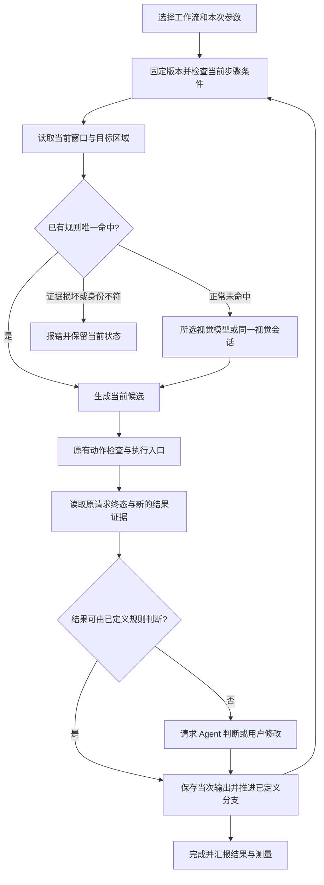

> **2026-10-02 当前顺序 / Current sequence:** 收益验证暂后置，按[主线计划](superpowers/plans/2026-10-01-learning-mainline-refocus.md)先核验窗口激活、连续运行、限定异常恢复和完整清理，再完成修改后复用与第三方迁移。完整稳定性尚未验收，不承诺每次成功；原50%/30%/95%、正式样本配额和P95标准不改。 / Prioritize activation and continuous recovery/cleanup, then edited reuse and transfer. Stability acceptance is still open; defer benefit work without changing formal thresholds.

## 2026-09-30 普通逐步结果与当前阻塞 / Per-step results and next gate

运行页新增只读“本次步骤结果”：逐步显示通过/未通过/不确定/等待核验、规则/Agent/运行时核验来源，以及有证据的时段与已记录模型调用。输入已派发不等于通过；缺少时钟和调用证据显示未知，已记录 0 次不等于完整模型调用为 0。切换运行或会话清除旧行，旧运行不借用新版步骤名称。原开发者信息保留，不需要阅读 JSON 才知道每步结果。 / The ordinary run page now exposes ledger verdicts, judgment sources and partial telemetry without equating dispatch with success or recorded counts with complete usage. Switching runs clears stale rows and pinned titles do not drift.

实现复用原 Trial history 与计量账本：`workflow_metrics.load_run_metrics` 返回按原 step_id 汇总的 `by_step`，`WorkflowRunHistory` 只读呈现，不新增执行器、输入权限或审核判定。新测试先 4 failed；运行页、恢复、实际 main 原队列、两轮当次输出、宿主报告及计量共 70 passed。首次截图第二行不完整，增大表格最小高度后只复测相关主窗口旅程 1 passed（与 70 项重叠，不相加）；`history-main-final.png` 已核对。均为全新合成内容的隔离/离屏验证，非真实输入和收益验收。 / Existing persistence supplies the view. Source checks and the inspected main-window capture pass; a focused layout rerun overlaps the 70 checks.

证据 / Evidence：`D:/AgentGUI-Projects/verification/AgentReviewAcceptance/20260930-run-history-01`。文档原件已备份，本轮没有打包、发布或修改版本。

当前主线核对：R1a/R1b 已有原始实机与清理证据；R1c 已冻结两轮 Record Desk 变化、截图预览、43 项源码预检和零输入清理，但明确操作确认仍未收到。只读子 Agent 核对和主 Agent 源码复核找到的普通 history 展示缺口已补齐；不把历史未勾选项直接推成未实现，也不把本轮局部检查当作完整验收。 / R1a/R1b evidence remains intact; R1c preflight has no physical inputs and awaits explicit confirmation. Read-only gap review identified the history view now implemented, not an independent physical acceptance result.

下一步必须在确认后加载当前源码的新宿主，重新截图定位，按已预览的 R-731 / R-284 两轮范围运行原保存程序。R2/R3 实机变化、异常恢复与清理，R4 配对收益，R5 基于实测优化，R6 第三方迁移和同候选独立验收仍开放。不能以更多源码微调、重复测试或旧记录回填替代这些出口；未知总调用/token 继续未知。真实输入依 AGENTS.md 的“确切预览和独立确认”要求等待用户答复。 / The next substantive step needs the pending exact-action confirmation. Physical continuity, paired benefits, measured optimization and transfer gates remain open; more source checks cannot substitute for them.

## 2026-09-30 改名保留审核 / Preserve review on rename

修复仅修改步骤显示名称时，当前步骤及依赖其输出的后续步骤被错误重置为待审核、已观测动作被标成人工修改的问题。保存仍生成不可变新版本；原目标规则、审核状态及动作来源保留。目标、填写来源、条件或验证规则等执行语义改变时，当前及相关下游步骤仍重新待审；明确撤销审核和原待审状态不会被改名覆盖。 / Cosmetic step renames now preserve review, provenance and locator bindings in a new immutable revision; semantic edits still invalidate affected steps, and explicit pending review stays pending.

故障契约 / Root contract：公共 `WorkflowProgramService._derive_provenance` 曾把 title 纳入执行语义变化集，并递归传播给下游；现仅从该变化集中排除显示标题，对所有工作流编辑入口统一生效。没有改变执行授权、动作校验或自动派发行为。 / Separate display metadata from executable semantics in the common save service, without changing action gates or dispatch.

验证 / Verification：新服务测试先 2 failed / 4 passed；补充普通 main 入口及来源检查后先 4 failed / 4 passed。修复后程序、目标依赖、目标编辑旅程、步骤面板及普通 main 保存重开共 **57 passed**。实际 Qt 控件完成改名、保存、关闭重开、旧版本读取且没有输入入队；这是全新合成内容的离屏验证，不能替代真实外部窗口验收。原失败记录和最终 JUnit：`D:/AgentGUI-Projects/verification/AgentReviewAcceptance/20260930-title-review-01`。 / Fresh offscreen controls verify persisted behavior and unchanged old revisions; first failures remain retained.

R1c 确切真实动作确认仍待回复；R2–R6 的实机变化、恢复、公平收益及第三方迁移未完成。未打包、发布或改版本。 / Physical variation, continuity, measured benefits and transfer remain open; no release occurred.

## 2026-09-30 审核等待计量 / Verification wait measurement

新运行现在单独记录从首次需要审核到原步骤结算或取消的等待时段，包括 Agent/人工审核和继续操作延迟；它不等于模型推理时间，也不增加模型调用数。重复查询、过早继续和同宿主重建 runner 不重置起点；跨进程重开标记不可计时，旧运行不补估算。总模型调用/token 仍未知。 / New runs measure verification handoff waits through reconciliation or cancellation, not inference or model calls. Repeated controls preserve the original clock; cross-process waits remain unmeasured and historical runs are not reconstructed.

相关运行时、计量、持久化、报告、取消及离屏面板检查 135 passed、1 skipped（当前环境无法创建目录符号链接）；新回归先 11 failed，补充损坏状态用例先 1 failed / 14 passed，修复后上述相关集合通过。原命令身份、重复计时拒绝、连续两步、取消、跨进程未知和真实单调时钟均覆盖。证据：`D:/AgentGUI-Projects/verification/AgentReviewAcceptance/20260930-verification-wait-01/focused-final.xml`。 / Focused verification: 135 passed, one directory-symlink capability skip; first failures remain recorded.

这是源码/隔离验证，未重新进行真实输入、打包或发布。R1b 原始实机证据保持不变；R1c 两轮真实变化测试的确切确认仍待回复，R2–R6 与三项收益仍未闭合。下一实机候选须加载本次源码并重新截图定位。 / This source-only change neither rewrites prior physical evidence nor closes physical variation, continuity, benefit or transfer gates; the next candidate must load the new source.

### R1c 变化预览与源码预检 / Variation preview and source preflight

后续两轮限定自建 Record Desk：相同已保存程序分别查询 R-731、R-284，使用同名记录、不同次序及 detail_above_rows / search_below_rows 布局和新详情。两场景已冻结并逐张核对实际截图；执行前仍须重新定位。只调用 select/capture，预览宿主和窗口已清理，用户确认待答复。首次预览因采集器只读白名单不含 select 而未派发；修正预览调用配置后复用原冻结数据成功，不重抽场景。 / Two exact variation previews are frozen and inspected without desktop input; approval is pending and preview resources are stopped. The initial select-admission failure remains recorded, with the same cases retained.

`r2-r3-source-preflight.xml`：动态目标、程序依赖、宿主变量绑定、普通上游输出入口、取消结算、运行页恢复和无名列表共 43 passed。仅源码/隔离及离屏检查，不能替代 R1c/R2/R3 实机通过。证据根目录 / Evidence root: `D:/AgentGUI-Projects/verification/AgentReviewAcceptance/20260930-learning-variation-02`。 / All 43 scoped checks pass; physical variation, recovery and benefit gates remain open.

## 2026-09-30 完整教学与换编号复用通过 / Full teaching and new-ID reuse passed

R1b 在同一全新 Record Desk 窗口和原 MCP 宿主内完成六步教学：查询 R-599 → 唯一行 → 打开详情 → 读取当次 Detail → 填写 → Verify value。普通工作台用真实控件修改上游输出绑定和动态行规则，保存新版本、关闭重开，再以 R-953 连续运行六步；新详情 `detail-73178a74a55a` 替换旧详情 `detail-a52e0dfef4be`，字段 UIA 核验及窗口 Matches current detail 均成功。 / R1b completes six-step teaching, ordinary editor changes, immutable save/reopen and same-session six-step reuse with a new record and fresh downstream detail.

五个复用输入动作全部命中当前学习规则：四个 memory_uia、一个 memory_visible_row；视觉定位交接 0。读取步骤由当前 Agent 查看原截图后回交本次输出，Find/Open/Verify 三个结果使用已声明的 Agent 判断，原运行通过工作台“继续原运行”按钮续接。不是完全无需 Agent 的规则链；未观测的总模型调用和 token 继续为未知，也没有公平对照的提速或准确率收益结论。 / All five input targets resolve from current learned rules without vision-grounding handoffs. One current-agent read and three declared agent result judgments remain; total calls/tokens and comparative benefit are unproven.

工作台驱动为实际 main 的离屏控件，目标窗口输入是真实 gated 输入。原始回执审计验证六个步骤、当次输出、当前候选和固定窗口身份、旧/新程序版本可加载、无输入重放及完整清理；宿主 exec 13540、工作台 exec 89403 退出 0，fixture 退出 0。最初先停止学习再审核使整理读到旧图，返回 needs_review；审核后通过原 learning_stop 提交新图后整理成功，没有重放输入。审计脚本首次误把 input_check 当作 steps 中一项；核对真实回执后改为检查独立 input_check 及值哈希，复核通过。 / Receipt and version audits plus cleanup pass. Preserve the pre-review synthesis response and initial audit-schema mistake separately; neither caused input replay.

证据 / Evidence: `D:/AgentGUI-Projects/verification/AgentReviewAcceptance/20260930-learning-full-task-02/live-task-01/full-task-audit.json`、原回执、workbench-saved-program.json、reuse-completed.json、截图与 cleanup.json。本轮沿用已通过 41 项检查的源码，四个文件哈希复核一致；未改产品源码、版本或发布包。 / This physical run uses the previously checked source, with four source hashes unchanged; no product code or release changes occurred.

R1b 主链已通过；R1c 的重新排序/状态变化集合、R2–R3 异常与编辑失效、R4 冻结配对计分、R5 按瓶颈优化、R6 外部应用迁移及同候选独立验收仍未完成。本轮两次完整流程授权已执行完毕，新增真实输入须给出新的确切预览；源码与离屏检查继续推进。 / R1c and R2–R6 remain open, including measured benefits and independent acceptance. The approved two flows are consumed; further physical inputs need their own exact preview while source/offscreen work can continue.

## 2026-09-30 同窗口学习与复用通过 / Same-window learning and reuse passed

R1a 第二轮在全新数据、同一 Record Desk 窗口和原宿主内完成：学习填写“学习样本甲”→ 当前 Agent 整理参数化草稿 → 普通工作台修改标题、保存并关闭重开 → 参数“复用样本乙”替换原字段 → UIA `field_equals` 成功 → 自建宿主及窗口清理。复用过程没有手工 MCP 恢复或输入重放。工作台使用实际 main 的离屏控件，目标窗口的两次输入是真实 gated 输入。 / The fresh second attempt completes learning, agent-assisted synthesis, normal workbench editing/save/reopen, parameterized reuse and native verification in one original window and host. The real main workbench is driven offscreen; target input is physical and uses the original gated runtime.

首次同窗口尝试保留为失败：乙值已写入，但字段内 1×15 像素的文本光标闪烁使两帧像素核验拒绝，工作台超时。公共观察器现只对有效截图中的字段像素不稳定最多完整重采三次，每次重新读值和前后截图，固定窗口与目标身份，保留失败证据；持续变化、身份漂移和损坏截图仍拒绝。没有重放输入或加入像素容差。 / The first attempt failed on a blinking caret after successful typing. The shared observer now allows at most three complete fresh read pairs for valid but unstable field pixels, preserving identity, strict pixel checks and prior failures; input is never replayed.

回归先为 4 failed / 1 passed，修复后相关 52 项通过。第二轮实机核验首对截图已稳定，没有触发重采；重采分支由真实 PNG 的隔离回归覆盖，不能写成现场重采已触发。审计脚本首次误认为学习事件 after 含 window_identity，随后按原动作回执中的原生身份逐步骤核对通过；这不是额外输入或产品运行失败。 / Regression evidence is 4 failing / 1 passing before and 52 passing after. The successful live pair needed no reacquisition; that branch is covered by PNG-based isolated regression. A read-only audit schema assumption was corrected without additional actions.

证据根目录 / Evidence root: `D:/AgentGUI-Projects/verification/AgentReviewAcceptance/20260930-learning-continuity-02/live-physical-learning-01`；`checkpoint-verification.json`、原始回执、工作台和目标截图及 cleanup.json。首次失败与 JUnit 位于相邻 `20260930-learning-continuity-01`。原 run_id：`trial-0991ae2ce6578d325ca645c60bfe8f8d811f063c11e313a6e9f0d7d61c80b33b`。

本轮只关闭 R1a 小检查点。复用命中 memory_uia，视觉定位交接为 0；输入组合 1408.857 ms，规则核验 200.5099 ms，分别为原回执阶段耗时，不能相加当完整任务或公平对照。模型调用总量/token 未知，三项收益尚未证明。R1b/R1c 的查询、动态行、当次详情数据流与修改验收，以及 R2–R6 连续变化、对照、优化和第三方迁移仍未完成。下一项是新数据的完整 Record Desk 流程；已有两次填写范围不扩展为查询、详情点击或新内容填写，须准备确切预览再独立确认。未打包、发布或改版本。 / R1a alone is closed. Zero reuse grounding handoffs and phase timings do not establish total model savings or speed/accuracy gains. R1b/R1c and R2–R6 remain open; the next full-flow input scope needs its own exact preview and confirmation. No release occurred.

# 学习模式：可复用工作流与收益目标 / Learning workflow product and success specification

## 2026-09-29 已授权两次填写与恢复边界 / Authorized fills and recovery limits

用户已明确确认原预览中的两次填写。原 `teach-fill` 成功写入“学习样本甲”，保留实际前后截图并生成带 `value` 参数、UIA 目标和 `field_equals` 规则的草稿；普通工作台已修改标题、保存、重开。重开测试窗口后，工作流原请求 `trial-exec-267b8898992184a9b30bb8b9685e6771` 成功写入“复用样本乙”。两次均只执行 focus/type/check_input，没有 Enter 或提交。第二次目标记忆命中，未产生视觉定位交接或外部识图调用；模型调用总量与 token 仍未知。 / Both approved fills occurred once. The second used the learned target and current parameter without a vision-grounding request; total model usage remains unknown.

第二次原运行 `trial-df4b4f2855053b039f06cb0d23c37de2a9a1d807cec90075a6265e930cec2526` 经原 wait_id 继续后，由本次 UIA 实值核验为 success/completed；只读重开工作台没有新增命令，所有自建宿主及测试窗口清理通过。 / The original run was reconciled using its original wait and a fresh UIA field value, without input replay; owned resources were cleaned.

**范围未闭合：** 首次查询脚本误用了 `learning_session_id`（事件查询应为 `learning_id`），导致原窗口提前清理；因此这是重开后的复用，第二次输入前新窗口字段为空，不能算“同一窗口由甲替换成乙”的连续通过。后续还需手动 MCP 恢复，R1a 普通用户无干预链与同窗口连续性仍待复验，R1b/R1c 及 R2–R6 未完成；没有提速或准确率提升结论。 / Reopened reuse is verified; same-window continuity, hands-off normal UI recovery and full benefit acceptance remain open.

本轮修复合法目标记忆被缺省视觉能力挡住、无 result 失败回执不能结算、记忆库短事务抢锁和同步恢复后旧错误提示残留。主 Agent 源码回归 157 passed，加宿主报告/客户端回归 55 passed（有重叠，不能相加为唯一用例数）。锁和报告修复没有热加载到已运行宿主；现场完成截图仍保留旧错误提示，不能把源码通过写成新候选实机通过。 / Source fixes pass focused checks; the existing live host did not hot-load the final lock/report changes, and its stale visible error is preserved as evidence.

证据 / Evidence: `D:/AgentReviewAcceptance/20260929-learning-benefit-01/live-physical-learning-02/physical-checkpoint-verification.json`、`workbench-completed.json`、`recovery-cleanup-02.json`；首次失败及各次工作台产物分别保留。未打包、推送、改版本或调用付费模型 API。 / First failures remain separate; no release or paid-model test occurred.

日期 / Date: 2026-09-29。状态 / Status: 成功标准已制定，源码实施中；完整闭环与真实收益尚未验收 / Success criteria defined; source implementation in progress, with end-to-end benefit acceptance pending.

## 1. 用户目标 / User goal

学习模式是 Agent 能从真实操作中生成、人工能审核和修改、下次能换数据复用的工作流。优先证明三个收益：减少模型使用、提高任务正确率、缩短完成时间。先跑通主流程和对照实验，暂不扩建安全策略、发布审批或大型界面重设计；原有真实动作校验和确认要求继续生效。

Learning produces workflows from real actions, supports human inspection and editing, and reuses them with new data. The priorities are measured reductions in model use and elapsed time, and improved task correctness. Existing action checks remain; new policy systems and extensive visual polish are deferred.

最终日常体验：用户说“学习这个任务”→ Agent 完成一次任务并生成草稿 → 用户能看懂、修改并保存 → 下次只提供变化参数 → 已知步骤由运行时连续推进 → 只有新情况或无法确定的判断交回 Agent → 返回真实结果、异常位置和本次收益。

Desired journey: learn a task, inspect/edit/save its draft, supply new inputs, run known steps through the existing runtime, involve the agent only for unresolved work, then report outcomes and measured reuse.

## 2. 当前基线 / Current baseline

权威学习源码：`<LEARNING_WORKTREE>`，`codex/dev-workflow-editor`，本轮读取 HEAD `c7a3099607d039fb3e377be1de7ff26151d1101c`，已有未提交修改必须保留。已发布执行模式 v0.1.0 在另一发布工作树；本计划不等于安装版更新。

The learning checkout contains existing uncommitted work that must be preserved. Execution v0.1.0 was published separately; this plan does not update the installed product.

| 能力 / Capability | 已有事实 / Existing evidence | 缺口 / Remaining gap |
| --- | --- | --- |
| 录制与内容库 / Recording and library | 终态回执、截图、独立界面、流程项目与版本 / Terminal receipts, captures, standalone interfaces, projects and revisions | 自动整理出足够可复用的目标和结果规则 / Compile usable locator and result rules |
| 编辑 / Editing | 步骤/结果规则、固定控件与多条件可见行、已有策略排序增删及保存重开已验 / Compound editing and persistence checked | 现场变化与完整运行页输入验收 / Live variations and physical run UI |
| 流程图 / Graph | 旧观测图和截图保留；步骤关系页新增同源程序图及节点定位编辑 / Existing evidence retained; program projection and node selection checked | 完整窗口、规则编辑及运行路径验收 / Whole-window editing and run acceptance |
| 局部试运行 / Trial | 固定版本、当次输出、幂等；原 MCP 编译三步只读链同会话两轮及宿主清理通过，普通运行与重开恢复已有源码/离屏证据 / Read-only reuse and source-level normal run/recovery checked | 真实宿主输入、变化及连续恢复 / Physical input, variations and continuous recovery |
| 目标定位 / Target resolution | 不可变引用、当前 UIA/模板解析及动态行可信绑定已接原路线 / Immutable recipes, current resolution and trusted dynamic bindings wired | 真实学习后点击、变化集及普通 UI 生成编辑闭环 / Physical reuse, variations and ordinary generation/editing |
| 收益 / Benefit | 历史源码测试及新原生表单的局部/三步证据 / Historical source tests and a fresh native three-step journey | 没有普通执行与学习复用的公平对照；不能宣称提速、省 token 或提高准确率 / No comparative benefit evidence |

历史验证详见 [2026-09-27 记录](verification/2026-09-27-workflow-editor.md)。其中 2112 项源码检查和独立 30 项是历史记录，本计划编写没有重跑。CodeGraph 未覆盖该工作树的新学习代码，本轮用精确源码读取确认断点。

The linked historical record is not a new test run. The current learning files are not covered by the available CodeGraph index; exact source inspection was used.

当前批次：原 Trial 新增启动时固定的 execution_strategy（learned 默认、steps_only）。steps_only 在生成原票据前禁用记忆定位，保留本次目标含义和当前变量，结果必须交回 Agent review；已保存程序不改写。采集器将 A 普通执行、B steps_only、C learned 与真实命令/回执核对，拒绝跨运行引用、策略冲突和 A/B 的目标记忆。 / Trial strategy is pinned before ticket creation; collection validates actual route commands and receipts.

检查：execution-strategy-integrated.xml 为 264 passed；集中源码 execution-strategy-source-suite.xml 为 2670 passed / 1 skipped。全新可见 Record Desk 经同一真实 MCP 完成 C 原生规则读取与 B 当前 Agent 看图后 review/continue；原 start 回读未覆盖后续完成状态，宿主和自建窗口清理通过。未派发物理输入。 / Focused and consolidated source checks pass; fresh real-MCP read-only strategy integration and cleanup are verified.

尚未达成：完整调用方模型计量、冷暖/学习开销及易混/负向/恢复集合、普通用户完整学习后连续点击填写、实机 A/B/C 配对和三项收益。总模型调用/token 仍为未知，empirical_acceptance=false；本轮只读任务不冒充查询、打开记录或下游填写成功。 / Complete caller telemetry, physical paired tasks and empirical benefits remain unverified. No release or version update.

最新分项见[完整计划](superpowers/plans/2026-09-29-learning-workflow-benefit.md)与[开发证据](verification/LEARNING_WORKFLOW_BENEFIT.md)。

## 3. 工作流保存什么 / What a workflow stores

每个步骤保存：动作含义、当前界面适用条件、目标查找规则、输入来源、成功判断、当次输出和下一步。原截图/回执作为证据保留。目标规则存不可变版本，步骤只引用确切版本；不把旧坐标当作下次的输入位置。

Each step stores intent, applicability, a versioned locator recipe, inputs, outcome checks, outputs and branches. Original evidence remains immutable. Coordinates are derived from the current observation.

内容分三类：

| 类型 / Kind | 示例 / Example | 运行规则 / Runtime rule |
| --- | --- | --- |
| 固定规则 / Fixed rule | 搜索框、结果列表容器、打开详情按钮 / Search field, results container, detail button | 保存身份/语义/外观规则，现场重新定位 / Save rules and locate afresh |
| 每次输入 / Run input | 查询词、客户编号、目标文件名 / Query, record ID, filename | 从本次参数绑定；不固定首轮值 / Bind this run's supplied value |
| 每次读取 / Fresh output | 最新状态、结果金额、详情文本 / Current status, amount, details | 当前观察重新获取并校验，携带运行/步骤/截图来源 / Read and validate fresh evidence with run/step/capture provenance |

首次成功只能证明这次动作完成，不能自动证明一个定位规则适用于所有变化。标记“已观察”“人工修改”“本次验证通过”分别展示。Agent 可建议变量、分支和成功条件；未观察的分支标为推测/待验证，不能伪造操作边。

A successful demonstration is not proof of generality. Observed evidence, editorial changes and run verification are distinct; inferred branches remain unverified.

## 4. 点击目标和动态内容 / Target selection and changing content

定位采用学习时保存的有序规则，最多尝试每种可用规则一次：当前 UIA 控件属性 → 当前图的稳定局部模板 → 当前可读文本与容器/行关系 → 已配置视觉来源。只有实际有证据的规则才进入列表，不强制每步遍历所有方法。OCR 是可选能力，不为使用 API/Agent 路线强制安装本地识图模型或 OCR 权重。

Use only evidence-backed locator strategies, in the stored order: current UIA properties, stable template regions, current text within a container/row, then the configured visual source. Optional OCR must not become a prerequisite for API/agent users.

每次定位先绑定当前窗口/进程、截图、尺寸与界面上下文；规则命中后统一产生当前候选，再交原动作 API。模板相似不等于界面身份一致；现有 `interface_identity_verified:false` 不能当作界面已验证。派发前重新检查目标区域与身份；区域变化则本次候选失效，不能沿用坐标。

Bind current window/process/capture/size/context before matching, produce a fresh candidate and use the existing action API. Template similarity alone does not verify interface identity. Revalidate immediately before input.

| 变化 / Change | 处理 / Handling |
| --- | --- |
| 查询词/编号变化 / New query or ID | 参数替换；动作和字段规则继续复用 / Bind new values to existing actions |
| 列表排序、新条目 / Reordered or inserted rows | 先定位当前容器，再按本次参数匹配唯一行，最后定位行内按钮；不记“第三行” / Resolve container → unique row → row-local action |
| 同名、缺项 / Duplicate or missing target | 增加已声明的属性约束；仍不唯一则暂停或请求模型判断，不猜第一项 / Apply declared constraints; unresolved ambiguity pauses |
| 动态数字/时间 / Changing numbers or timestamps | 作为读取输出；稳定模板避开这些区域 / Read as fresh output and exclude from stable visual templates |
| 小幅移动 / Small movement | 当前图内局部搜索，使用新点 / Search current pixels and produce a new point |
| 窗口缩放、布局重排、主题变化 / Scale, layout or theme change | 旧模板可能失效；使用已验证的语义规则或所选视觉路线重新定位，不拉伸旧坐标 / Re-resolve semantically or visually; do not scale stale coordinates |
| 弹窗、加载中 / Popup or loading | 有已定义状态分支则按条件处理；否则等待当前状态稳定或交给 Agent；未确认动作结果不重放 / Follow defined state handling or pause; never replay unknown input |
| 元素不在可见区域 / Target off screen | 第一版只执行已定义且有界的滚动步骤；未知分页/虚拟列表探索交给 Agent / Use explicit bounded scroll steps; delegate unknown pagination |

第一版动态列表支持“当前可见容器内，精确属性/文本匹配的唯一行”，当前实现中的文本指完整 UIA 树的 Text 属性；截图 OCR 或任意网页结构提取不是已交付能力。变量来自宿主核验的本次运行，调用者不能给定位器任意塞入一份旧输出；缺少目标身份时也不能用含糊的 goal 交给模型随便点击。“挑最合适的职位/商品”等开放判断继续由 Agent 完成，并计入模型使用；不宣称已编译成确定规则。大范围布局自适应、多尺度模板、循环/批量遍历不作为第一阶段前置条件。

The first dynamic-list scope is a unique visible row selected by explicit UIA properties/text. Trusted run bindings must supply the actual target identity even on visual handoff; arbitrary injected outputs or an underspecified goal are not acceptable. OCR/general web extraction are not delivered by this UIA implementation. Open-ended ranking remains agent work.

正常记忆未命中可转所选视觉来源，并记录原因；损坏资产、哈希不符、协议错误、模型异常、窗口漂移必须显式报错，不能用回退掩盖主路径故障。API/Agent/local 是用户选定的路线，不自动跨供应商或偷偷加载本地模型。Codex 委派复用同一个视觉 worker 会话，每张新图绑定新请求。

Expected misses may use the configured visual source with an explicit reason. Corruption, protocol errors and binding failures remain errors. No silent provider switching; Codex reuses its configured visual worker while renewing screenshot/request identity.

## 5. 运行时与 Agent 的分工 / Runtime and agent responsibilities

Agent 负责初次理解任务、生成/修正定义、开放式判断和新情况。运行时负责固定版本、参数传递、已定义条件、定位调度、原请求的终态回读和已定义分支。已知步骤不再要求主 Agent 每次回复“下一步”；需模型/人工输入时才返回明确待处理事项。

The agent handles initial planning and unresolved reasoning. The runtime advances a pinned definition, manages dataflow, routes localization and consumes original terminal receipts. Known steps require no per-step conversational planning.

成功条件使用同一标准，例如字段实际值相等、当前目标行详情 ID 一致、指定状态实际改变。按钮已点击、鼠标已派发、任意像素变化都不足以单独证明任务成功。证据不足时仍调用模型或暂停；这种代价也纳入收益统计。

Success checks verify the intended outcome, not mere input dispatch or arbitrary pixel changes. Additional judgment costs count toward the result.

## 6. 用户怎么审核和修改 / Human editing

第一版普通入口分工：用户在原 Agent 对话发起学习、结束及提出整理修正；同一 Agent 处理整理请求。工作台负责等待/需补充/可审核状态、原证据和草稿修改保存。“刷新最近学习”只读取状态，不会自动唤醒 Agent。未连接活跃 Agent 时提示回原对话继续；用户不传请求编号或 JSON。草稿纠错详情及重开已有离屏证据；断线恢复与这条完整普通用户链仍待验收。 / The current conversation handles learning and synthesis; the workbench reviews state and edits the result. Read-only refresh does not invoke an agent, and the complete correction/recovery journey remains an acceptance requirement.

初次整理后若是可修正的结构/注释错误，同一活跃 Agent 最多自动修正一轮；再次失败显示具体步骤/字段并等用户补充。来源损坏直接报错。所有回复、等待和学习成本都计量；用户明确要求继续时恢复原学习段，不重新录制或新建会话。 / Allow at most one automatic correction, then surface the precise gap. Preserve the original learning identity and measure every reply and wait.

默认步骤页显示“做什么、对哪个对象、值从哪里来、怎样算成功”；旁边可展开本轮证据。用户可更改字段/按钮目标、固定值与变量、目标行条件、成功规则和分支，保存新版本后可试跑一个步骤或从指定步骤继续。显示名变化不使定位失效；改变对象/动作含义则解除不适用的旧目标规则并使受影响验证待定。

The editor exposes intent, target, value source and success checks with evidence on demand. Semantic edits invalidate affected locator/verification bindings; title-only edits do not.

保留独立界面库、已有流程图、原始截图和旧版本。新增程序流程图由同一份步骤定义投影，不能用排序暗中补跳转。当前 uncertain 分支仍暂停，不新增“猜测继续”；缺上游输出时显示需要哪个值，并允许显式改为本次输入后另存版本。用户无需手填请求 ID、JSON 或截图路径。

Retain standalone interfaces, the existing graph and all original evidence. Program graphs derive from the same executable definition. Uncertain outcomes pause; missing outputs require explicit resolution. Normal users do not manage request IDs or JSON.

普通参数化已实现“改为每次输入”、已有输入/前序文本输出选择、对话框内类型与必填校验；删除、类型改变、重名或重排使引用不可用时明确保留，不能自动换值。实际 main 的草稿编辑、保存重开、真实参数对话框与原 start/run 队列已用全新合成证据验证；两轮不同读取值经原调度送入填写队列，缺值仍阻塞。此证据不等于真实宿主输入或模型收益验收，R1 的完整实机链仍未完成。 / Guided binding and typed dialogs are source-verified through the real main window and original queue; physical and empirical gates remain open.

完整验收例子：第一次学习“按编号查询记录→打开该记录→读取当前状态”，将示例编号标成输入 `record_id`。下次输入新编号、打乱列表并改变状态文本，流程仍打开正确记录，输出新状态。用户把“编号包含”改为“编号相等”后生成新规则版本，关闭重开仍保留修改；运行中的旧版本保持不变。原截图、规则说明、每步实测结果和调用统计都可从普通界面查看。

Acceptance example: learn lookup → open → read status, bind the sample ID to `record_id`, then reuse with a new ID, reordered rows and changed status. Editing the selection condition creates a new recipe/version that survives reopening without mutating an active run. Normal controls expose source evidence and measured results.

## 7. 成功指标 / Success criteria

以下数值是本计划建议的工程目标，不是已经测得的结果。先冻结场景和口径，再实现、测量；未达到就说明差距，不能调弱成功条件来获得好看数据。

These are proposed engineering targets, not measured claims. Freeze scenarios and definitions before comparison; do not weaken outcome checks to improve scores.

| 维度 / Dimension | 目标与口径 / Target and definition |
| --- | --- |
| 最小闭环 / Minimum loop | 全新任务学习一次、保存、换参数、重开、复用、读取新结果、完成清理 / Learn-save-change-input-reopen-reuse-read-current-result-cleanup |
| 固定目标定位 / Stable target | 已支持且命中的目标不调用视觉大模型，也不预加载本地视觉大模型；模型钩子断言与真实日志同时证明 / Zero visual-model calls or preparation on supported memory hits |
| 模型使用 / Model use | 稳定重复任务可完整观测的规划+定位+判断调用总数至少降低 50%；某项无法观测就单独报告，不能把局部数当总量 / At least 50% fewer fully observed total calls on stable tasks; missing telemetry remains unknown |
| 速度 / Speed | 稳定重复任务端到端中位耗时至少降低 30%；每类任务 P95 不高于基线 110%；全变化集也报告真实耗时 / At least 30% lower stable-task median and per-task P95 no worse than 110% of baseline |
| 正确率 / Correctness | 正向任务目标成功率至少 95%，且不低于普通执行；预先固定的易混目标变化集在基线有提升空间时，应有更高正确率、更少错误点击 / At least 95% supported-task success and no regression; improve predefined ambiguous-target cases where the baseline has room to improve |
| 证据约束 / Claim limit | 基线已 100% 时只能报持平，不能因此宣称“准确率提升”或三项收益全部达成；小样本点估计升高只能报本轮改善，需更充分配对证据才能称稳定提升 / A perfect baseline permits parity only, not a claim that all three benefit goals are met; small-sample improvement is not a general reliability claim |
| 易用性 / Usability | 从普通入口完成学习、修改、试跑和重开；无需开发者面板/JSON；流程图仍可访问 / Complete the journey through normal controls without developer JSON |
| 异常 / Recovery | 已知状态处理、不确定暂停、重连回读原回执、取消及收尾；不重复派发 / Handle defined changes and reconcile receipts without duplicate input |

模型使用须拆分规划/视觉定位/结果判断，记录 local/agent_current/agent_delegate/external_api 来源。精确 token 仅在提供方或调用方有实际 usage 时报告；未提供则为 null。OCR 与本地匹配耗时独列，不藏入“免费”。学习成本、首次冷启动、后续热运行、人工等待和未分类等待分别记录。

Track planning, grounding and verification separately, with actual backend identity. Report exact tokens only when supplied, and distinguish OCR/matching, learning, cold start, warm reuse, human wait and unclassified time.

对照使用同一应用/任务/输入/模型/结果标准，A=普通执行，B=只复用步骤（诊断子集），C=步骤+目标记忆+规则验证。A/C 至少三个任务类型各 20 对运行；每类型固定/参数变化/布局及列表变化分层，异常注入另计。准备和学习样本与最终测试样本分开；配对交换先后次序，保留首次失败与重跑。B 每类 5 对，解释节省来自少规划还是少识图。测量中不改定义，调整后新冻结版本重跑相关集合。

Use matched A/C runs and a smaller B ablation: three task families, at least 20 A/C pairs and five B comparison pairs per family. Separate learning and held-out data, counterbalance order, retain failures and freeze the tested revision.

采数前固定配对初态、允许的人工介入、超时计分及计时/调用边界。每个任务类型分别报告调用节省、耗时和成功率；另报相同 case/配额的稳定集汇总，P95 按类判断。每类 20 对仅支持本轮工程样本结论，不证明总体 95% 可靠性或稳定 P95；B 每类 5 对仅作机制对照。置信区间和样本限制随结果保留，跨软件的稳定收益需要额外独立样本。 / Freeze initial conditions and intervention policy; distinguish per-family and matched aggregate metrics, and do not promote the initial cohort into a population reliability claim.

三类任务固定为：①填写查询条件并验证字段/结果；②按唯一编号从当前可见列表定位记录并打开详情；③读取详情的当前状态，再传给后续受控表单。每类正向集 20 对分为固定布局 8 对、未见参数/当前值 6 对、相关位置/排序变化 6 对；相关变化不适用于某任务时，在采数前声明等价布局变化。重复 ID、缺失对象、遮挡弹窗和中断作为单独负向/恢复集报告，不混进正向成功率。具体种子、输入和超时在采集前写入冻结清单。 / Freeze three families: query and verify, uniquely select and open a row, and read current details into a downstream form. Each has 8 stable, 6 unseen-data and 6 relevant layout/order pairs; negative and recovery cases are scored separately. Pin seeds, inputs and timeouts before collection.

成功率按所有有效尝试计分；产品阻塞和未完成不能删掉。安全拒绝只在预设无合法目标的负向场景计正确行为，不能充当正向任务成功。耗时同时报告全部尝试（含超时）和双方均成功的配对样本；调用数包含失败、补救和等待期间的额外判断。用配对差值及置信区间描述不确定性，不挑最好的一轮。

All valid attempts count, including product blocks and failures. Rejection is correct only for predefined negative cases. Report all-attempt timing plus common-success pairs, and include recovery calls; use paired uncertainty estimates.

学习开销为 L、每次实际节省为 S 时，仅在 S>0 时报告盈亏平衡复用次数 `ceil(L/S)`；耗时与 token 各自计算。若 S<=0，明确当前没有摊平收益。外部 API 无合适供应商时，只验协议和流程；不付费选型，不用模拟供应商延迟证明提速/准确率。真实收益可用现有本地模型或现有 Agent 路线测量，并注明覆盖来源。

Report break-even reuse only when savings are positive. API protocol fixtures cannot establish model accuracy or speed; use an available real backend for that claim without requiring a paid API.

## 8. 交付边界 / Delivery boundaries

第一可用版本包括：完整录制到复用闭环、固定控件记忆、当次参数/输出、唯一可见动态行、有界连续运行、可编辑步骤和图、真实收益报告。未知布局由模型处理；不承诺任意软件任意变化都无模型完成。

The first useful release covers the measured end-to-end journey, stable controls, run-local dataflow, unique visible rows, bounded execution, editable steps/graphs and evidence-backed benefit reporting.

源码实现通过后才冻结候选，主 Agent 先做单项和同会话连续验收，再交独立 Agent 验收同候选。学习模式发布/版本号/覆盖安装另按用户指令处理。日常 Edge 配置、扩展、缓存和旧学习资产不用于验收、不清理；真实测试使用全新数据和自建应用，后续通用性测试用独立临时配置。

Validate source, then a frozen candidate, then independent acceptance in that order. Publication remains separate. Preserve everyday browser profiles and historical assets; use fresh isolated data and applications.

执行拆解见 [实施计划](superpowers/plans/2026-09-29-learning-workflow-benefit.md)。

本批实现范围：同一 Agent 的持久纠错轮次已接原 MCP，普通窗口区分“可自动纠错”和“等待你补充”。新原生只读内容已由实际当前 Agent 完成一次错误注入后的纠正，并经实际 main 离屏修改保存重开；完整物理学习/复用和收益仍按第7节验收。复合编辑支持已声明 UIA/visible_row 的条件和排序，不承诺模板或任意网页结构编辑。 / Current evidence covers bounded synthesis and compound editing, not all physical or benefit claims.
