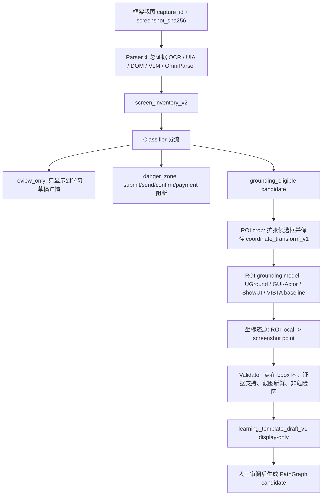

# 学习模式识别重构：Parser、候选模型和二阶段定位

最后更新：2026-07-04

## 目标边界

这份文档只描述 Learn Mode 前半段识别链路的重构方案。它不替换 Execute Mode，不授权点击，不放宽 Gate，也不证明 90% 识别目标已经达成。

当前目标是把旧的“整屏模型直接给框/点位”的学习流程拆成可审查的几层：

```text
框架截图 / OCR / UIA / DOM / 模型输出
-> 可插拔 Parser
-> screen_inventory_v2
-> Classifier
-> ROI crop
-> Grounding model
-> Validator
-> learning_template_draft_v1
-> Learning Draft Review / PathGraph candidate
```

## 可插拔 Parser 是什么

Parser 不是新的决策层，也不是点击授权层。Parser 只负责把不同来源的观察结果翻译成同一种库存格式：`screen_inventory_v2`。

更准确地说，Parser 在你这个项目里就是“证据翻译器 / adapter”：

```text
不同来源的原始证据
OCR 文本、UIA 控件、DOM 节点、OmniParser 框、VLM 语义区域、Learn Deep 校准点
        │
        ▼
统一成 screen_inventory_item_v2
label / role / bbox / source_evidence / interactable_evidence / risk_hint
```

它不负责拆任务，不负责决定下一步，也不负责点哪里。拆任务仍然是 Agent 的事；能不能进 ROI 定位由 Classifier / Validator 决定；能不能真实点击仍然由 Execute Mode 的 Operation + Gate 决定。

所以“可插拔”的意思不是多造一层复杂架构，而是让不同识别工具都接同一个插座：

- 今天可以接 OCR、UIA、Qwen3-VL、calibrated targets。
- 明天可以接 OmniParser、DOM/accessibility tree、GUI-Actor verifier。
- 后天换一个更好的 parser，只要它输出 `screen_inventory_item_v2`，后面的学习草稿 / PathGraph candidate 不需要重写。

Parser 输出最多表示“这里有一个候选证据”。它不能直接把一个框变成 PathGraph action，更不能直接授权点击。

例如：

- OCR parser：把 OCR 文本变成 readable item。
- UIA parser：把 Windows 控件变成 actionable / form_field item。
- DOM parser：未来把浏览器 DOM / accessibility tree 变成 item。
- OmniParser parser：未来把 UI 元素检测框和图标说明变成 item。
- VLM parser：把整屏理解模型输出的语义区域变成 semantic region item。
- Calibrated target parser：把 Learn Deep / locate 阶段已经校验过的 bbox、click_point 和 `coordinate_validation` 重新输入 inventory。
- Grounding output parser：把 UGround / GUI-Actor 的点位结果变成可验证 grounding evidence。

所有 parser 都必须输出类似结构：

```json
{
  "contract_version": "screen_inventory_item_v2",
  "item_id": "search_input_1",
  "label": "Search",
  "item_type": "form_field",
  "role": "input",
  "bbox": {"x": 900, "y": 150, "w": 220, "h": 45},
  "source_evidence": ["uia", "ocr"],
  "evidence_level": "uia_control",
  "interactable_evidence": {"uia_invokable": true},
  "click_candidate": false,
  "artifact_is_authorization": false
}
```

重点：

- Parser 可以说“屏幕上有什么”。
- Parser 不能说“现在可以点这里”。
- Parser 输出的 bbox 只是证据，不是可执行坐标。
- 可点击性必须由 Classifier、Grounding、Validator 和 Gate 后续共同证明。

## 为什么需要 Parser 层

旧学习模式的问题不是只有模型弱，而是证据类型混在一起：

- OCR-only 普通文字看起来像候选框。
- semantic-only 大区域和真实按钮重叠。
- 代码块、标题、卡片、浏览器工具栏混入定位层。
- 模型给出的语义区域过早被当成可点击目标。

Parser 层的价值是先把来源和证据等级写清楚。后续规则就能明确拒绝：

- `ocr_text_only` 普通文本。
- `semantic_region_only` 且没有交互证据的区域。
- 浏览器 chrome / 工具栏 / 地址栏。
- final submit / send / confirm / payment 危险动作。

换句话说，Parser 不是为了“相信模型”，而是为了知道每个候选到底来自哪里：

| 来源 | Parser 输出含义 | 默认处理 |
|---|---|---|
| OCR-only | 屏幕上有这些文字 | 可读，不可点 |
| VLM semantic-only | 模型认为这里是一个语义区域 | 只审阅，不进 grounding |
| UIA/DOM clickable | 系统或页面结构证明可交互 | 可进入候选分类 |
| OmniParser interactive | UI parser 认为是可交互元素 | 可进入候选分类，但仍需验证 |
| Calibrated target valid | Learn Deep 已校准过 bbox/point | 可作为强证据，但仍需当前截图复核 |
| danger vocabulary | submit/send/confirm/payment 等 | 进入 danger zone，不变普通 action |

## OmniParser-style 输入适配

OmniParser V2 / OmniParser-style parser 的常见输出可以先按以下结构接入：

```json
{
  "sources": {
    "omniparser": {
      "parsed_content_list": [
        {
          "type": "icon",
          "content": "Search",
          "bbox": [0.1, 0.2, 0.2, 0.25],
          "interactivity": true,
          "source": "box_yolo_content_yolo"
        }
      ]
    }
  }
}
```

适配规则：

- `bbox` 支持 `[x1, y1, x2, y2]`。如果数值在 0-1 之间，则按 `screen_size` 转为像素 bbox。
- `interactivity=true` 会记录为 `interactable_evidence.omniparser_interactable=true`。
- interactive icon/button 类元素可进入 `actionable` 候选，但仍然不是点击授权。
- `interactivity=false` 的 text / readonly 内容仍按 readable 或 layout 处理，默认不能进入 grounding。
- 所有 OmniParser-derived item 都保持 `artifact_is_authorization=false`。
- 当前 recorded coverage 已包含 search action、表单字段、readonly helper text 和 final-submit danger-zone：`omniparser_style_form_fields_output_v1.json` 会把 `Email`、`Mobile phone`、`Cover letter` 归类为 form field；`omniparser_style_final_submit_output_v1.json` 会把 `Submit application` 归为 danger zone。它们只是 recorded parser evidence，不是 fresh OmniParser actual call。

## Execute candidate recorded 输入适配

已有 Execute recognition-plan trace 中的 `candidate_result.candidates[*]` 可以作为 recorded parser evidence 回放到 Learn Recognition：

```json
{
  "sources": {
    "execute_candidate_result": {
      "source_trace_path": "logs/traces/vision/recognition-plan.json",
      "candidates": [
        {
          "candidate_id": "path_graph_home",
          "eligible": true,
          "element": {
            "label": "Home",
            "role": "nav text action",
            "bbox": {"x": 30, "y": 120, "w": 80, "h": 60}
          }
        }
      ]
    }
  }
}
```

适配规则：

- `eligible=true` 会记录为 `interactable_evidence.execute_candidate_ranked=true`，可作为进入 ROI grounding 的强交互证据。
- 输出仍是 `screen_inventory_item_v2`，并强制 `click_candidate=false`、`artifact_is_authorization=false`、`execute_binding_enabled=false`。
- 这只复用历史 trace 来扩充 recorded parser coverage，不代表当前页面新鲜，也不代表 Execute candidate 可以被学习模式直接执行。

## Calibrated target 输入适配

Learn Deep / locate 阶段已经会输出 `learn_all_targets.targets[*]`，其中包含 bbox、click_point 和 `coordinate_validation`。这些结果可以作为下一轮学习草稿的更强证据输入，但必须保留边界：

- 只有 `coordinate_validation.status=valid`、bbox 和 click_point 都在图内、且 click_point 落在 bbox 内的 target，才会被标记为 `interactable_evidence.calibrated_target_validated=true`。
- 未验证或验证失败的 target 只能进入 human review，不能因为来自历史学习结果就进入 grounding。
- 该 parser 输出仍是 evidence，不是点击授权；真实执行仍必须重新截图、重新验证窗口和 Gate。
- Manifest 中的 `recorded_parser_calibrated_targets_python_homepage` 是 recorded parser evidence，只证明 ingestion/validation，不证明模型稳定性。

## 候选模型参数和推荐位置

以下 profile 是 Learn Mode 专用候选。当前 `learn_mode_qwen3_vl_8b` 已指向本地 Qwen3-VL 8B GGUF 权重和 `13240` understanding endpoint，可用于整屏 semantic inventory / 草稿结构；`learn_mode_uground_2b` 已完成本地材料化和 no-action endpoint smoke，可作为 learn-only ROI grounding candidate；VISTA-4B baseline 也可作为 learn-only actual-call baseline。其他 UGround 7B / GUI-Actor / ShowUI / OmniParser 候选仍是 metadata-only，未下载、未启动，也没有替换 Execute Mode 默认模型。每个 profile 都必须带有实验优先级、输入合同、输出合同和坐标输出解释，方便后续面板或 benchmark 读取。

| Priority | Profile | 模型 | 参数量 | 当前状态 | 输入合同 | 输出/坐标合同 | 推荐位置 |
|---:|---|---|---:|---|---|---|---|
| 1 | `learn_mode_qwen3_vl_8b` | `Qwen/Qwen3-VL-8B-Instruct` | 约 8.8B | 本地 baseline，可 launch | full screen + OCR/UIA context | semantic bbox candidates, no click point | 整屏结构理解、页面摘要、草稿结构生成 |
| 2 | `learn_mode_omniparser_v2` | `microsoft/OmniParser-v2` | 工具型 parser | metadata-only | full screen screenshot | normalized/pixel bbox candidates via adapter | UI 元素框、图标、可交互区域候选 |
| 3 | `learn_mode_uground_2b` | `osunlp/UGround-V1-2B` | 2B | 本地 smoke verified，可 launch | ROI crop + target expression | ROI-local/normalized point, must replay transform | 快速 ROI 局部点位定位 |
| 4 | `learn_mode_uground_7b` | `osunlp/UGround-V1-7B` | 7B | metadata-only / not downloaded | ROI crop + target expression | ROI-local/normalized point, must replay transform | 高质量 ROI 局部点位定位 |
| 5 | `learn_mode_gui_actor_3b` | `microsoft/GUI-Actor-3B-Qwen2.5-VL` | 3B | metadata-only / not downloaded | ROI crop + target expression | action region / point, must pass validator | action-region 候选和验证 |
| 6 | `learn_mode_gui_actor_7b` | `microsoft/GUI-Actor-7B-Qwen2.5-VL` | 7B | metadata-only / not downloaded | ROI crop + target expression | action region / point, must pass validator | 更强 action-region 候选和验证 |
| 7 | `learn_mode_showui_2b` | `showlab/ShowUI` | 约 2B-4.2B，按实际权重核验 | metadata-only / not downloaded | ROI/full screen + target expression | normalized point/action output, must transform | 轻量 GUI action baseline |
| 8 | `learn_grounding_vista_4b_baseline` | `inclusionAI/VISTA-4B` | 4B | 本地 baseline，可 launch | ROI crop + target expression | ROI-local point, must replay transform | 当前对照 baseline，不作为最终推荐 |

推荐组合不是“一个模型全干”，而是分工：

```text
Qwen3-VL 8B：理解整屏和生成候选草稿
OmniParser：提供 UI 元素候选框
UGround 2B/7B：在 ROI 内做精确点位定位
GUI-Actor：作为 action-region verifier / 对照
ShowUI 2B：轻量 baseline
```

当前更现实的短期组合是：

```text
整屏理解：Qwen3-VL 8B
结构候选增强：OmniParser V2 或 UIA/DOM parser
精确点位：UGround 2B 先验证适配，UGround 7B 再挑战 SEEK 小控件 miss
对照/诊断：VISTA-4B baseline 和 GUI-Actor recorded/actual-per-config
```

不要把整屏模型当定位模型。Qwen3-VL 8B 在 SEEK header 上已经出现 bbox 与 reference control 无重叠的真实证据；它适合做页面理解和草稿结构，不适合单独输出最终可用 bbox。

执行模式当前使用的模型 profile 保留不变。Learn Mode 候选模型必须保持 `mode_scope=learn_only`，任何实验输出都不能直接进入 Execute 点击授权。

这些 profile 的坐标输出都只是候选证据。只有经过 ROI crop、`coordinate_transform_v1` 复盘、bbox 内点位检查、wrong-surface/danger-zone 检查后，才可以进入学习草稿审阅；即便进入草稿，也仍然是 display-only。

### 研究候选和 profile 边界

还有几类模型值得关注，但当前不应直接混入可运行 profile，避免把“研究候选”误当成“项目已接入能力”：

| 候选 | 参数量 | 可能用途 | 当前处理 |
|---|---:|---|---|
| Qwen2.5-VL-3B | 3B | 轻量整屏理解、bbox/region 生成对照 | 先作为研究候选，不替换当前 Qwen3-VL 8B observe/default |
| Qwen2.5-VL-7B | 7B | 整屏理解、文档/图表/页面结构理解对照 | 若后续下载，应新增 learn-only profile，并只进入 parser/review 层 |
| UI-TARS-1.5-7B | 7B | GUI action reasoning、目标控件描述、长流程对照 | 只适合作为学习模式 action-candidate 研究，不接管 Execute |
| GUI-Actor-2B/3B/7B | 2B/3B/7B | coordinate-free GUI grounding、action-region verifier | 优先用于 ROI 局部定位或 verifier，不直接输出授权点击 |
| GoClick 230M | 0.23B | 轻量 GUI grounding 研究候选 | 仅记录为未来轻量化方向，先不进当前 benchmark 主线 |

接入规则：

- 只有实际下载、启动、并写入 `configs/model_profiles/learn_mode_*.json` 的模型，才算项目 profile。
- 只有 `actual_model_call` 或合规 `recorded_output_per_config`，才可以讨论模型输出能力。
- 研究候选可以进入文档和实验计划，但不能出现在报告的能力分母里。
- Execute Mode 的现有 Qwen/VISTA profile 保持不变；学习模式模型只能通过 parser / grounding adapter / validator 输出 display-only 学习草稿。

### Qwen3-VL 8B actual parser smoke

`scripts/run_learn_recognition_actual_parser_smoke.py` 已经提供整屏 parser smoke：它调用 `observe_screen`，把模型返回的 `vision_regions_v1` 转成 `learn_observe_bundle_v1`、`screen_inventory_v2`、classification 和 display-only `learning_template_draft_v1`。

当前有效证据：

- 报告：`logs\benchmarks\learn_recognition_actual_parser_qwen8b_python\learn_actual_parser_smoke_report.json`
- replay artifact：`artifacts\benchmarks\learn_recognition_recorded_outputs\qwen8b_python_homepage_actual_parser_output_v1.json`
- replay benchmark：`logs\benchmarks\learn_recognition_actual_parser_replay\learn_recognition_benchmark_report.json`
- profile-aware rerun：`logs\benchmarks\learn_recognition_actual_parser_learn_qwen8b_profile\learn_actual_parser_smoke_report.json`，使用 `--model-profile learn_mode_qwen3_vl_8b`，记录 learn-only profile provenance，`actual_parser_call.attempted=1`、`vision_region_count=12`、`accepted_for_grounding_count=0`、`review_only_count=12`。

Qwen3-VL 8B 在 python.org 全窗口截图上输出了 12 个 semantic regions，例如 `Search`、`GO`、`Downloads`、`Documentation`。这些 region 当前会被记录成 `semantic_region_only`，因此只作为 screen inventory / review evidence，不进入 ROI grounding。这个结果说明整屏模型可以帮助“看见页面结构”，但还不能单独证明“这个点可以点”。Learning Draft Review 现在会把这类 `classification` 结果渲染成 display-only 的 `Screen Understanding Preview`，单独展示 review-only 区域、grounding candidates 和 danger zones；真正进入二阶段定位仍需要 OCR/UIA/OmniParser/calibrated-target 等交叉证据。

Reviewer 已确认这条边界必须更硬：Qwen3-VL 8B 的整屏输出目前只能称为 semantic inventory / review evidence，不能称为 clickable element recognition。当前安全解释应写成：

- `vision_region_count=12`
- `screen_inventory_count=12`
- `semantic_region_only=12`
- `accepted_for_grounding=0`
- `grounding_not_attempted_due_to_missing_interactable_evidence`

因此新的 eligibility gate 会把 `semantic_region_only` 标记为 `review_only=true`、`grounding_eligible=false`、`grounding_block_reason=semantic_region_only_without_interactable_evidence`。只有当同一候选同时获得 OCR/UIA/DOM/OmniParser/calibrated-target 等交互证据时，才允许进入 ROI crop 和二阶段定位。

### Cross-evidence eligibility

当前第一版 cross-evidence adapter 已接入 `parse_existing_evidence_to_inventory()`：

- Qwen / VLM 的 `semantic_region_only` 仍默认是 review-only。
- 如果 semantic region 与真实交互证据框高度重合，parser 会把该 semantic item 标记为 `evidence_level=cross_evidence_grounded`。
- 可支持放行的交互证据包括 UIA Invoke/Value、OmniParser interactive、calibrated target valid、Execute recorded candidate ranked。
- 放行后 item 会记录 `interactable_evidence.cross_evidence_overlap=true`、保留 `vision_claim=true`，并在 metadata 中写入 support item、support sources、IoU、coverage。
- 大容器套小按钮不会被放行：当前规则要求 IoU 或双向 coverage 足够，或者两者面积接近。

这一步的含义是：整屏模型仍负责“看懂页面”，交互证据负责“证明这个区域可能能操作”。两者重叠后才进入 grounding eligibility；仍然不是点击授权。

## 二阶段定位流程

二阶段定位的核心是：第一阶段只理解和提候选，第二阶段才在小区域内定位点位。

用一句话说：先用整屏 parser 找“可能是什么”，再用 ROI grounder 找“点在哪里”。

更具体的工程流程如下：



每一步都要有失败分类。失败不能被“补框”隐藏：

| 失败层 | 例子 | 正确处理 |
|---|---|---|
| Parser miss | Qwen3-VL bbox 与 SEEK search input 无重叠 | 记录 `model_bbox_not_overlapping_reference`，不进 PathGraph |
| Classifier 误放行 | OCR-only 文字进入 grounding | 记录 `non_actionable_leaked_to_grounding` |
| ROI crop 错 | 目标被裁掉或只剩一半 | 记录 `roi_target_coverage_failed` |
| Grounder miss | 点落在 bbox 外 | 记录 `model_point_outside_roi_candidate_bbox` |
| Transform 错 | ROI 点还原后不在原图目标 | 记录 `coordinate_transform_failed` |
| Safety hit | Submit/Send/Confirm | 记录 danger zone，不能变普通 action |

### 阶段 0：框架截图和绑定证据

由现有框架完成：

```text
绑定窗口
-> 聚焦窗口
-> 截整屏
-> 记录 capture_id / window_id / viewport_size / screenshot_sha256
```

如果窗口已经最大化，不应为了截图把窗口 restore 成普通大小。只有最小化窗口才需要 restore。

### 阶段 1：整屏理解和候选生成

输入：

- 整屏截图。
- OCR anchors。
- UIA / DOM / accessibility evidence。
- 可选 OmniParser 输出。
- 用户或 Agent 的学习目标。

输出：

- 页面状态：例如 `homepage`、`search_results`、`detail`、`form`、`blocker`。
- 页面区域：例如 `nav`、`search_area`、`content_list`、`detail_panel`、`form_body`。
- 候选动作：例如 search input、search button、download link。
- 非动作区域：例如正文、标题、代码块、卡片说明、装饰图。
- 危险区域：例如 Submit、Send、Complete、Confirm、Payment。

阶段 1 不输出可执行点击坐标。它最多输出候选 bbox 和语义标签。

阶段 1 的合格输出不是“框得越多越好”，而是每个候选都要说明证据等级：

```json
{
  "label": "Search",
  "bbox": {"x": 633, "y": 184, "w": 850, "h": 48},
  "source_evidence": ["vision", "uia", "ocr"],
  "evidence_level": "multi_source_grounded",
  "grounding_eligible": true,
  "why": "vision label overlaps UIA input and OCR nearby text"
}
```

如果只有：

```json
{
  "source_evidence": ["vision"],
  "evidence_level": "semantic_region_only"
}
```

则只能进入学习草稿的页面详情，不能进入 ROI grounding。

### Grounding 请求合同

当前公共层已经提供 `learn_grounding_request_v1`。每个进入二阶段定位的候选都会生成一个请求对象，包含：

- 目标 label / item_type / role / candidate bbox。
- ROI 图内的 `candidate_bbox_in_roi`，供 grounding 模型在裁剪图坐标系内选择点位。
- ROI crop 和 `coordinate_transform_v1`。
- 可接受的输出合同：`screen_point`、`roi_local_point`、`uground_0_999`、`normalized_0_1000`、`normalized_0_1`。
- 安全边界：`artifact_is_authorization=false`、`execute_binding_enabled=false`、`real_action_requires_gate=true`、`final_submit_forbidden=true`。

这意味着 UGround、GUI-Actor 或 ShowUI 的输出必须先被还原为可复盘的整屏点位，再进入 Validator。未知 coordinate space 不会被猜测还原。

当前受控 smoke 脚本是 `scripts/run_learn_recognition_actual_grounding_smoke.py`。它只对保存截图和 ROI 调用模型，不走 Execute，不点击。第一轮 VISTA actual call 因缺少 `candidate_bbox_in_roi` 偏出 Search button 右边界 1px；修复后报告 `logs/benchmarks/learn_recognition_actual_grounding_smoke_v3/learn_actual_grounding_smoke_report.json` 通过。这个结果只能说明单 ROI actual grounding smoke 路径可跑，不能说明 90% 或稳定性。

后续 calibrated target batch 暴露了两个真实问题：旧 VISTA server 会把任意 `[x,y]` 包装成 `coordinate_space=normalized_0_1000`；服务重启后，smoke prompt 里的固定数字示例又诱发模型复制 `[57,46]`。当前修正结果是：`scripts/model_servers/vista_openai_server.py` 会按 instruction 包装 `roi_local_point`，legacy 默认仍保持 `normalized_0_1000`；smoke prompt 移除了固定坐标示例，只保留 ROI-image candidate bbox 和 `[x,y]` 输出合同。最新 5-case fresh actual report 位于 `logs/benchmarks/learn_recognition_actual_grounding_smoke_batch_v2_prompt3/learn_actual_grounding_smoke_batch_report.json`，`actual_model_call.attempted=5`、`passed=5`、`failed=0`。这仍然只是同一保存截图上的小批量 ROI smoke，不是模型可靠性或 90% 结论。

UGround 2B/7B 的 recorded-per-model 合同样本已接入 benchmark。`recorded_grounding_uground_2b_search_point_valid` 和 `recorded_grounding_uground_7b_apply_now_point_valid` 分别加载 `learn_mode_uground_2b`、`learn_mode_uground_7b` 的 recorded output，使用 `coordinate_space=uground_0_999` 还原 ROI 中心点并通过 Validator。报告会输出 `recorded_model_profile_breakdown` 和每个 case 的 `recorded_model_profile`。最新报告为 `logs/benchmarks/learn_recognition_uground_recorded_profile_evidence/learn_recognition_benchmark_report.json`，`case_count=42`、`recorded_grounding_output=4`、`actual_grounding_call=0`。这证明的是 UGround 输出合同和坐标复盘链路，不是 fresh UGround actual call。

Actual grounding smoke 也已经支持 profile-aware readiness 预检。调用 `scripts/run_learn_recognition_actual_grounding_smoke.py --model-profile learn_mode_uground_2b` 时，报告会把 `learn_mode_uground_2b` 写入 `model_profile`，并在没有显式 `--model` 时把 `model_config.model_name` 解析为 `osunlp/UGround-V1-2B`，避免把 UGround profile run 误标成旧的 VISTA 默认模型。若 profile 仍是 metadata-only、未下载、不可 launch 或缺少 endpoint，runner 会在模型调用前输出 `learn_actual_grounding_model_profile_readiness_v1` blocker，并保持 `actual_model_call_in_this_run=false`，不进入 actual-call 分母。当前 UGround 2B SEEK header readiness 报告为 `logs/benchmarks/learn_recognition_uground_2b_profile_readiness_preflight/learn_actual_grounding_smoke_report.json`，`blocker.failure_category=model_profile_not_downloaded`。若 fixture 前置条件失败，同样不调用模型；若 endpoint 在 launchable profile 上不可用，则仍按 blocked smoke 处理。

当前已经可跑的 actual baseline 是 `learn_grounding_vista_4b_baseline`。它是 Learn Recognition 专用 wrapper，复用现有本地 VISTA-4B endpoint，但不替换 Execute Mode 的 `vista_4b_transformers` profile。第一次 profile-aware actual run 位于 `logs/benchmarks/learn_recognition_actual_grounding_vista_profile_baseline/learn_actual_grounding_smoke_batch_report.json`：同一张保存的 python.org 截图上 5 个 calibrated-target ROI case 全部通过，`actual_model_call.attempted=5`。后续 mixed baseline 位于 `logs/benchmarks/learn_recognition_actual_grounding_vista_mixed_baseline/learn_actual_grounding_smoke_batch_report.json`：9 个 case 中 6 个 fresh VISTA ROI call 通过，3 个 semantic-only / danger-zone / OCR-only 前置条件被阻断为 `fixture_precondition_failed`，并排除在 actual-call 分母外。这只说明二阶段定位 actual-call 链路和前置安全路由可跑，不能说明 90% 或跨页面可靠性。

SEEK saved header follow-up 位于 `logs/benchmarks/learn_recognition_actual_grounding_vista_seek_header_point_quality/learn_actual_grounding_smoke_batch_report.json`。它对同一张保存的 SEEK results header 截图跑 3 个 fresh VISTA ROI call，并新增 `learn_actual_grounding_point_quality_v1`：Search keyword field 通过；SEEK search button 左偏 10px、Pay filter 输出到 ROI 外，二者都归类为 `model_point_outside_roi_candidate_bbox` 并被 Validator 拒绝。这个结果很重要：它证明 ROI / coordinate transform / Gate 能保留真实模型 miss，而不是把失败硬修成通过。后续比较 UGround、GUI-Actor、ShowUI 或 recorded-per-config 输出时，应复用同一类 point_quality 字段。

同一 SEEK miss 已经加入两个 recorded-per-config 对照：`recorded_grounding_uground_7b_seek_search_button_point_valid` 和 `recorded_grounding_gui_actor_7b_seek_pay_filter_point_valid`。对应 report 是 `logs/benchmarks/learn_recognition_seek_recorded_per_config_counterfactual/learn_recognition_benchmark_report.json`，manifest 共 45 cases，`recorded_grounding_output=6`，`actual_grounding_call=0`。这一步只证明 UGround/GUI-Actor 风格点位输出能走同一 ROI transform 和 Validator；它不证明这些模型真的跑过，也不能作为 90% 或可靠性证据。

### 阶段 2：ROI 局部精定位

只对阶段 1 被接受的 `actionable` / `form_field` 候选运行：

```text
候选 bbox
-> 扩张为 ROI crop
-> 发送 ROI + 目标描述给 grounding 模型
-> 得到 ROI-local point / bbox
-> 使用 coordinate_transform_v1 还原成整屏坐标
```

这样可以避免全屏定位时模型把相邻文字、父容器、大卡片或工具栏误当目标。

ROI crop 建议固定成可复盘策略：

1. 输入 candidate bbox。
2. 按元素大小扩张，例如 `padding=max(24px, 0.35 * max(w,h))`。
3. clamp 到截图边界。
4. 保存 `roi_bbox`、`crop_size`、`scale_x/scale_y`。
5. 把 candidate bbox 转换成 `candidate_bbox_in_roi`。
6. Grounding prompt 只允许返回 ROI 图内坐标，不允许返回整屏坐标。
7. 输出经过 `coordinate_transform_v1` 还原。
8. Validator 验证还原点是否落在原 candidate bbox 或 expected bbox 内。

这一步要避免之前的错误：模型如果在 1280 宽 inference 图里输出 bbox，不能直接按 2x 猜回 2560 宽截图；必须记录模型输入图尺寸、截图原尺寸、letterbox/pad/resize 策略和 ROI transform。

### 阶段 3：Validator 验证

Validator 必须验证：

- actual point 是否落在 expected bbox 内。
- ROI-local point 是否能通过 `coordinate_transform_v1` 复盘到整屏坐标。
- screenshot / capture_id 是否新鲜。
- OCR/UIA/DOM/OmniParser evidence 是否支持该目标。
- 目标是否是 non-actionable / readonly / semantic-only。
- 目标是否落在 final submit / send / confirm / payment 危险区。

失败时进入 failure taxonomy，而不是补假坐标。

### 阶段 4：学习草稿

只有通过验证的内容进入 `learning_template_draft_v1`：

```text
states
regions
action_templates
blockers
verification_rules
safety flags
```

学习草稿仍然是 display-only：

- `artifact_is_authorization=false`
- `execute_binding_enabled=false`
- `real_action_requires_gate=true`
- `final_submit_forbidden=true`
- `needs_human_review`

## Overlay 显示建议

为了避免再次出现“满屏绿框看不懂”的 demo 问题，学习模式 overlay 应按证据层分色显示：

| 类型 | 建议颜色 | 含义 |
|---|---|---|
| 语义区域 | 淡蓝 | 页面结构区域，不可直接点 |
| OCR-only 文本 | 灰色，可开关 | 可读证据，不是点击候选 |
| 可交互候选 | 绿色 | 进入 ROI grounding 的候选 |
| 表单字段 | 青色 | 可填候选，但仍需 safe-fill policy |
| 危险区 | 红色 | submit/send/confirm/payment 等禁止自动点击 |
| 最终 grounding 点 | 蓝点 | 通过 validator 的候选点 |
| 被拒绝候选 | 橙色虚线 | 可用于诊断，不进入草稿动作 |

默认 demo 视图应隐藏 OCR-only 普通文本和被拒绝候选，只展示结构区域、可交互候选、危险区和最终点位。诊断模式再打开全部证据。

## 报告口径

报告不得输出一个总 accuracy。应继续分层：

- `parse_inventory`
- `actionable_classification`
- `form_field_classification`
- `non_actionable_leaked_to_grounding`
- `semantic_bbox_without_interactable_evidence`
- `semantic_only_rejection`
- `non_actionable_rejection`
- `danger_zone_rejection`
- `wrong_surface_rejection`
- `roi_target_coverage`
- `grounding_point`
- `coordinate_transform`
- `pathgraph_candidate_validation`

当全部样本仍是 fixture-only 时，必须显示：

```json
{
  "parser_reliability_status": "fixture_only_not_model_validated",
  "grounding_reliability_status": "fixture_only_not_model_validated"
}
```

`wrong_surface_rejection` 用来确认错误 surface / 浏览器 chrome / 弹窗遮挡层没有被送入 grounding；`roi_target_coverage` 用来确认进入二阶段定位的候选在 ROI 图里完整可见，并带有可复盘的 `coordinate_transform_v1`。只有 `recorded_parser_output`、`recorded_grounding_output`、`actual_parser_call` 或 `actual_grounding_call` 进入分母后，才可以讨论真实模型输出能力。

报告还应输出：

- `grounding_eligibility_breakdown`：统计 `grounding_eligible`、`review_only` 和各类 `grounding_block_reason`。
- `parser_output_quality`：只说明 parser output 是否可用于审阅或 grounding，不得解释为点击成功率。

例如 Qwen3-VL 8B 只产生 semantic-only 区域时，正确结论是 `parser_useful_for_review=true`、`parser_useful_for_grounding=false`。

## 下一步最小实验

不要直接大规模下载模型。建议顺序：

1. 已完成：接入 recorded parser output，确认 parser adapter 能生成 `screen_inventory_v2`。
2. 已完成：接入 recorded grounding output，确认 UGround-style coordinate transform 和 Validator 能复盘。
3. 已完成：benchmark report 已出现非零 `recorded_parser_output` / `recorded_grounding_output`，并能按 UGround 2B/7B profile 汇总 recorded evidence。
4. 已完成：用 `learn_grounding_vista_4b_baseline` 跑通一个 bounded actual grounding baseline。
5. 已完成：用 `learn_grounding_vista_4b_baseline` 跑通 9-case mixed baseline，把 6 个 fresh actual ROI call 和 3 个 precondition safety stop 分开报告。
6. 已完成：用保存的 SEEK header 截图保留真实 VISTA point miss，并在报告中拆出 `model_point_outside_roi_candidate_bbox`。
7. 已完成：给同一 SEEK miss case 增加 UGround/GUI-Actor recorded-per-config 对照，但仍明确 `actual_grounding_call=0`。
8. 已完成：`learn_mode_qwen3_vl_8b` 已从 metadata-only 修正为本地可运行的 learn-only semantic parser wrapper；它仍只产生 review evidence，不用于 final point 或 Execute 授权。
9. 下一步：扩展到独立截图、真实 miss/rejection、wrong-surface/precondition case、ROI edge case、coordinate transform edge，再选择 UGround 2B/7B、GUI-Actor 或 ShowUI 做 actual/per-config 对比；不要把保存截图上的小样本通过解释成模型可靠性。

这个顺序能避免把 fixture 通过误读成模型能力，也避免一开始下载多个模型后找不到失败层。


## Simple-native 五屏诊断边界（Phase A）

此路径固定为 5 屏 / 25 target 的 `regression_diagnostic_only=true`，`promotion_eligible=false` 离线诊断。默认 CLI 为 `preflight`，不得导入权重、启动服务、保留 GPU 或执行 click。仅在当前任务获得明确批准并同时提供 `--operator-approved-model-start` 后才能考虑 actual；实现阶段不运行 actual。

Omni native output 仅有 normalized bbox、type、content、interactivity，adapter 再补 runtime 字段。诊断先逐字节复制公开 regression image，并建立同一 capture 的 bundle；没有同源 OCR/UIA 时持久化明确 empty/unavailable 的 review-only source，不能伪造 item。Omni normalized bbox 经确定性的 lower-floor / upper-ceil 映射形成 `provider_safe_result_v1 -> hybrid_omni_candidate_ledger_v1 -> hybrid_omni_inventory_v1`，不得从 Gold 或 target 常量补几何。

Qwen 完整 runtime request 继续是 capture/freshness/provenance 的真源；模型面对固定 goal 与短 ordinal candidate projection `{candidate_index,bbox,active}`，且只可返回由 `{goal_index,candidate_index,status,confidence}` 组成的 bare top-level JSON array。`BOUND` 必须引用现有 index，`UNBOUND` 必须为 `null`；adapter 从 goal 确定性恢复 role/label，并从封存 Omni inventory 恢复 stable candidate ID。遗漏、重复 goal index、重排、越界、布尔 index、额外字段或 inactive BOUND 均 fail closed，后者在 VISTA 前 abstain；不同固定 goal 可合法绑定同一现有 candidate。每个 provider 调用前后都重新读取复制的 capture，核对 SHA 与尺寸。VISTA 以严格 `Select the <role> labeled '<label>'` grammar 解析的 25 个 provider goal 为上限：每个 goal 必须恰好记录一个 outcome；只有 active per-goal BOUND candidate 才新建并持久化 ROI crop，其余均单次 abstain。bare `[x,y]` 必须经 crop hash、capture hash、candidate、capture strict bounds 验证，不能 clipping、nearest-point 或 bbox fallback。scorer 先验证 provider artifact 的 5 个有序 case、25 个唯一 goal/outcome 和 denominator，然后才读取 Gold；regression report 绑定该 artifact 的 SHA-256。

报告必须保留 raw UTF-8、parsed/error、hash、parent lineage、slot latency/bytes、分子/分母和 cleanup receipt。任一坐标、lineage、Gold isolation、schema 连续失败、GPU ownership 或 zero-action 不变量失败即停止。Phase B 只有在批准 actual trace、安全证据、无 holdout 和足以证明抽象必要性的第二实现/重复 seam 存在时才可另行设计；本阶段不改 Learning 或 Benchmark v2 schema。


> 实现状态：CLI 的 `actual` 分支已在 `--mode actual` 与 `--operator-approved-model-start` 双重 guard 之后惰性接通。provider 仍按 `Omni -> cleanup -> Qwen -> cleanup -> VISTA -> cleanup` 批处理：Omni 的 official 四字段 native 输出复用现有 worker/scope/cleanup 路径；Qwen 在一个 non-benchmark exact scoped lease 上串行 compact per-goal binding 请求；VISTA 在一个 exact lease 上串行 bare ROI point 请求。每个阶段从现有 exact cleanup/scope 证据生成 closed 十字段 cleanup observation，dispatch 失败、残留或观测不确定均禁止后续 provider。本次只用注入 fake 验证该路径，没有运行 actual、启动模型或修改 Benchmark v2 supervisor。
