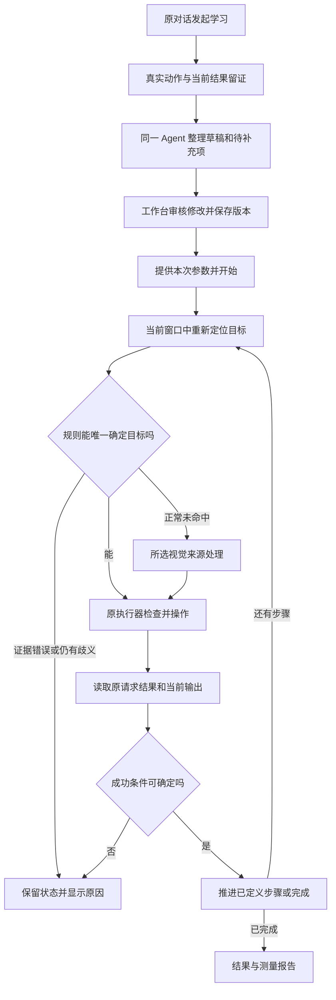

> **2026-10-02 当前顺序 / Current sequence:** [学习主线重排计划](2026-10-01-learning-mainline-refocus.md) 为当前入口。P0 与本批 P1 普通闭环已核验：两轮同窗口不复位复用、缺失目标停止、普通输入修正及清理；真人审核仍未发生，完整 R1/R2 不自动完成。P2 v3 原 A 完成319.965秒、C 在原内部读取回收据时未完成均保留；共同只读接线修复 Main199 passed并核对真实原read/公开接口，v4六对已冻结但未启动，配对为0；随后 P3 限定恢复及 P4 实测优化、迁移和扩大验收。三项收益和总调用/token 未知，正式配额和目标保持；原失败记录保留。 / The scoped journey passes; finish actual pilot wiring before sampling, with wider acceptance and benefits still open.

## 2026-09-30 两项独立源码切片 / Two independent source slices

- [x] 原控制入口接收真实调用方计量，绑定原执行/草稿回复，去重、哈希复核，并在状态中单列部分汇总；原观测计量与未知全量保持不变。 / Receipt-bound caller telemetry, deduplication, integrity checks and separate partial summaries implemented.
- [x] 预留执行/学习共用的默认关闭判断合同，验证关闭/未连接零调用、严格回复、同窗口证据与请求绑定，以及原核验路径兼容。 / Disabled shared judgment contract and isolated compatibility checks implemented.
- [ ] 发布后，按核实的供应商协议接线、提供设置、实施网络超时与实时证据采集，再检验真实 API 和业务结果处理。 / Future verified provider/settings/transport/evidence integration and live validation.

详见[接口合同](../../OPTIONAL_JUDGMENT_AND_MODEL_USAGE.md)和[本轮验证](../../verification/LEARNING_WORKFLOW_BENEFIT.md)。本次不等于主线实机收益验收，也没有修改版本或发布。 / This slice does not establish physical benefits or a new release.

## 2026-09-30 可选判断模型预留 / Optional judgment model reservation

用户确认的后续开发约定；共用合同现已按上方切片完成，供应商适配器、服务连接和真实模型验证仍留待后续。 / Confirmed future development decision; the shared contract is now implemented as described above, while provider integration and live model validation remain future work.

- 执行模式与学习模式共用可选的结果判断接口，接收明确条件和当次截图／文字证据，绑定原运行、步骤与截图身份。目标定位和动作派发继续复用现有路径。 / Both modes share an optional outcome-judgment interface receiving explicit predicates and current image/text evidence bound to the original run, step and capture; preserve existing grounding and dispatch.
- 未配置、未启用或尚未接入时，沿用现有规则核验与 Agent 判断；不要求 API 可用、不探测远端、不安装本地模型、不引入额外等待。既有工作流无需迁移即可正常使用。 / When unconfigured, disabled or not yet integrated, retain existing rule and Agent judgment with no API prerequisite, remote probe, local-model installation or additional wait; existing workflows need no migration.
- 判断服务单独配置，待发布后按确认的官方协议接入，不预填未核实的模型 ID。模型的“是／否”映射到条件是否满足；超时、接口错误或证据不足单独记录为不可判断，不能伪装成“否”或成功。 / Configure the provider separately and integrate its verified protocol after release without an assumed model ID. Map yes/no to predicate satisfaction; report timeouts, API errors and insufficient evidence separately as indeterminate, never as false or success.
- 后续实现时验证未配置／关闭路径不会调用判断 API、原工作流仍可完成；适配器先用隔离契约检查原运行与证据绑定及结果处理，实际接入后再测耗时、调用量和准确率。预留不作为当前发布前置条件。 / Future checks must establish zero judgment API calls and unchanged workflow completion when absent or disabled, then verify bindings and result handling with isolated adapter contracts. Measure latency, calls and accuracy after real integration; reservation is not a prerequisite for the current release.

## 2026-09-30 普通逐步结果与当前阻塞 / Per-step results and next gate

运行页新增只读“本次步骤结果”：逐步显示通过/未通过/不确定/等待核验、规则/Agent/运行时核验来源，以及有证据的时段与已记录模型调用。输入已派发不等于通过；缺少时钟和调用证据显示未知，已记录 0 次不等于完整模型调用为 0。切换运行或会话清除旧行，旧运行不借用新版步骤名称。原开发者信息保留，不需要阅读 JSON 才知道每步结果。 / The ordinary run page now exposes ledger verdicts, judgment sources and partial telemetry without equating dispatch with success or recorded counts with complete usage. Switching runs clears stale rows and pinned titles do not drift.

实现复用原 Trial history 与计量账本：`workflow_metrics.load_run_metrics` 返回按原 step_id 汇总的 `by_step`，`WorkflowRunHistory` 只读呈现，不新增执行器、输入权限或审核判定。新测试先 4 failed；运行页、恢复、实际 main 原队列、两轮当次输出、宿主报告及计量共 70 passed。首次截图第二行不完整，增大表格最小高度后只复测相关主窗口旅程 1 passed（与 70 项重叠，不相加）；`history-main-final.png` 已核对。均为全新合成内容的隔离/离屏验证，非真实输入和收益验收。 / Existing persistence supplies the view. Source checks and the inspected main-window capture pass; a focused layout rerun overlaps the 70 checks.

证据 / Evidence：`D:/AgentGUI-Projects/verification/AgentReviewAcceptance/20260930-run-history-01`。文档原件已备份，本轮没有打包、发布或修改版本。

当前主线核对：R1a/R1b 已有原始实机与清理证据；R1c 已冻结两轮 Record Desk 变化、截图预览、43 项源码预检和零输入清理，但明确操作确认仍未收到。只读子 Agent 核对和主 Agent 源码复核找到的普通 history 展示缺口已补齐；不把历史未勾选项直接推成未实现，也不把本轮局部检查当作完整验收。 / R1a/R1b evidence remains intact; R1c preflight has no physical inputs and awaits explicit confirmation. Read-only gap review identified the history view now implemented, not an independent physical acceptance result.

下一步必须在确认后加载当前源码的新宿主，重新截图定位，按已预览的 R-731 / R-284 两轮范围运行原保存程序。R2/R3 实机变化、异常恢复与清理，R4 配对收益，R5 基于实测优化，R6 第三方迁移和同候选独立验收仍开放。不能以更多源码微调、重复测试或旧记录回填替代这些出口；未知总调用/token 继续未知。真实输入依 AGENTS.md 的“确切预览和独立确认”要求等待用户答复。 / The next substantive step needs the pending exact-action confirmation. Physical continuity, paired benefits, measured optimization and transfer gates remain open; more source checks cannot substitute for them.

## 2026-09-30 改名保留审核 / Preserve review on rename

修复仅修改步骤显示名称时，当前步骤及依赖其输出的后续步骤被错误重置为待审核、已观测动作被标成人工修改的问题。保存仍生成不可变新版本；原目标规则、审核状态及动作来源保留。目标、填写来源、条件或验证规则等执行语义改变时，当前及相关下游步骤仍重新待审；明确撤销审核和原待审状态不会被改名覆盖。 / Cosmetic step renames now preserve review, provenance and locator bindings in a new immutable revision; semantic edits still invalidate affected steps, and explicit pending review stays pending.

故障契约 / Root contract：公共 `WorkflowProgramService._derive_provenance` 曾把 title 纳入执行语义变化集，并递归传播给下游；现仅从该变化集中排除显示标题，对所有工作流编辑入口统一生效。没有改变执行授权、动作校验或自动派发行为。 / Separate display metadata from executable semantics in the common save service, without changing action gates or dispatch.

验证 / Verification：新服务测试先 2 failed / 4 passed；补充普通 main 入口及来源检查后先 4 failed / 4 passed。修复后程序、目标依赖、目标编辑旅程、步骤面板及普通 main 保存重开共 **57 passed**。实际 Qt 控件完成改名、保存、关闭重开、旧版本读取且没有输入入队；这是全新合成内容的离屏验证，不能替代真实外部窗口验收。原失败记录和最终 JUnit：`D:/AgentGUI-Projects/verification/AgentReviewAcceptance/20260930-title-review-01`。 / Fresh offscreen controls verify persisted behavior and unchanged old revisions; first failures remain retained.

R1c 确切真实动作确认仍待回复；R2–R6 的实机变化、恢复、公平收益及第三方迁移未完成。未打包、发布或改版本。 / Physical variation, continuity, measured benefits and transfer remain open; no release occurred.

## 2026-09-30 审核等待计量 / Verification wait measurement

新运行现在单独记录从首次需要审核到原步骤结算或取消的等待时段，包括 Agent/人工审核和继续操作延迟；它不等于模型推理时间，也不增加模型调用数。重复查询、过早继续和同宿主重建 runner 不重置起点；跨进程重开标记不可计时，旧运行不补估算。总模型调用/token 仍未知。 / New runs measure verification handoff waits through reconciliation or cancellation, not inference or model calls. Repeated controls preserve the original clock; cross-process waits remain unmeasured and historical runs are not reconstructed.

相关运行时、计量、持久化、报告、取消及离屏面板检查 135 passed、1 skipped（当前环境无法创建目录符号链接）；新回归先 11 failed，补充损坏状态用例先 1 failed / 14 passed，修复后上述相关集合通过。原命令身份、重复计时拒绝、连续两步、取消、跨进程未知和真实单调时钟均覆盖。证据：`D:/AgentGUI-Projects/verification/AgentReviewAcceptance/20260930-verification-wait-01/focused-final.xml`。 / Focused verification: 135 passed, one directory-symlink capability skip; first failures remain recorded.

这是源码/隔离验证，未重新进行真实输入、打包或发布。R1b 原始实机证据保持不变；R1c 两轮真实变化测试的确切确认仍待回复，R2–R6 与三项收益仍未闭合。下一实机候选须加载本次源码并重新截图定位。 / This source-only change neither rewrites prior physical evidence nor closes physical variation, continuity, benefit or transfer gates; the next candidate must load the new source.

### R1c 变化预览与源码预检 / Variation preview and source preflight

后续两轮限定自建 Record Desk：相同已保存程序分别查询 R-731、R-284，使用同名记录、不同次序及 detail_above_rows / search_below_rows 布局和新详情。两场景已冻结并逐张核对实际截图；执行前仍须重新定位。只调用 select/capture，预览宿主和窗口已清理，用户确认待答复。首次预览因采集器只读白名单不含 select 而未派发；修正预览调用配置后复用原冻结数据成功，不重抽场景。 / Two exact variation previews are frozen and inspected without desktop input; approval is pending and preview resources are stopped. The initial select-admission failure remains recorded, with the same cases retained.

`r2-r3-source-preflight.xml`：动态目标、程序依赖、宿主变量绑定、普通上游输出入口、取消结算、运行页恢复和无名列表共 43 passed。仅源码/隔离及离屏检查，不能替代 R1c/R2/R3 实机通过。证据根目录 / Evidence root: `D:/AgentGUI-Projects/verification/AgentReviewAcceptance/20260930-learning-variation-02`。 / All 43 scoped checks pass; physical variation, recovery and benefit gates remain open.

## 2026-09-30 完整教学与换编号复用通过 / Full teaching and new-ID reuse passed

R1b 在同一全新 Record Desk 窗口和原 MCP 宿主内完成六步教学：查询 R-599 → 唯一行 → 打开详情 → 读取当次 Detail → 填写 → Verify value。普通工作台用真实控件修改上游输出绑定和动态行规则，保存新版本、关闭重开，再以 R-953 连续运行六步；新详情 `detail-73178a74a55a` 替换旧详情 `detail-a52e0dfef4be`，字段 UIA 核验及窗口 Matches current detail 均成功。 / R1b completes six-step teaching, ordinary editor changes, immutable save/reopen and same-session six-step reuse with a new record and fresh downstream detail.

五个复用输入动作全部命中当前学习规则：四个 memory_uia、一个 memory_visible_row；视觉定位交接 0。读取步骤由当前 Agent 查看原截图后回交本次输出，Find/Open/Verify 三个结果使用已声明的 Agent 判断，原运行通过工作台“继续原运行”按钮续接。不是完全无需 Agent 的规则链；未观测的总模型调用和 token 继续为未知，也没有公平对照的提速或准确率收益结论。 / All five input targets resolve from current learned rules without vision-grounding handoffs. One current-agent read and three declared agent result judgments remain; total calls/tokens and comparative benefit are unproven.

工作台驱动为实际 main 的离屏控件，目标窗口输入是真实 gated 输入。原始回执审计验证六个步骤、当次输出、当前候选和固定窗口身份、旧/新程序版本可加载、无输入重放及完整清理；宿主 exec 13540、工作台 exec 89403 退出 0，fixture 退出 0。最初先停止学习再审核使整理读到旧图，返回 needs_review；审核后通过原 learning_stop 提交新图后整理成功，没有重放输入。审计脚本首次误把 input_check 当作 steps 中一项；核对真实回执后改为检查独立 input_check 及值哈希，复核通过。 / Receipt and version audits plus cleanup pass. Preserve the pre-review synthesis response and initial audit-schema mistake separately; neither caused input replay.

证据 / Evidence: `D:/AgentGUI-Projects/verification/AgentReviewAcceptance/20260930-learning-full-task-02/live-task-01/full-task-audit.json`、原回执、workbench-saved-program.json、reuse-completed.json、截图与 cleanup.json。本轮沿用已通过 41 项检查的源码，四个文件哈希复核一致；未改产品源码、版本或发布包。 / This physical run uses the previously checked source, with four source hashes unchanged; no product code or release changes occurred.

R1b 主链已通过；R1c 的重新排序/状态变化集合、R2–R3 异常与编辑失效、R4 冻结配对计分、R5 按瓶颈优化、R6 外部应用迁移及同候选独立验收仍未完成。本轮两次完整流程授权已执行完毕，新增真实输入须给出新的确切预览；源码与离屏检查继续推进。 / R1c and R2–R6 remain open, including measured benefits and independent acceptance. The approved two flows are consumed; further physical inputs need their own exact preview while source/offscreen work can continue.

## 2026-09-30 完整任务预检与动态行修复 / Full-task preflight and dynamic-row repair

R1a 同窗口学习复用已通过。R1b 新建 Record Desk 的只读截图/UIA 预检发现无名列表被目标编辑器隐藏、记录专属子控件 ID 被固定进规则的问题。现支持用非空自动化 ID 精确识别无名容器；普通编辑器可明确取消行内属性/动作的固定 ID 限制，匹配仍在每个当前行内要求唯一，旧规则不自动改变。 / R1a passed. Fresh R1b preflight exposed unnamed-container filtering and record-specific child IDs. Identified unnamed containers and explicit per-row ID choices are now supported while preserving unique matches and existing recipes.

新增回归先 5 failed / 3 passed，修复后目标解析、编辑器、服务及实际 main 保存重开共 41 passed；中文界面截图已核对。本轮真实 UIA 树回放同一规则分别选中 R-599、R-953 的 Open detail，没有执行点击。证据：`D:/AgentGUI-Projects/verification/AgentReviewAcceptance/20260930-learning-full-task-01`，最终 JUnit 为 `unnamed-rows-fixed-final.xml`，`live-task-01/row-replay.json` 为只读回放。一次命令误列不存在的测试文件，0 tests，单独保留 fixed-02.xml，不计通过。 / Tests and read-only real-tree replay pass; an invalid test-path invocation remains separately recorded.

两轮完整查询/详情/填写/校验的确切预览已给用户，确认尚待答复；当前只有 select/capture，无新增真实输入。预览宿主 exec 82353 已按 stop 请求正常退出 0，自建窗口退出 0、cleanup_verified=true，原回执中只有 select/capture。完整任务请求与回读脚本已完成合同校验，缺确认的输入在入队前被拒绝，队列未改变。确认后使用修复后源码的新宿主并重新截图核对同一范围，不复用已关闭句柄或旧坐标；不可把请求校验或离线回放记作完整实机通过。R1b/R1c 及 R2–R6、总模型用量及性能/准确率收益仍未通过。 / Exact full-flow approval remains pending; no physical input occurred. The original preview host and fixture are now cleanly stopped. Request contracts and fail-closed admission are checked without input; load a new repaired host and refresh the confirmed target before acceptance. Full-task and benefit gates remain open.

## 2026-09-30 同窗口学习与复用通过 / Same-window learning and reuse passed

R1a 第二轮在全新数据、同一 Record Desk 窗口和原宿主内完成：学习填写“学习样本甲”→ 当前 Agent 整理参数化草稿 → 普通工作台修改标题、保存并关闭重开 → 参数“复用样本乙”替换原字段 → UIA `field_equals` 成功 → 自建宿主及窗口清理。复用过程没有手工 MCP 恢复或输入重放。工作台使用实际 main 的离屏控件，目标窗口的两次输入是真实 gated 输入。 / The fresh second attempt completes learning, agent-assisted synthesis, normal workbench editing/save/reopen, parameterized reuse and native verification in one original window and host. The real main workbench is driven offscreen; target input is physical and uses the original gated runtime.

首次同窗口尝试保留为失败：乙值已写入，但字段内 1×15 像素的文本光标闪烁使两帧像素核验拒绝，工作台超时。公共观察器现只对有效截图中的字段像素不稳定最多完整重采三次，每次重新读值和前后截图，固定窗口与目标身份，保留失败证据；持续变化、身份漂移和损坏截图仍拒绝。没有重放输入或加入像素容差。 / The first attempt failed on a blinking caret after successful typing. The shared observer now allows at most three complete fresh read pairs for valid but unstable field pixels, preserving identity, strict pixel checks and prior failures; input is never replayed.

回归先为 4 failed / 1 passed，修复后相关 52 项通过。第二轮实机核验首对截图已稳定，没有触发重采；重采分支由真实 PNG 的隔离回归覆盖，不能写成现场重采已触发。审计脚本首次误认为学习事件 after 含 window_identity，随后按原动作回执中的原生身份逐步骤核对通过；这不是额外输入或产品运行失败。 / Regression evidence is 4 failing / 1 passing before and 52 passing after. The successful live pair needed no reacquisition; that branch is covered by PNG-based isolated regression. A read-only audit schema assumption was corrected without additional actions.

证据根目录 / Evidence root: `D:/AgentGUI-Projects/verification/AgentReviewAcceptance/20260930-learning-continuity-02/live-physical-learning-01`；`checkpoint-verification.json`、原始回执、工作台和目标截图及 cleanup.json。首次失败与 JUnit 位于相邻 `20260930-learning-continuity-01`。原 run_id：`trial-0991ae2ce6578d325ca645c60bfe8f8d811f063c11e313a6e9f0d7d61c80b33b`。

本轮只关闭 R1a 小检查点。复用命中 memory_uia，视觉定位交接为 0；输入组合 1408.857 ms，规则核验 200.5099 ms，分别为原回执阶段耗时，不能相加当完整任务或公平对照。模型调用总量/token 未知，三项收益尚未证明。R1b/R1c 的查询、动态行、当次详情数据流与修改验收，以及 R2–R6 连续变化、对照、优化和第三方迁移仍未完成。下一项是新数据的完整 Record Desk 流程；已有两次填写范围不扩展为查询、详情点击或新内容填写，须准备确切预览再独立确认。未打包、发布或改版本。 / R1a alone is closed. Zero reuse grounding handoffs and phase timings do not establish total model savings or speed/accuracy gains. R1b/R1c and R2–R6 remain open; the next full-flow input scope needs its own exact preview and confirmation. No release occurred.

## 2026-09-30 普通运行入口的未入队恢复 / Unsubmitted-run recovery

修复 `start` 已创建 ready 任务、紧接的 `run` 因队列忙或宿主暂未就绪而未入队后，普通面板无法继续原任务的问题。成功创建时即保存准备状态；恢复后由用户选择单步或连续运行，固定原 run_id、程序版本、起点和输入，不自动重发或重新创建任务。 / Preserve a successfully prepared trial when the subsequent run request is not submitted; an explicit user action resumes the original identity and inputs.

新增四个反例先全部失败，修改后运行面板、恢复、客户端、普通 main 旅程与运行报告共 65 项通过。先前编辑命令未成功写入时的复测仍为 4 failed / 61 passed，原 XML 保留；最终为 `focused-fixed-final.xml`。证据根目录：`D:/AgentGUI-Projects/verification/AgentReviewAcceptance/20260930-learning-recovery-01`。 / Four regression cases fail before the production fix; the final focused suite passes all 65 checks, preserving earlier failed runs.

本次仅源码及离屏组件/入口检查，未再次执行真实填写、未更新安装版或发布。R1a 同窗口连续性与普通 UI 无手动协议恢复仍待新宿主实机复验；R1b/R1c 和 R2–R6 继续未完成，总模型调用/token 与性能准确率收益仍未证明。下一步使用修复后的新宿主复验完整学习、审核、保存重开与复用主链。 / Source verification does not close physical continuity or empirical benefit acceptance; the next step is the complete journey on a newly loaded host.

# Learning Workflow Benefit Implementation Plan / 学习工作流闭环与收益实施计划

## 2026-09-29 已授权两次填写与恢复边界 / Authorized fills and recovery limits

用户已明确确认原预览中的两次填写。原 `teach-fill` 成功写入“学习样本甲”，保留实际前后截图并生成带 `value` 参数、UIA 目标和 `field_equals` 规则的草稿；普通工作台已修改标题、保存、重开。重开测试窗口后，工作流原请求 `trial-exec-267b8898992184a9b30bb8b9685e6771` 成功写入“复用样本乙”。两次均只执行 focus/type/check_input，没有 Enter 或提交。第二次目标记忆命中，未产生视觉定位交接或外部识图调用；模型调用总量与 token 仍未知。 / Both approved fills occurred once. The second used the learned target and current parameter without a vision-grounding request; total model usage remains unknown.

第二次原运行 `trial-df4b4f2855053b039f06cb0d23c37de2a9a1d807cec90075a6265e930cec2526` 经原 wait_id 继续后，由本次 UIA 实值核验为 success/completed；只读重开工作台没有新增命令，所有自建宿主及测试窗口清理通过。 / The original run was reconciled using its original wait and a fresh UIA field value, without input replay; owned resources were cleaned.

**范围未闭合：** 首次查询脚本误用了 `learning_session_id`（事件查询应为 `learning_id`），导致原窗口提前清理；因此这是重开后的复用，第二次输入前新窗口字段为空，不能算“同一窗口由甲替换成乙”的连续通过。后续还需手动 MCP 恢复，R1a 普通用户无干预链与同窗口连续性仍待复验，R1b/R1c 及 R2–R6 未完成；没有提速或准确率提升结论。 / Reopened reuse is verified; same-window continuity, hands-off normal UI recovery and full benefit acceptance remain open.

本轮修复合法目标记忆被缺省视觉能力挡住、无 result 失败回执不能结算、记忆库短事务抢锁和同步恢复后旧错误提示残留。主 Agent 源码回归 157 passed，加宿主报告/客户端回归 55 passed（有重叠，不能相加为唯一用例数）。锁和报告修复没有热加载到已运行宿主；现场完成截图仍保留旧错误提示，不能把源码通过写成新候选实机通过。 / Source fixes pass focused checks; the existing live host did not hot-load the final lock/report changes, and its stale visible error is preserved as evidence.

证据 / Evidence: `D:/AgentReviewAcceptance/20260929-learning-benefit-01/live-physical-learning-02/physical-checkpoint-verification.json`、`workbench-completed.json`、`recovery-cleanup-02.json`；首次失败及各次工作台产物分别保留。未打包、推送、改版本或调用付费模型 API。 / First failures remain separate; no release or paid-model test occurred.

> **For agentic workers:** REQUIRED SUB-SKILL: Use superpowers:subagent-driven-development (recommended) or superpowers:executing-plans to implement this plan task-by-task. Steps use checkbox (`- [ ]`) syntax for tracking. Follow the user's scoped workflow instructions: no ritual worktrees, commits or approval rounds.

**Goal:** 让 Agent 自动生成的工作流可被人工审核和修改，并用真实复用证明模型使用减少、速度提高、结果正确率改善。 / Deliver editable learned workflows with measured reductions in model use and runtime and evidence-backed correctness gains.

**Architecture:** 在既有录制、不可变内容库、步骤服务和 Instant 执行器之间补齐目标记忆、规则验证和异步调度。所有输入复用原动作 API；Agent 只处理初次规划、开放式判断和明确等待项。 / Extend the existing recorder, immutable library, program/trial service and Instant executor with target recipes, outcome rules and asynchronous scheduling; do not create another input engine.

**Tech Stack:** Python、Pydantic、PySide6、现有 MemoryWorkspace / Instant MCP / UIA / 模板匹配 / 可选 OCR 与已配置视觉来源。 / Existing Python/Pydantic/PySide6 and runtime components; OCR and local vision remain optional for API/agent users.

**Spec:** [完整产品与成功标准](../../LEARNING_WORKFLOW_SUCCESS_SPEC.md)。完整 T0–T8 已获实施授权；以下是持续维护的计划，源码进度与真实验收分别记录。 / Full implementation is authorized; this living plan distinguishes source progress from live acceptance.

## 当前进度与最终交付 / Current progress and final delivery

### 本次完整计划的执行起点 / Current execution entrypoint

本计划沿用已实现的 T0–T8，不重新建设已通过检查的组件。71 项检查与真实只读重开是此前基线；最新两次填写和恢复证据见上方记录，尚未关闭完整物理与收益出口。完整产品定义见 Spec，第一个小检查点与最终成功必须分别记账。 / Reuse implemented components; the latest recovered fills extend the earlier read-only baseline without closing complete physical or benefit acceptance.

| 顺序 / Order | 要交付的结果 / Deliverable | 判定条件 / Completion evidence |
| --- | --- | --- |
| R1a 真实填写小检查点 / Physical input checkpoint | 在新建 Record Desk 的同一字段学习“学习样本甲”，自动生成草稿，经普通工作台编辑、保存重开后，以参数“复用样本乙”执行 / Learn one value and reuse a different value through the normal workbench | 2026-09-30 第二轮通过：同窗口甲替换为乙，普通工作台保存重开、原回执和 UIA 核验及清理均成功，无手工复用恢复 / Second attempt passes same-window replacement, normal workbench save/reopen, original receipts, verification and cleanup |
| R1b 完整任务 / Complete task | 输入编号 → 当前列表唯一行 → 打开详情 → 读取新状态 → 填入受控字段 → 核对实际值 → 收尾 / Query, select, open, read, fill, verify and clean up | 从普通入口完成学习、自动草稿、变量/目标/结果规则修改、保存重开和复用；用户无需请求 ID 或 JSON / Complete normal-user controls without manual protocol |
| R1c 换数据复用 / Held-out reuse | 改编号、列表次序和状态值，再运行已保存版本 / Reuse the saved revision with unseen inputs and current values | 下游消费本次读取结果，旧示例和旧运行输出不能使任务通过 / Fresh dataflow rather than replayed sample values |
| R2–R3 变化与连续使用 / Variation and continuity | 依后文覆盖歧义、消失、编辑失效、弹窗、中断、恢复和取消 / Exercise the declared variation and recovery cases | 正向完成、负向明确拒绝、原请求不重发、完整收尾；保留首次失败 / Truthful outcomes, no input replay and retained first failures |
| R4–R6 收益与最终验收 / Benefit and acceptance | 冻结对照 → 按瓶颈优化 → 相关回归 → 第三方应用迁移 → 同候选独立验收 / Compare, optimize, regress, transfer and independently accept | 按 Spec 分别判断可用性、少调用、提速和正确率；不可观测或未达标项明确保留 / Report each goal and every measurement limitation separately |

- [x] R1a 执行前重新截图定位；原预览票据已过期，不沿用坐标。使用原 gated input_sequence 和原宿主，回读原命令终态。 / Reacquire grounding and consume the original terminal receipt through the existing executor.
- [x] R1a 的成功只关闭真实填写、参数化和保存重开这个小检查点，不能替代 R1b/R1c、动态行验收或收益测量；其两次填写确认也不覆盖后续查询、记录点击或其他输入。 / The narrow checkpoint and its confirmation do not cover the full journey or later actions.
- [ ] R1b/R1c 人工修改输入来源、目标条件和成功规则后保存新版本；运行中旧版本、原截图、旧观察图及独立界面内容保持不变。 / Verify semantic editing and immutable history in the full journey.
- [ ] 必要计量从 R1a 同步记录，覆盖所有能观测的模型调用和阶段耗时；不得等到 R4 才补写前面运行的估计值。全量调用或 token 缺失时为未知，完整模型节省目标保持未验证。 / Capture actual telemetry from the first checkpoint; never reconstruct unknown usage as measured values.
- [ ] R4 测试集合在计分前冻结；每类 A/C 20 对（稳定 8、未见数据 6、布局/排序变化 6），B 每类 5 个同 case 对照，负向与恢复另列。修复改变候选后建立新轮次，保留旧结果。 / Freeze matched cases and preserve prior cohorts across repairs.
- [ ] 每阶段交付可运行功能、原始证据、首次失败与修复复测、相关文档。只做计划校准或静态脚本检查时，不登记产品运行通过。 / Each stage delivers behavior, evidence and documentation; planning is not runtime acceptance.

原预览已经收到用户明确确认，两次填写均已用完；不再轮询旧 exec session 62190，也不将该确认扩展为后续查询/点击。所有自建会话已清理。下一项是在修复后的冻结候选验证完整 R1 和连续性，动作范围按新的确切预览处理。 / The original approval is consumed and all owned sessions are stopped; preserve scope for subsequent acceptance.

### 2026-09-29 真实宿主连接与工作台重开 / Live host attachment and workbench recovery

修复 Windows 虚拟环境启动器 PID 与实际宿主 PID 不同导致工作台拒绝连接的问题。附着仍核对活进程、直接父进程、确切宿主入口和会话路径，并固定实际宿主 PID/创建时间。切换会话清空旧步骤、等待原因、输出及悬停明细；原控制回执必须返回原 run_id，不能替换成其他运行。 / Attach verified launcher children without weakening session identity; clear stale presentation and bind returned controls to their original run.

相关源码检查 **71 passed**（guided-recovery-integrated-fixed.xml）。全新 RecordDesk、原 MCP/宿主及实际 main 离屏控件完成两步只读学习整理、保存、单步等待、关闭重开、明确继续完成，再启动另一次两步运行；原请求没有重发，两次 start 输出均为空，后续执行 ID 各自独立。live-guided-recovery-04 的中文界面截图已核对，宿主清理为 true，fixture 退出 0。 / A fresh live host and real workbench controls pass a read-only save/reopen/continue/new-run journey with distinct execution records and verified cleanup.

保留 01/02 连接失败、03 行为通过但离屏字体未加载的截图，以及测试中 psutil 全局替换造成的夹具失败；04 加载离屏字体后复验，不修改产品字体。完整 R1/R2/R3（实际点击填写、内容变化、弹窗/异常恢复）和 R4–R6 仍未完成；total_model_calls/token 未知，empirical_acceptance=false。未打包、发布、改版本或推送。下一步准备确切物理动作预览并按项目要求独立确认，不能重复只读流程代替完整任务。 / Failures remain separate; physical and empirical acceptance remains open, with no release or version change.

最终交付是一条普通用户可操作的路径：说出要学习的任务 → 完成一次操作并生成有证据的草稿 → 审核、改变量/目标/结果规则 → 保存新版本 → 换数据连续复用 → 查看当前结果、异常原因及真实收益。 / Deliver a normal learn–edit–save–reuse–verify journey with measured benefit.

| 任务 / Task | 已有证据 / Existing evidence | 完成前还需要 / Remaining completion gate |
| --- | --- | --- |
| T0 测量 / Measurement | 原票据计量、冻结采集、可复现场景与当前结果观察 / Frozen collection and realized cases | 全量调用方与实机 A/B/C 配对 / Complete caller telemetry and physical comparisons |
| T1 引用 / References | 来源核验、人工 reviewed 保存及语义修改失效已测；原 MCP 旧版本保护通过 / Provenance/review persistence and old-version protection checked | 自动生成及真实动作复用 / Generated references and physical reuse |
| T2 定位 / Resolution | 原执行接线及只读解析已有证据 / Original execution wiring and read-only resolution checked | 真实单项点击、效果验证和清理 / Physical input, outcome and cleanup |
| T3 结果 / Results | 修复目标外光标闪烁误拒；编译链两轮共六个当前文本输出通过 / Scoped observations and six current read outputs checked | 动作改变数据后的新值、后续真实填写消费 / Fresh changed values and downstream physical use |
| T4 动态行 / Dynamic rows | UIA 可信变量、普通多条件行及策略编辑保存重开已验 / Trusted compound rules and persistence checked | 未见输入、重排和当前值实机验收 / Held-out physical variation acceptance |
| T5 调度 / Scheduling | 原 MCP 编译只读链同会话两轮、输出/计量隔离及宿主清理通过 / Compiled same-session read-only reuse checked | 真实输入、变化、中断恢复和完整收尾 / Physical continuous acceptance |
| T6 自动草稿 / Compilation | 同会话当前 Agent 整理→草稿→保存重开→两轮只读复用已通过 / Actual current-agent read-only synthesis and reuse checked | 普通生成入口、真实动作/参数化复用验收 / Normal generation controls and physical/parameterized acceptance |
| T7 普通界面 / UI | 运行/恢复、同一 Agent 有界纠错、复合规则和实际 main 修改保存重开均有分层证据 / Attached execution, bounded synthesis and compound editing checked | 真实输入、现场变化、完整运行页与活宿主连续验收 / Physical and complete live-run acceptance |
| T8 收益 / Benefit | 没有真实 A/C 收益结论 / No measured comparative benefit | 冻结对照、变化集、连续验收和同候选独立复验 / Matched benchmark and frozen acceptance |

当前批次：原 Trial 新增启动时固定的 execution_strategy（learned 默认、steps_only）。steps_only 在生成原票据前禁用记忆定位，保留本次目标含义和当前变量，结果必须交回 Agent review；已保存程序不改写。采集器将 A 普通执行、B steps_only、C learned 与真实命令/回执核对，拒绝跨运行引用、策略冲突和 A/B 的目标记忆。 / Trial strategy is pinned before ticket creation; collection validates actual route commands and receipts.

检查：execution-strategy-integrated.xml 为 264 passed；集中源码 execution-strategy-source-suite.xml 为 2670 passed / 1 skipped。全新可见 Record Desk 经同一真实 MCP 完成 C 原生规则读取与 B 当前 Agent 看图后 review/continue；原 start 回读未覆盖后续完成状态，宿主和自建窗口清理通过。未派发物理输入。 / Focused and consolidated source checks pass; fresh real-MCP read-only strategy integration and cleanup are verified.

尚未达成：完整调用方模型计量、冷暖/学习开销及易混/负向/恢复集合、普通用户完整学习后连续点击填写、实机 A/B/C 配对和三项收益。总模型调用/token 仍为未知，empirical_acceptance=false；本轮只读任务不冒充查询、打开记录或下游填写成功。 / Complete caller telemetry, physical paired tasks and empirical benefits remain unverified. No release or version update.

详细记录见 [开发证据](../../verification/LEARNING_WORKFLOW_BENEFIT.md)。真实输入仍须满足项目已有的确切预览和独立确认；确认待定不阻断源代码、离屏及只读工作。 / Existing input confirmation rules remain; independent source and read-only work can continue.

### 用户最终拿到什么 / User-facing completion

用户说“学习按编号查询记录并填写当前状态”。Agent 在原对话完成一次真实任务，自动生成可审核草稿；用户在工作台确认或修改编号参数、目标条件和成功规则，保存一个明确版本。下次只提供新编号，运行时完成已知步骤，输出本次读到的状态和每步结果。关闭重开后，工作流、人工修改、原图和旧版本仍可查。 / A real demonstration produces an editable draft; the saved version accepts new inputs and returns current outputs, with persistent evidence and history.

首个完整验收流程固定为：**输入编号 → 在当前列表找到唯一记录 → 打开详情 → 读取当前状态 → 将本次状态填入受控字段 → 核对字段实际值 → 收尾**。第二次必须换编号、列表顺序和状态值，不能只重放教学样本。 / The reference journey must also succeed with held-out IDs, reordered rows and changed current values.

每步默认只讲四件事：**做什么、找哪个对象、值从哪里来、怎样算成功**。Agent 生成规则，用户能看懂和修改；不能把一次点击成功自动升级为“所有变化都可靠”。学习所得是带证据的步骤和规则，不依赖重新训练模型。 / Expose intent, target, value source and success criteria; demonstrations do not establish generality.

### 点击对象与变化内容 / Targets and changing content

保存的是“在哪个界面、哪个容器、匹配哪些属性、操作哪个控件”，坐标只属于当次截图。每次复用都重新读取当前窗口、当前控件与当前图像，再产生候选和点击点，仍经过原动作入口。可用规则按已保存顺序尝试；只有正常未命中才转用户配置的视觉来源，协议错误、错窗口、坏资产必须显式失败。 / Persist target identity and rules, derive fresh coordinates, and distinguish ordinary misses from broken contracts.

| 遇到的变化 / Variation | 预期行为 / Required behavior | 通过证据 / Evidence |
| --- | --- | --- |
| 查询词、编号不同 / New input | 将教学值绑定为本次参数 / Bind a declared input | 更换输入仍选中对应对象 / Correct new identity |
| 列表顺序或位置变动 / Reordering | 先找容器，再按编号和必要属性匹配唯一行 / Resolve the current unique row | 不依赖第几行或旧坐标 / Position-independent selection |
| 名称相同但编号不同 / Same name | 用编号等明确条件消歧 / Apply explicit distinguishing attributes | 目标唯一且当前证据相符 / Exactly one matching target |
| 完全重复或目标不存在 / Duplicate or absent | 标明缺失或歧义，等待修正 / Surface ambiguity or absence | 不点击任意第一项 / No arbitrary first match |
| 状态、金额、详情变化 / New output | 当前重新读取，保存到本次运行输出 / Read fresh run-local output | 下游消费新值；旧值导致失败 / Downstream uses the new value |
| 轻微移动、布局变化 / Layout changes | 现场重新定位；规则不适用时交所选视觉来源 / Re-resolve or request configured vision | 新点在新目标内，结果检查通过 / Fresh geometry and verified outcome |
| 加载、已知弹窗 / Loading or known dialog | 有界等待或执行已定义分支 / Bounded wait or defined branch | 能恢复并完成收尾 / Recovery and cleanup |
| 未知页面、语义变化 / Unknown state | 交回 Agent 判断并提出局部修正 / Ask the agent to interpret and propose a revision | 原版本保留，新版本单独验证 / Preserve old version and verify the new one |

第一版范围是固定控件、当前可见的唯一行、明确参数与当前输出、已定义分支和有界步骤。任意网页结构、无限循环/分页、开放式“选最合适的一项”继续由 Agent 处理，实际开销计入报告。当前 UIA 文本能力不等于已经支持任意截图 OCR。 / Keep the first release bounded; open-ended selection remains measured agent work.

### 人怎么修改、图怎么保留 / Human editing and graphs

普通工作台保留步骤列表、程序流程图、原始截图与右侧修改区。用户可修改输入来源、对象条件、成功规则及已有分支，试跑单步或从可用步骤继续；无需手写 JSON、请求 ID 或截图路径。界面显示“正在做什么、为何暂停、缺哪个值、下一步怎么处理”，开发者入口保留。 / Normal controls expose editable workflow concepts and actionable run state without protocol fields.

每次保存创建新版本；运行中的版本保持固定。修改动作或对象含义时，让受影响规则和验证重新待审；只改标题不应破坏定位。丢失上游输出时，提示补足来源或明确改为输入，不能悄悄沿用旧值。失败后保留原步骤、原请求和错误位置，修正只影响后续明确启动的新版本。 / Preserve version isolation and invalidate semantic dependencies precisely.

原有流程图、原图和独立界面库继续保留。单界面学习默认产生独立内容；加入图不自动造跳转，移出图不删除界面。新的程序图由同一份步骤定义生成，图上修改和步骤编辑必须一致。 / Retain interface-first content and evidence graphs; project executable graphs from the same program definition.

### 模型协作和速度来源 / Models and latency

主 Agent 负责首次理解、草稿生成、开放判断和异常修正；运行时连续推进已知步骤、传递参数和当前输出、执行定位与结果规则。规则命中不再要求主 Agent 每一步回复“下一步”，也不预加载未使用的视觉大模型。 / The runtime advances known work; agent reasoning is reserved for unresolved decisions.

视觉来源由用户选择 external_api、agent_current、agent_delegate 或 local。API/Agent 路线不要求本地权重。Codex 委派复用同一个视觉 worker，以新请求和新截图续接；它不会自动替换主 Agent，也不逐图新建子 Agent。会话复用是否提速必须实测，不能假定所有等待都是模型推理。 / Preserve backend choice and one continuous Codex visual worker; measure the actual effect of reuse.

没有合适 API 时，继续完成协议接线及成功、鉴权失败、限流、格式错误、超时和原请求恢复检查；这些只证明接口流程。收益测量使用已可用的一条真实模型路线，不为测试购买 API，也不用模拟延迟证明真实速度。 / Protocol tests remain separate from empirical model performance.

### 当前普通入口检查点 / Current guided-entry checkpoint

本批普通参数化界面已实现：固定文字可直接“改为每次输入”；填写来源选择当前声明的文本输入或前面步骤的文本结果。删除、改类型、重名或重排造成的失效引用保留并阻止保存，不自动换值。运行参数对话框验证文本/有限数字/三态布尔，保留合法的 0、false 和原文字；取消及校验失败零派发。 / Guided text bindings and typed runtime inputs preserve explicit dependencies and reject invalid values before dispatch.

普通 main 的新合成学习草稿已完成参数化、目标/规则编辑、保存重开、真实参数对话框及原 start/run 队列检查。另一条 main 路径选择上游结果并保存重开；同一原 WorkflowRuntime 的两轮合成读取分别将新值送入原填写队列，缺来源时零输入，不能沿用旧 run 输出。新增“运行工作流”入口、可读当前步骤和缺失结果来源提示。 / Actual-entrypoint and original-queue integration are verified with synthetic evidence, including two distinct current outputs and missing-output refusal.

主 Agent 检查：`guided-input-integrated.xml` 128 passed；强化后的两条队列旅程 `guided-queue-journey-final.xml` 2 passed（有重叠，不相加），四张实际 main/对话框离屏截图已目视核对。此前 2670 passed / 1 skipped 是本批 UI 修改前的全套基线，本批未重跑全套。 / Focused integration and rendered UI checks pass; the earlier full suite remains a historical baseline.

范围：只改源码 UI 及检查，未改变执行器/程序格式/动作门控，未运行物理输入、付费模型或独立实机验收；未打包、改版本或更新安装版。R1 的完整活宿主学习后真实输入、R2/R3 变化恢复及 R4–R6 收益和独立验收继续待完成。模型总调用/token 未完整观测，实际省调用、提速和准确率改善尚未证明。 / Physical user acceptance and empirical benefit remain open; no release or installed update.

### 下一批的确切顺序 / Immediate execution order

A/B/C 策略已接原命令，源码与同连接真实只读差异已有证据。下一步继续 R1 普通用户完整任务与必要调用方计量；真实点击填写和完整模型收益仍待验证。不要继续堆叠基准基础设施而推迟普通使用闭环；完整统计集合在 R4 集中运行。 / Preserve verified strategy wiring while closing the complete user journey and missing telemetry; physical benefit remains open.

实施前普通入口核对发现动作绑定依赖两处手写同名，且真实 main 参数化到运行对话框的组合未覆盖。T7d 现已修正并完成合成内容、实际 main 与原队列检查，详见本节检查点；下一步接完整活宿主任务与变化，不重做已有组件。 / T7d closes the observed guided-binding and source-journey gaps; physical task acceptance remains next.

第一项可审阅交付固定为：打开本轮自动草稿，把示例编号转为本次输入，从列表选择上一步的当前状态作为填写内容，修改目标条件，保存重开，在真实参数对话框输入另一编号，由原运行队列收到正确的新值。离屏做到队列边界后，再按原要求完成真实输入和结果验收；准备命令不记作运行成功。 / First prove guided parameter/output binding through the real dialog and original queue, then separately verify physical input and outcomes.

必要计量随 R1–R3 一起接入，每个成功任务都留阶段耗时和可观测模型调用；大规模采数放在 R4。无法观测的主 Agent 调用或 token 明确标未知，不用等待次数代替，也不阻止先修普通界面；若最终仍不完整，模型总量降低目标只能报未验证。 / Instrument the actual journey incrementally; incomplete caller telemetry limits benefit claims rather than delaying usable UI.

### 从当前状态推进的里程碑 / Milestones from the current state

下列待办沿用后文 T0–T8 的文件、接口及测试，不另建执行器；已有代码只修补缺口。每批完成条件是功能、对应证据和文档同时交付。 / The batches reuse the detailed technical tasks below and end with working behavior, evidence and synchronized documentation.

| 批次 / Batch | 要完成的工作 / Work | 成功出口 / Exit evidence |
| --- | --- | --- |
| R1 完整最小任务 / Minimum journey | T6/T7/T1–T5：原对话学习、自动草稿、参数修改、审核保存、连接原宿主、执行与重开 / Learn through normal controls and reuse | 本轮新数据完成首个端到端任务，再换参数完成一次；用户无需开发协议 / Fresh learn-and-reuse without manual protocol |
| R2 变化与人工修正 / Variation and edits | T2/T3/T4/T7：新编号、行重排、同名对象、新详情、局部规则修正和版本依赖 / Current identity, output and revisions | 正向选对并读到新值；歧义明确停止；保存重开和旧版本不变 / Correct fresh data and immutable history |
| R3 连续使用与恢复 / Continuous use | T5/T7：同窗口连续运行、同视觉会话、弹窗、中断、重连、取消和收尾 / One-session continuation and reconciliation | 不重发未决动作，不混用旧输出；完整任务和清理均成功 / No input replay or stale output, verified cleanup |
| R4 公平收益对照 / Matched comparison | T0/T8：冻结实际 A/B/C、模型配置、输入、成功规则和计量；补冷暖/学习/易混/负向/恢复集 / Frozen routes and evidence | 三类任务各 20 对 A/C，B 每类至少 5 个同 case 对照；每次失败和未知量保留 / Complete comparable dataset |
| R5 按证据优化 / Evidence-led optimization | T2–T5/T8：按实测最大耗时和错误来源修公共路径，复测受影响集合 / Fix measured bottlenecks | 三项收益分别判断达标、未达标或未能观测；不靠改评分过关 / Explicit scoped benefit outcomes |
| R6 日常可用验收 / Daily-use acceptance | T8：新第三方应用迁移检查、集中源码回归、主 Agent 单项与连续验收、同候选独立验收 / Generality and frozen acceptance | 相同冻结候选通过主 Agent 后才交独立 Agent；保存全部首次失败 / Independent evidence after primary acceptance |

- [ ] R1 的普通主窗口验收覆盖自动整理、编辑、运行和关闭重开；串联 `test_workflow_run_journey.py`、`test_workflow_user_journey.py` 与本轮原 MCP/新夹具证据，不能用直接构造内部对象替代用户入口。 / Validate through the real application entrypoint.
- [ ] R2 覆盖同名不同编号、目标消失、重复目标、上游值变化和编辑依赖失效；沿用 T4/T7 的动态目标及目标编辑测试，再做新数据单项。 / Exercise identity and dataflow changes.
- [ ] R3 在同一应用会话保留状态累积，覆盖一次中断后的原请求回读和最终清理；失败修复后跑相关单项和连续回归，不覆盖首次记录。 / Preserve failures and reconcile original requests.
- [ ] R4 先证明路线行为确实不同，再采数：A 不用学习产物；B 只复用步骤/参数关系，定位和结果判断仍交模型；C 使用同一任务的已审核定位与结果规则。不能把采集器的 route 标签当作策略实现。 / Verify actual route semantics before sampling.
- [ ] R4 的策略必须在原命令票据固定前生效，并记录到本次运行；不能派发时偷偷删字段而让预览和回执不一致，也不能改写 C 的已审核程序来伪装 B。B 的 Agent 判断按原 review 来源记录，不标成 rule 验证。 / Pin experiment policy before ticket compilation and retain truthful provenance.
- [ ] R5 按记录区分模型请求、截图/UIA、匹配、输入、验证、调度和人工等待；无法归类的耗时保留未知。修改冻结候选后建立新轮次，不篡改旧清单。 / Optimize measured components and retain old cohorts.
- [ ] R6 保留 API/Agent 无本地模型使用说明、普通 UI 操作说明、已支持范围和真实收益报告。只有后续准备发布时才生成交付包并做独立解释器依赖闭合；本轮计划不修改安装版或版本号。 / Publish user-facing limits and evidence; delivery packaging remains a later action.

### 完整推进路线与成功出口 / Complete delivery roadmap

采数前同时冻结配对初态、允许的人工介入、超时计分及计时/调用边界。调用节省和速度中位数逐任务类报告，并报告同 case、同配额的稳定集汇总；每类 P95 单独判断。每类 20 对是首轮工程验收样本，不能据此宣称总体 95% 可靠性或稳定 P95；报告配对不确定性，B 每类 5 对只用于解释节省机制。若要宣称跨软件的稳定收益，另行扩大独立样本。 / Freeze intervention and timing policy, report per-family and matched aggregate effects, and limit small-sample conclusions to the tested cohort.

| 要证明的结果 / Outcome | 建议工程目标 / Proposed target | 判定边界 / Claim boundary |
| --- | --- | --- |
| 工作流可用 / Usability | 学习、生成、审核修改、保存、换数据运行、重开、恢复及清理全部完成 / Complete user journey | 离屏或单步不能替代整链 / No isolated-test substitution |
| 模型使用减少 / Model use | 稳定重复任务的规划＋定位＋判断调用总数至少减少 50% / At least 50% fewer fully observed calls | 缺一段就不能报完整总量；交接次数不等于真实模型调用数 / Missing coverage remains unknown |
| 速度提高 / Speed | 稳定任务端到端中位耗时至少减少 30%；每类 P95 ≤普通执行的 110% / Median reduction ≥30%, per-family P95 ≤110% | 含失败、补救及等待；另列双方成功样本 / Include all attempts and waits |
| 正确率 / Correctness | 正向任务成功率至少 95% 且不低于基线；易混集有提升空间时证明改善 / ≥95% and no regression, with ambiguous-case gains | 基线 100% 只能报持平；负向正确拒绝单列 / Perfect baseline means parity |
| 学习值得复用 / Break-even | 学习和人工修改成本可追溯，按实测节省计算摊平次数 / Report measured amortization | 只有每次节省 S>0 才算 ceil(L/S)；时间/token 分开 / No invented savings |

A/C 每类 20 对按稳定 8、未见输入/当前值 6、布局或排序变化 6 冻结；训练数据不进入这些样本。易混、无合法目标、遮挡和恢复另建集合。A/B/C 使用相同模型及配置、相同成功标准，交替先后顺序；冷启动、热运行、学习和人工等待分开记录，不能让 C 独享预热或额外答案。 / Use matched held-out cases with identical configuration and explicit cohorts.

首轮成功率、所有尝试完成率、错误点击、补救次数、实际 token、P50/P95 和原始证据一并报告。未知模型调用或 token 保持未知；若当前客户端无法提供完整计量，先完成可观测范围的验收并写明整体收益尚未证明，不把目标改成更容易通过的指标。 / Report all outcomes and telemetry coverage without substituting easier metrics.

最终材料是：可用的学习工作流、普通用户说明、保留历史的编辑与图形界面、真实对照报告、同候选验收记录。源码合同通过、完整任务通过、收益达标三个状态分别记录；只有三项收益都有相应证据，才宣称学习模式达成全部收益目标。 / Deliver usable behavior, documentation and separately evidenced product and benefit acceptance.

## Global Constraints / 全局约束

- 学习开发路径固定为 `<LEARNING_WORKTREE>`；保留所有已有未提交修改。 / Preserve the existing dirty learning checkout.
- 先跑通主流程和对照实验，暂不扩建安全策略、发布审批或大型界面重设计；原有真实动作校验和确认要求继续生效。 / Prioritize the loop and evidence; retain existing checks.
- 所有真实点击仍通过 `POST /action/execute_recognition_plan`；不新增键鼠后端，不用旧图坐标，不把准备/派发当任务成功。 / Reuse the existing action route and fresh evidence.
- API/Agent 路线不强制安装本地视觉模型或 OCR 权重，不偷偷跨模型/供应商回退。 / No forced local model/OCR or silent backend switching.
- 单界面默认独立；成员变更不造边、不删界面；程序引用确切版本，编辑不改旧证据。 / Keep standalone interfaces and immutable pinned references.
- 不读旧学习资产做验收，不改日常浏览器配置；测试自建窗口和全新数据。 / Use fresh isolated acceptance data and preserve normal browser profiles.
- 注释用中文，文件 UTF-8；新增维护/设计/交付说明中英双语。 / Chinese comments, UTF-8 and bilingual maintenance/design docs.
- 只在用户授权范围内提交、推送、发布或付费；当前实施不改版本、不打包、不替换安装版。 / Source implementation does not imply a version change, package, publication or paid API call.
- 实施按 `skills/code-implementation-loop/SKILL.md`：最小修改→相关检查→核对→修复→复测；源测试完成后才进行真实输入。 / Follow the existing implementation loop and acceptance order.

## Review Focus / 重点检查

1. 同外观控件出现在错误界面/错误行：上下文不匹配不得点击；T2/T4 覆盖。 / Identical appearance in a wrong state or row: T2/T4.
2. 人工改目标后仍携带旧模板：语义绑定必须失效，纯标题修改不重学；T1/T7 覆盖。 / Stale target binding after a semantic edit: T1/T7.
3. 执行已发生但断线或落盘失败：只回读原请求，不能换 ID 重放；T5 覆盖。 / Input followed by disconnect/persistence failure: T5.
4. 新查询返回旧页面或旧输出：输入、观察和结果身份必须属于当次运行；T3/T4 覆盖。 / Stale results after changed inputs: T3/T4.
5. “少调用模型”只是漏记判断/预热/主 Agent 调用：边界完整计数、未知值显式保留；T0/T8 覆盖。 / Incomplete telemetry producing false savings: T0/T8.

---

## 基线与实现决策 / Baseline and implementation decisions

计划起点的断点包括：草稿和命令未保留执行可用的目标引用；旧 `template_memory` 不被动作校验接受；模板仅离线调用；本地路线先准备模型，Agent/API 路线先请求视觉。目前 T1/T2 已补引用及模型调用前解析，真实零模型点击尚未证明。后续不能把这些历史断点继续记成未开发，也不能把离线接线记成收益达成。 / The initial gaps motivated T1/T2. Source wiring now precedes model work, but the live benefit remains unproven.

已有 UI 入口是 `scripts/run_learning_memory_workbench.py`，三页为任务步骤、流程项目、独立界面库。旧流程图真实存在；任务步骤的关系页可切换关系表和程序图。程序图投影同一执行定义，旧观测图与原截图继续保留。实际 main 窗口的空状态、规则编辑保存和重开已有离屏证据；连续运行及完整学习主路径仍待验收。 / Actual main-entry construction and limited editing/reopen checks exist; the complete learn-and-run journey remains open.

### 数据契约 / Data contracts

下表是实现共用契约；已实现的内部模块不代表普通 UI 或全部外部 API 已完成。接口调整须同步本表和关联任务。 / Shared implementation contracts; internal availability does not imply complete UI/public-API delivery.

| 契约 / Contract | 定义 / Definition |
| --- | --- |
| `TargetMemoryRef` | `{recipe_id, interface_key, state_key}`；recipe ID 为 `target-recipe-<sha256>`，读取根目录仅由宿主配置，不接收调用者路径 / Host-owned immutable reference |
| `TargetRecipe` | `contract_version=target_recipe.v1 / target_recipe.v2 / target_recipe.v3`；v1/v2 保持原证据合同。v3 增加 `editorial={kind:human_edit,validation:unverified,context_recipe:<original v2>}`，固定原界面、作用域和证据；修改后的目标另核验存在性及动作类型，不宣称原动作验证了新目标 / v3 preserves an original v2 context and marks human changes unverified |
| `RecipeResolution` | `status=matched|miss|ambiguous|unsupported|invalid`, `reason`, `strategy`, `candidate`, `evidence`；matched 的 candidate 必含 `capture_id, viewport_size, source, bbox, click_point, freshness` / Structured current-capture resolution |
| 程序扩展 / Program extension | 保留现有 action 字段；click/input_sequence 可选 `target_memory`；步骤可选 `verification`，读取步骤可选 `read_spec`。旧版本缺字段即旧行为，读取不改写原文件；保存才产生新程序版本 / Optional fields preserve old immutable records |
| `verification` | `{kind, target?, expected?, output_name?}`；kind 首批为 `field_equals`, `text_equals`, `text_contains`, `target_present`, `target_absent`, `agent_judgment`；target 为 `{control_type,name?,automation_id?}`，至少声明 name 或 automation_id；expected 复用 constant/input/output 引用 / Finite checks with closed observation selectors |
| 读取来源 / Read source | 可选 `source_evidence={learning_id,event_id,event_sha256,review_sha256}`，保存时核验冻结来源；来源证明不等于人工审核或本轮任务成功 / Verify immutable provenance independently of review and run outcome |
| `read_spec` | `{target, method, output_name}`；method 为 `uia_value`, `visible_text`, `agent_read`；当前 visible_text 读取 UIA Name，不能假设 accessible name 就是屏幕动态值；证据不足必须明确请求阅读 / Current extraction must respect actual accessibility semantics |
| `VerificationResult` | `{verdict:success|failure|uncertain, source, observations, outputs, evidence_refs, reason}`；与当次运行、步骤、终态回执和新观察绑定 / Outcome evidence bound to this run |
| `WorkflowRunSnapshot` | 复用 TrialService 的 run_id/program_id/inputs/outputs/history/pending；新增 `runner_state`, `wait_reason`, `metrics`，不另建一套完成账本 / Extend the existing trial ledger |
| 等待项 / Wait item | `queue_busy`, `grounding_required`, `verification_required`, `input_required`, `execution_pending`, `result_unknown`, `single_step_complete`, `uncertain`, `failed`；仅已知未入队的 queue_busy 可沿原 ID 延后入队；其他等待核对原回执，保留确切 wait_id 和 run/step/request / Only proven non-admission allows deferred original-ID submission |
| `MeasurementEvent` | schema `workflow_measurement.v1`；`event_id, run_id, step_id, request_id, phase, source, started_ns, ended_ns, status, usage, evidence_refs`；phase 区分 planning/grounding/verification/ocr/matching/input/wait / Deduplicated trace spans and actual usage |

目标语义摘要覆盖动作类型、目标含义、定位作用域及选择规则；不包含显示标题和每次输入的具体值。持久化规则不用跨进程失效的 UIA runtime_id 作唯一定位依据；runtime_id 只在当前观察内用于校验。 / Semantic hashes exclude display titles and per-run values; UIA runtime IDs are current-observation facts, not durable locators.

### 定位接入边界 / Execution integration boundary

1. 在宿主正常请求分派前读取 `target_memory`，用当前捕获做一次纯读取的规则解析；命中后构造内部 `MemoryGroundingTarget`。没有 memory 引用的普通执行走原路线。 / Resolve memory before normal visual dispatch.
2. 在 `local_direct_step` 接受精确的内部 memory 类型；命中跳过视觉模型 prepare，owner 线程安装作用域；API 识别计划钩子从该对象生成当前 plan。 / A typed internal adapter skips model preparation and installs owner-thread scope.
3. 原 API 现场图必须与适配器证据一致，派发前再核验目标；不一致返回 stale/invalid。保留原窗口、候选、动作、后验检查；模板自身 `allowed:true` 不是最终许可。 / Revalidate against the route's own capture and keep all common gates.
4. 正常 miss/unsupported 才交所选原视觉路径；ambiguous 可交模型消歧，但不从相同候选中随便选一个；invalid 直接失败。模型异常显式返回，不以第二供应商隐藏。 / Expected misses may request the configured backend; invalid evidence fails explicitly.
5. 输入框使用同样的目标解析，但仍由原 `input_sequence` 完成焦点、输入值、搜索语义核验，不能把按钮模板硬编码成输入框。 / Field reuse preserves existing focus/value/search contracts.

现有 `AgentGroundingTarget` 保持 agent/API 来源；新增适配器只产生候选和验证，不点击。`source=memory_*` 真实记录，不伪装成 agent_visual/api_visual。优先复用公共几何/新鲜度帮助函数，不复制执行器。 / The memory adapter is not another executor and reports its true source.

## T0：冻结对照口径与计时边界 / Freeze measurement and baseline

- [x] 三类各 8/6/6 正向 case 确定性生成并校验；同一夹具窗口重置实际内容/顺序/布局，按本次 epoch 状态与事件判结果；原 MCP＋离屏夹具已验证零任务输入不误算成功。 / Positive scenario realization and no-input failure classification are checked.

- [x] 冻结清单、同一原 MCP 连接的采集、原请求回读、失败/重跑保留及 runs/comparison/report 导出；已验证真实只读协议，不等同三类实际任务对照。见 [采集说明](../../LEARNING_BENCHMARK.md)。 / Frozen collection is checked independently of empirical task acceptance.

**Files:** Maintain `app/learning_memory/{measurement,workflow_metrics,runtime_verification,workflow_runner}.py`, `app/vision/{external_grounding_api,agent_command_jobs}.py`, `tests/test_workflow_measurement.py`, `tests/test_workflow_measurement_storage.py`, `tests/test_workflow_metrics.py`, `tests/test_external_grounding_api.py` and `tests/fixtures/learning_workflow_app.py`; Maintain `scripts/benchmark_learning_workflow.py` and `app/learning_memory/benchmark_manifest.py`; update runtime/client integration tests and verification notes.

**Interfaces:** `record_event(session_dir: Path, event: dict) -> None`; `load_events(session_dir: Path, run_id: str) -> list[dict]`; `summarize_run(events: list[dict]) -> dict`; `record_rule_observation(session_dir, envelope, verdict)`; `record_api_attempt(session_dir, *, run_id, step_id, execution_request_id, grounding_request_id, attempt)`; `load_run_metrics(session_dir, run_id, *, trial: dict | None = None) -> dict`. Benchmark CLI: `--phase baseline|compare --data-dir <new-root> --recognition-source <existing-source>`. It calls the existing Instant connection, never OS input directly.

**Current gap:** 清单、同连接采集、正向案例生成/同窗口重置/当前 epoch 结果已接线验证；实际 A/B/C 执行策略、完整主 Agent 计量、冷暖/学习成本、负向/恢复和物理收益未完成。 / Realized positive scenarios are connected; full empirical benchmarking remains open.

- [x] Agent 当前/委派的原交接边界保存真实单调时钟；完成/取消/过期/失败及坏计量证据已测，重复查询不重记，仍不推断模型用量。 / Agent waits are measured without fabricated model calls.

- [x] 同会话多 run、原观察事件幂等及当前快照部分覆盖已有相关回归；具体集合见首表。 / Per-run isolation and partial production projection are checked.
- [x] API 成功/429/超时及后续 store 失败保留真实尝试；原票据/历史关联、重复轮询幂等、回环 HTTP→指标已有整合检查。 / Actual attempts and run attribution are checked.
- [x] 坏日志/来源回执返回 metrics unavailable，保留可读执行状态、原文件和未知总量，不重放动作。 / Unavailable telemetry remains explicit and does not hide execution.

- [x] `test_counts_all_model_roles_without_double_counting_nested_spans` 已通过：规划/定位/判断分别汇总，重复 ID 幂等，嵌套时间不相加；这只证明记录器，不代表所有生产调用都已接入。 / Accounting is checked independently of production coverage.
- [x] `test_missing_usage_stays_null_and_failed_attempts_remain` 已通过：没有 usage 不是 0，失败和重跑独立保存。 / Unknown usage and failures are preserved.
- [x] 多 run 原计划由 `test_multiple_runs_have_independent_logs_and_summaries` 及同文件身份/路径用例覆盖；原 MCP case04 也检验两轮各3条规则事件。 / Per-run isolation has both source and read-only native evidence.
- [ ] 将事件接到真实 planning/grounding/verification 边界及原命令/回执 ID；计数和 token 都带覆盖范围。API 429、委派等待、超时、补救计入对应尝试；无法观察的主 Agent 调用不填零。用真实边界 spy 核对一次请求只计一次，不能只测手造事件。 / Instrument real boundaries and report telemetry coverage.
- [ ] 运行 `python -X utf8 -m pytest -q tests/test_workflow_measurement.py`，确认预期失败后实现测量记录和汇总，再运行至通过。 / Verify a meaningful red-to-green cycle.
- [x] 全新原生夹具包含字段、唯一 ID 可重排列表、当前详情、受控下游字段和弹窗；详情改变不自动填值，旧验证失效，控制去重和 oracle 写失败离屏已验。真值仅验收器读取。 / Native fixture and offline observer contracts checked; physical input remains separate.
- [ ] 固定三任务的输入、变化、成功条件和冷/热分组；按原路径采集 A 基线，记录主 Agent 调用方是否可提供规划计数。无法完整计数时明确限制全量目标。 / Freeze matched baselines and telemetry limits.

**Done:** 先有可重跑对照和原始记录，再判断优化；不得用假的模型回复/睡眠时间作收益基线。 / A real measurable baseline exists.

耗时按任务规划、截图/UIA/可选 OCR、目标匹配、模型请求及等待、动作、结果验证、调度和人工等待分别记录。先依据实测找最大项；已有步骤批量推进、同一视觉会话复用和规则判断分别验证是否减少往返。主 Agent 推理慢只是待测假设，不能预先把其他耗时归零。 / Measure the actual latency breakdown before attributing the bottleneck to agent reasoning or claiming session reuse is faster.

- [x] T0 策略接线分项：start 固定 learned/steps_only；A/B/C 采集校验、原 start 回读及 B Agent review 已通过源码与真实只读联调。此勾选不包含实机点击、完整计量或收益达标。 / Strategy wiring is checked within source and read-only scope only.

## T1：步骤到目标记忆的完整引用 / Preserve target recipes end to end

**Files:** Create `app/learning_memory/target_recipe.py`, `tests/test_target_recipe.py`; Modify `workflow_program.py`, `workflow_trial.py`, `reader.py`, `receipt_adapter.py`, `templates.py`, `app/api/models/request.py`, `app/desktop_review/local_action_contract.py`; extend existing program/trial tests. Input-sequence request validation is extended in its existing contract module located by `run_input_sequence` imports.

**Interfaces:** `validate_target_reference(value: dict) -> dict`; `save_target_recipe(library, recipe: dict) -> dict`; `load_target_recipe(library, reference: dict) -> dict`; `resolve_target_recipe(library, reference: dict, *, frame: dict, observations: dict, bindings: dict) -> dict`. T1 implements strict storage/reference behavior; T2/T4 add strategies.

- [ ] 写旧定义兼容、保存重开引用保持、未知字段拒绝、缺失资产/摘要冲突拒绝的用例。 / Test old versions and strict references.
- [ ] 写 `test_semantic_edit_invalidates_recipe_but_title_edit_does_not`；参数具体值改变不使规则无效，选择规则改变则无效。 / Pin edit semantics.
- [ ] 写学习事件→草稿→保存→试运行命令的贯通用例，断言同一 recipe 引用不丢失。 / Test the complete reference chain.
- [ ] 运行 `python -X utf8 -m pytest -q tests/test_target_recipe.py tests/test_workflow_program.py tests/test_workflow_trial.py`，确认失败位置后实现、复测。 / Implement against failing behavior.
- [ ] 将未生效的旧 `reader.template_memory` 输出改为读取既有 template 后构造规范 recipe；保留旧模板文件及离线 API，不宣称旧字段曾被执行器支持。 / Preserve assets while fixing the broken bridge.

**Done:** 规则引用真正抵达合法执行请求；旧程序读取不重写、编辑不污染证据。 / References reach accepted commands without mutating history.

## T2：首次真实“命中就不识图” / Execute memory hits without visual-model work

**Files:** Create `app/core/memory_grounding_target.py`, `tests/test_memory_grounding_execution.py`; Modify `app/learning_memory/live_template.py`, `target_recipe.py`, `app/desktop_review/local_direct_step.py`, `app/api/action.py`, `app/vision/agent_command_jobs.py`, `scripts/run_local_step_session.py`; extend `tests/test_agent_command_jobs.py`, `tests/test_local_step_timings.py`.

**Interfaces:** `MemoryGroundingTarget(reference: dict, resolution: dict, *, read_current)` with `plan(*, image_path, goal, identity) -> dict` and `before_dispatch(point, *, identity) -> None`; `memory_grounding_scope(target)` owner-thread context. `resolve_target_recipe` returns current template/UIA candidates using the contract above.

- [ ] 写 `test_memory_hit_never_prepares_or_calls_visual_model`：把 local prepare、agent handoff、API transport 钩子设为一调用即失败，命中路径仍完成同一门控动作。 / Prove actual bypass, not a label in a receipt.
- [ ] 写错误窗口但图像相同、视口变化、重复匹配、当前图变化、模板损坏、跨会话根目录隔离的拒绝/未命中用例。 / Test identity, freshness and isolation.
- [ ] 先运行 `python -X utf8 -m pytest -q tests/test_memory_grounding_execution.py tests/test_agent_command_jobs.py tests/test_local_step_timings.py`，确认断点，再实现上一节定义的接入边界。 / Integrate the bounded adapter.
- [ ] miss 保留原因并进入所选原路线；invalid 失败；没有 recipe 的普通执行行为保持。 / Preserve explicit route outcomes.
- [ ] 复测上述用例、现有模板用例与原输入/API契约；主 Agent 在新夹具完成一次学习后的真实单项点击，核对原始日志、前后图、零视觉调用和收尾。 / Verify source and one fresh physical memory hit.

**Done:** 最小里程碑：学过的稳定按钮实际点击成功；本次目标定位无视觉大模型准备或调用，且不是旧坐标重放。此时仍不宣称整条任务提速。 / A genuine zero-visual-call memory hit is established.

## T3：结果规则与当次输出 / Verify outcomes and capture fresh outputs

**Files:** Create `app/learning_memory/workflow_verification.py`, `verification_observation.py`, `runtime_verification.py` and their focused tests; Modify `workflow_program.py`, `workflow_trial.py`, `workflow_control.py`, `receipt_adapter.py`, `scripts/run_local_step_session.py`; reuse current UIA/text readers.

**Interfaces:** `verify_step(step: dict, *, inputs: dict, outputs: dict, receipt: dict, observation: dict) -> dict` returns VerificationResult; `TrialService.record_verified_result(run_id, request_id, execution_request_id, result)` validates and records it. Existing `review` remains a compatibility path, explicitly source=agent. Observations bind run/step/request/capture and cannot assert success without linked evidence.

- [ ] 写字段值不同、点击成功但结果未变、旧查询结果仍显示、缺少必要输出、前次运行输出注入被拒的用例。 / Test semantic outcomes and fresh dataflow.
- [ ] 写规则成功不请求 Agent 判断、规则证据不足返回 uncertain、无 OCR 能力仍可明确请求配置路线的用例。 / Verify honest model-free checks and capability limits.
- [ ] 运行 `python -X utf8 -m pytest -q tests/test_workflow_verification.py tests/test_workflow_trial.py tests/test_conditional_observation.py`，再实现有限规则、当前区域读值与来源记录，复测。 / Implement finite evidence-bound checks.
- [ ] 真实测试“填新值→读当前结果→后续步骤使用该值”；改变结果内容后必须得到新值，关闭重开不能借前次值补齐。 / Validate run-local output reuse.

**Done:** 能证明任务效果，且可判断的步骤不再依赖主 Agent 逐次确认；不把多做 OCR 的成本忽略。 / Deterministic outcome checks replace only justified judgment calls.

## T4：参数、容器与动态行 / Parameterized targets and changing lists

**Files:** Create `app/learning_memory/target_selectors.py`, `app/learning_memory/uia_rows.py`, `app/learning_memory/workflow_target_bindings.py`, `tests/test_workflow_dynamic_targets.py`, `tests/test_workflow_uia_rows.py`, `tests/test_target_resolution_rows.py`, `tests/test_workflow_target_bindings.py`; Modify `app/learning_memory/{target_recipe,target_resolution,memory_observation,runtime_target,workflow_program,workflow_trial}.py`, `app/desktop_review/local_direct_step.py`, `app/desktop_review/input_sequence.py`, `app/vision/agent_command_jobs.py`, `scripts/run_local_step_session.py`; add fresh fixture variants.

**Interfaces:** `resolve_visible_row(*, container: dict, rows: list[dict], constraints: list[dict], bindings: dict, capture: dict) -> dict`; constraints use declared properties with `eq/contains`, and constant/input/current-output bindings. Selection returns one current row only; row-local action resolution produces RecipeResolution.

**Host bindings:** `load_workflow_target_bindings(library_root, session_dir, *, execution_request_id, command) -> dict | None` derives bindings from the exact current Trial ticket. `contextual_target_goal(recipe, bindings) -> str` preserves this run's target identity on a normal visual miss. Bindings are frozen before observation and never replace the original persisted command. / 变量由宿主原票据派生并冻结，视觉接管使用当前对象身份，原命令不被改写。

- [ ] 写列表排序/插入、相同标题不同 ID、同 ID 多候选、目标缺失、价格变化、按钮位于另一行的用例。 / Pin unique row identity and current content.
- [ ] 写窗口尺寸/布局变化不缩放旧坐标，文本规则可用则重新找，规则不支持则请求所选视觉源的用例。 / Test explicit adaptation boundaries.
- [ ] 运行 `python -X utf8 -m pytest -q tests/test_workflow_dynamic_targets.py tests/test_target_recipe.py`，实现容器→行→行内动作，复测。 / Implement scoped current selection.
- [ ] 在学习样本未出现的新输入/新排序上做真实单项及连续两轮；冻结验证数据后不得针对它硬编码标签或布局。 / Use held-out inputs and orders.
- [ ] 宿主只从当前 Trial 原 execution_request_id 和确切 suggested_command 派生 run_id/inputs/outputs；变量缺失或过期不得自动消歧。视觉接管须携带本次完整对象身份，不能将模糊 goal 当作可点击任务。 / Bind from the original host ticket and preserve target identity on visual handoff.
- [ ] 从普通编辑入口修改行条件、生成新 recipe、使旧语义引用失效、保存重开并执行；旧版本和运行中版本不改变。 / Verify an end-to-end semantic edit without mutating pinned runs.

**Done:** 换查询/列表顺序仍找到正确对象，缺失和重复不乱点；不宣称支持无限滚动、任意循环或开放式排序。 / Dynamic visible-row reuse works within the stated scope.

## T5：复用原命令的连续调度 / Bounded continuous scheduling

**Files:** Maintain `app/learning_memory/workflow_runner.py`, `app/learning_memory/workflow_runtime.py`, `app/core/instant_command_queue.py`, `tests/test_workflow_runner.py`, `tests/test_workflow_runtime.py`, `tests/test_workflow_cancelled_trial.py`, `tests/test_instant_command_queue.py`; Modify `app/learning_memory/workflow_control.py`, `app/learning_memory/workflow_trial.py`, `app/instant_mcp.py`, `scripts/run_local_step_session.py`, `app/learning_memory/editor_client.py`.

**Interfaces:** `WorkflowRunner(session_dir, *, library_root, submit_command, read_result, verify_step)`; methods `start(run_id, request_id, mode, *, vision_capabilities=None)`, `advance(run_id)`, `resume(run_id, request_id, wait_id)`, `status(run_id)`, `cancel(run_id, request_id)` return WorkflowRunSnapshot. mode=`single|until_wait`; one pending command per session; <=256 distinct program steps per run. `WorkflowRuntime(session_dir, coordinator, *, agent_jobs=None)` connects `control(request, request_id)`, `tick()` and `admit(request_id, command)` to the original host queue. Construction/status never dispatch; single-step continuation requires its exact wait ID.

**Control extension:** retain old start/prepare semantics. Add `learning_workflow` action `run` (`run_id, mode`, optional explicit `vision_capabilities`) and `continue` (`run_id, wait_id`) using the outer request ID. The host must bind client capabilities at run start without inferring image support. Resolve grounding or result review through the original evidence APIs before continuing; continue cannot inject arbitrary commands, outputs or replacement execution IDs. `verify` (`run_id,execution_request_id`) is the current read-only native verification entry.

- [ ] 写三步链在没有未知判断时可连续推进且无每步规划回合；等视觉/结果/确认/输入时暂停为明确状态的用例。 / Test automatic progression and explicit waits.
- [ ] 写请求重复、pending 超时、进程重开、输入后响应丢失、取消待执行步骤、落盘失败、旧回复晚到的用例，断言不双派发。 / Test failure windows and idempotency.
- [ ] 覆盖外部客户端与调度器同时入队，以及等待识图/结果判断时取消；取消须回读原请求终态并保留真实派发事实，不能把取消请求当作已撤销。 / Test queue races and cancellation from every wait state against original receipts.
- [x] 公共入队锁、同 ID 幂等、已知未入队的 queue_busy 延后、取消未入队请求的真实零输入回执已有源码和 133 项相关回归；原 MCP 三步只读链复测通过。后续写入错误仍属 unknown，不能套用“队列忙”重放。 / Shared admission and read-only progression are checked; unknown writes never become safe retries.
- [ ] 每个 run 单独持久化，active 指针只指当前运行；新任务不覆盖旧任务查询或幂等记录。单步完成后只有确切继续请求才走下一步。 / Retain per-run history and explicit single-step continuation.
- [ ] 运行 `python -X utf8 -m pytest -q tests/test_workflow_runner.py tests/test_workflow_trial.py tests/test_learning_async_receipts.py`，实现调度及原回执对账，再复测。 / Implement persistence-aware scheduling.
- [ ] 调度在宿主后台任务中推进，不在 MemoryWorkspace 锁或 UI 主线程内等待模型；视觉等待继续原 AgentCommandJobs；Codex 同一视觉 worker 续接。 / Keep locks/UI responsive and reuse grounding jobs.
- [ ] 真实同会话覆盖参数变化、已定义弹窗分支、一次异常中断、回读恢复、取消和最终清理；unknown 后不自动重试，需先拿到原输入事实。 / Validate the complete continuous journey.
- [ ] 区分等待 Agent 的未结算步骤和已记账 uncertain：前者补齐原请求判断，后者不覆盖历史。修改规则后固定新版本，从用户选定起点创建新运行；所需上游值须显式提供为新输入，不借旧运行输出补齐。 / Preserve uncertain history and require explicit new inputs when retrying an edited version.

**Done:** 用户发起一次已定义任务即可运行到完成或明确待处理状态；框架管理状态，主 Agent 处理真正需要推理的内容。 / The runtime owns known-step progression.

## T6：从一次真实操作生成可复用草稿 / Compile a usable draft from observation

**Files:** Maintain `app/learning_memory/{workflow_compiler,learning_synthesis,learning_observation_source,target_recipe_proposal,event_store,projector,graph_source,workflow_program,receipt_adapter,workflow_control}.py`, `app/instant_mcp.py`, `app/instant_receipt.py`, `scripts/learning_benchmark_client.py`; test `tests/{test_learning_synthesis,test_workflow_learning_compiler,test_workflow_compile_control,test_learning_observation_source,test_target_recipe_proposal,test_instant_mcp,test_learning_benchmark_client}.py`. Retain completed capture adapters in `app/desktop_review/local_direct_step.py` and `app/vision/agent_command_jobs.py`; update `AGENT_GUIDE.md` when the external contract passes.

**Interfaces:** `compile_workflow_draft(library, *, learning_session_id, parameter_bindings: dict, annotations: dict) -> dict` returns a draft definition plus `unresolved_items`, `evidence_refs` and proposed target recipes; it uses existing import/save services. `annotations` links explicit Agent judgments to recorded events, not to imagined execution.

现有 `learning_workflow.compile` 只读返回草稿与 proposed_target_recipes；唯一控件、独立锚点和确切来源齐全才生成固定 UIA 提议。显式 save 核验后写新版本，新增推断仍 pending。同一当前 Agent 经原 MCP 的两步只读整理及工作台草稿入口已有证据；真实输入参数化、完整普通会话编排和收益仍待验收。 / Current-agent read-only synthesis and normal draft controls are verified within their documented scope.

**T6a — 封存动作前证据 / Archive pre-action evidence.** learning_target_observation.v1 已绑定事件/command SHA、before 图像摘要和尺寸、窗口/应用、完整 UIA、实际候选/来源/框/点击点。owner 线程采集，Agent/Memory 路线用派发前复核图；普通路线用 API 计划原图。缺来源、UIA 不完整或点在框外明确 unavailable，编程异常不吞掉。归档只复制原回执证据，compile 不写资产，save 产生新版本。原生 UIA 与截图读取不是原子命中证明；真实动作与效果验收另做。 / Implemented source provenance does not itself prove physical input or task success.

- [x] 动作前归档绑定与重开已实现于 test_learning_observation_source：原始文件移除后仍读归档，错事件/摘要/窗口/应用/候选/不完整树和篡改拒绝；原 API 作业票据贯通见 test_learning_api_recording。 / Immutable source and original-route integration checked.
- [x] test_target_recipe_proposal 覆盖唯一 UIA 目标、独立锚点、歧义和绑定拒绝；实际 MemoryWorkspace compile→save→reopen 见 test_learning_observation_source。提议不自动获得人工 reviewed，也不证明变化集通用。 / Proposal and persisted draft boundaries checked.

**T6a 同状态多动作已接线 / Multi-action source binding implemented.** 新提议为 target_recipe.v2：第一份证据固定代表界面和原图，第二份固定图来源 bundle、segment、event、source node 与 observation。load/save 验证当前候选对应的唯一 UIA 控件、独立锚点及原动作语义；不会放宽 v1 图像校验或移动 pin。不同 before PNG 的 A/B、保存重开/当前解析、旧 v1 字节保护、来源篡改/审核状态错绑已有回归。物理多动作仍待验收。 / Source-level binding and compatibility are verified; physical acceptance remains open.

- [x] test_learning_action_evidence 覆盖真实持久库同状态两个动作、v1/v2 重开、pin/原图保护及来源拒绝；test_target_recipe_proposal 补完整目标框与锚点不重叠。 / Multi-action persistence and locator binding checks passed.

**T6b — Agent 一次整理，框架校验，用户审核 / One synthesis pass followed by validation and review.** 停止学习后把本学习段的摘要和来源引用交给当前 Agent，生成现有 `parameter_bindings/annotations`；只补真正缺失的目标含义、参数和结果条件。结构校验失败返回具体步骤和字段；不无限重问、不逐步新建 Agent。调用 compile 得到草稿，所有新增推断先待审，实际成功与人工 reviewed 分开。前台显示“生成草稿中/需要补充/可审核”；中断后恢复同一学习段及草稿，不覆盖人工版本。 / Use the existing compiler input shape, explicit validation and resumable draft identity rather than treating hand-written annotations as automatic generation.

**T6b 当前接口与剩余验证 / Implemented interface and remaining checks.** `LearningSynthesisService(library, session_dir)` 提供 `prepare(learning_id)`, `status(synthesis_id)`, `complete(synthesis_id, source_sha256, parameter_bindings, annotations, request_id)`；对应三个 `synthesis_*` action。公共输出为 `synthesis_request`，停止时位于 `synthesis.synthesis_request`。本批实际由当前 Agent 根据新原图/请求回交两步读取规则，保存重开并复用两轮；接口自身不另起模型。普通 UI、真实输入参数化及全任务收益仍待完成。 / The service is a resumable same-agent handoff, now exercised through the original MCP on fresh read-only content.

- [x] `tests/test_learning_synthesis.py` 的 8 项局部测试已通过，保存首轮失败；没有正式程序自动保存和物理输入。 / Eight focused service checks pass, with initial failures retained.
- [x] 补 `test_synthesis_handoff_survives_public_receipt`：经原 MCP 的 stop、prepare、status 与 `instant_result`，无论默认或完整回执，整理请求的身份、来源、允许事件和回复合同均可达；保持原命令个人文本不被意外回显。先复现字段丢失，再修公共回执合同。 / Preserve the public synthesis payload without undoing input-text redaction.
- [x] 补 `test_synthesis_source_failure_is_not_annotation_error` 和 `test_synthesis_attempt_is_bound_to_request`：来源损坏报来源错误，不能包装成让 Agent 改注释；attempt/completion 与原整理身份绑定，篡改或跨请求复制不接受。 / Distinguish source failures from correctable model output and verify persisted reply scope.
- [x] 补 `test_standalone_and_incomplete_stop_do_not_synthesize`：独立界面不强制成图，未完成学习不伪造草稿；无 Agent 连接显示等待，重开可恢复同一请求。 / Keep interface-first semantics and truthful waiting states.
- [x] 运行 `python -X utf8 -m pytest -q tests/test_learning_synthesis.py tests/test_workflow_compile_control.py tests/test_instant_mcp.py tests/test_learning_benchmark_client.py tests/test_learning_async_receipts.py`；修复相关失败后复测，旧全套通过不能代替此检查。 / Verify the current integrated path rather than reuse an older passing baseline.
- [x] 使用全新内容和原 MCP，由当前 Agent 实际阅读整理请求并回交一次；检查草稿、明确错误、重复查询、保存重开及已有人工版本保护。只读链先走通，物理学习复用另验收；不把测试手写 annotations 当真实模型生成。 / Exercise the real agent handoff with fresh evidence before claiming automatic generation.
- [x] 整理指标注明 `synthesis_handoff_only`；交接历时包括等待，不叫模型推理耗时；缺少调用方 usage 时总模型调用/token 保持 null。把后续重试与学习开销计入 T0。 / Separate observable handoff costs from unavailable model totals.

本批实际测试名：公共回执用例为 `test_learning_synthesis_request_survives_public_receipts_without_command_echo`；其余来源错误/回复归属/独立界面/不完整停止和不支持动作分别在 `test_learning_synthesis.py`。真实当前 Agent 回复与原 MCP 运行见 `live-synthesis-readonly-01`；下面普通入口综合用例仍未完成。 / Actual test names and live evidence close transport/service scope, not the ordinary UI journey.

- [ ] `test_learning_stop_synthesis_produces_reviewable_draft`：从普通学习入口到 Agent 注释、compiler、待审步骤和保存重开；坏注释定位到字段，重复请求不重建已编辑草稿，调用次数进入 T0 计量。以当前 Agent 路线验证，无需付费 API。 / Test actual orchestration, validation, persistence and measured synthesis cost.

- [ ] 写终态成功事件生成步骤/规则草稿、pending 不生成成功边、孤立界面不强制成图、重复编译不重复资产的用例。 / Test receipt-derived compilation.
- [ ] 成功 A→失败/待定 B→成功 C 不得因过滤 B 而补 A→C；按可信实际动作顺序编译，顺序缺失或冲突须显示未验证，不用图数组顺序推断。非支持动作如 double/right click 不降格为 single click。 / Preserve interruptions and action semantics instead of inventing a continuous chain.
- [ ] 写参数声明替换首轮具体值、未观察分支标为未验证、人工修订不被新编译覆盖的用例。 / Preserve parameterization and editorial changes.
- [ ] 运行 `python -X utf8 -m pytest -q tests/test_workflow_learning_compiler.py tests/test_learning_memory_v1.py tests/test_learning_async_receipts.py`，实现后复测。 / Add the compiler over existing storage.
- [ ] 初次运行完成后由 Agent 一次整理变量、结果规则与不确定项；在已有范围内直接复用草稿，新规则保存后标明验证范围。 / Make generation automatic while exposing uncertainty.
- [x] 主 Agent 已整合 compile 元数据/client 白名单及来源保留；相关回归见首表，原 MCP 已走过录制→compile→save→reopen→recompile。 / Discovery, source persistence and original MCP compile/save were exercised.
- [x] 目标外光标变化回归及原 MCP 两轮编译只读链04通过；两轮结果/计量隔离且宿主清理成功。 / Scoped observation and compiled multi-run checks passed.
- [x] 原计划的 reviewed 保存用例合入 `test_real_read_event_compiles_saves_and_reopens_without_transition`：首次待审、仅审核可保存、语义与依赖变更待审、来源拒绝及旧版保护均检查。 / The planned review regression is integrated into the existing persistent read-source test.
- [ ] `test_recipe_proposal_uses_only_captured_evidence`、`test_recipe_proposal_masks_changing_values`、`test_saved_editorial_version_survives_recompile` 覆盖候选来源、动态值参数化和既有人工版本保护。 / Test truthful synthesis and persistence boundaries.

**Done:** 用户不用手工建立每一步和定位规则；仍能查看来源、修正错误，且首次学习成本可测。 / A trace becomes an editable useful workflow.

## T7：普通用户主路径与同源流程图 / Usable editor and program graph

**Files:** Maintain `scripts/run_learning_memory_workbench.py`, `app/learning_memory/{workflow_steps_pane,workflow_rules_editor,editor_client,program_graph,program_graph_widget}.py`, `tests/test_workflow_rules_editor.py`, `tests/test_workflow_program_graph.py`, `tests/test_workflow_user_journey.py`; Maintain `app/learning_memory/workflow_target_editor.py`, `app/learning_memory/workflow_target_editor_service.py`, `tests/test_workflow_target_editor.py`, `tests/test_workflow_target_editor_service.py`, `tests/test_workflow_target_journey.py`; Maintain `app/learning_memory/workflow_run_client.py`, `app/learning_memory/workflow_run_panel.py`, `tests/test_workflow_run_client.py`, `tests/test_workflow_run_panel.py`, `tests/test_workflow_run_panel_recovery.py`, `tests/test_workflow_run_journey.py`; extend `tests/test_workflow_steps_ui.py`, `tests/test_learning_membership_ui.py`. Reuse `app/desktop_review/graph_view.py`.

**Interfaces:** `project_program_graph(definition: dict) -> dict` maps program step IDs and explicit branches to the existing graph rendering contract, without writing to the observed graph library. UI client uses T5's run/snapshot/continue contract.

目标编辑器从学习时证据选择控件/容器、绑定本次参数、编辑唯一行条件及有序定位策略，显示匹配预览和未解决项；用户不手填 recipe ID。保存使用 T1 原服务产生新版本。运行 client 只附着用户选定的现有 Instant 会话，核对进程身份与同一数据/记忆库，发送 T5 原控制命令；不新开输入宿主。关闭工作台不终止别的客户端宿主；会话失效显示“重新连接”。视觉能力声明必须来自客户端配置，不能从 UI 下拉框猜测。 / Provide evidence-based target editing and attach normal run controls to an explicitly selected existing session, preserving host ownership and capability declarations.

**普通学习入口决策 / Normal learning entry.** 用户在当前 Agent 对话说“学习这个任务／结束学习／按这个意见修改”，Agent 经原 MCP 发起学习、消费停止时的整理请求、回交草稿。工作台负责展示状态、证据和人工编辑，不另起模型或新会话。“刷新最近学习”只读，不冒充触发了 Agent。没有活跃 Agent 时明确提示回到原对话继续；用户不用复制 JSON、请求编号或截图路径。 / The current agent conversation is the ordinary learning/synthesis entry; the workbench reviews its results without invoking another agent. A read-only refresh must not imply background orchestration.

- [x] 真实 main 已显示并保留最近整理的具体步骤/字段与可读原因，关闭重开仍可看见；修正后草稿清除旧错误。新回复以 attempt_index 排序，历史无序号且无时间时标 unknown，来源错误不变成注释错误。 / Persisted correction details and truthful attempt order are checked; this does not implement model-call orchestration.
- [ ] 同一活跃 Agent 消费 stop 返回的请求并提交初次回复；结构/注释错误最多自动修正一轮，再失败则显示具体缺口并等待用户在原对话补充。来源/存储错误不触发猜修；每次模型回复与等待纳入 T0，查询不算新回复。 / Bound automatic correction to one additional reply and count its cost; source faults stop speculation.
- [ ] `test_learning_conversation_to_workbench` 覆盖用户在原对话学习/结束→同一 Agent 整理→普通窗口审核保存；`test_synthesis_correction_reopens_in_workbench` 覆盖坏字段→显示原因→同一 Agent 修正→草稿→保存，含断线等待和旧人工版本保护。用新的真实当前 Agent 证据验证交接，用户步骤中不得手贴协议。 / Verify the normal conversation-to-editor journey and correction/reopen without manual protocol handling.

- [x] 先从真实 `main` 窗口构造方式测普通入口和空状态，不能只直接实例化 Pane 就声称完整主路径通过。 / Test the actual entrypoint.
- [x] main 入口三页、空状态、规则保存重开和相邻图检查已有 29 项离屏通过记录；不代表完整主流程。 / Limited actual-entrypoint evidence exists.
- [x] Agent 判断规则切换及结果依赖删除保护已复测；改变 read_text 动作时清除旧来源引用，纯文字编辑保留来源。 / Rule switching, dependency protection and action-edit source detachment are checked.
- [x] 普通主窗口读取既有学习段，区分等待/不完整/无步骤/草稿/已有版本；打开、改标题、保存规则与程序、关闭重开已验。后台读取不覆盖编辑；错库会话报错且零输入。学习刷新保持只读；T7a 另接现有宿主的运行控制并完成隔离验证，真实宿主上的完整链仍待验收。 / Learning refresh is read-only; T7a execution controls are separately source-checked, with live acceptance still open.
- [x] 固定 UIA/单条件可见行的人工修改保存 v3 editorial/unverified；保留原 v2 上下文、图 pin、原图和旧程序。预览不落盘，保存前检查当前动作、目标控件类型与 input/上游 output 依赖；未知或未来引用拒绝，依赖改变使审核待定。 / Single-rule editorial storage and dependency/type invariants are verified.
- [x] 源码/隔离 main 覆盖现有连接身份、同库与过期拒绝、关闭 UI 不关闭宿主、错误会话零派发、原请求/ready 起点恢复。新参数经真实 Trial/原队列传递；测试没有运行真实宿主或消费输入命令，物理验收仍单列。 / Attached execution and recovery are checked at source scope only.
- [ ] 覆盖学习→自动草稿→把固定值改为参数→修改目标规则→保存→运行→看新结果→关闭重开的离屏交互。 / Verify the normal edit-and-run journey.
- [ ] 步骤默认展示动作、目标、数据来源、成功条件；高级规则可展开；运行区显示正在做什么、为何暂停、结果来源和调用统计；JSON 保留开发者入口。 / Expose user concepts, not protocol machinery.
- [ ] 程序图与步骤列表同源，点击节点可定位编辑项；分支编辑写同一程序定义，排序不建边；旧流程项目图、原图和独立界面仍可访问。 / Keep program and evidence graphs coherent but distinct.
- [ ] 运行 `python -X utf8 -m pytest -q tests/test_workflow_user_journey.py tests/test_workflow_steps_ui.py tests/test_learning_membership_ui.py`；检查中文、窗口尺寸、慢响应/关闭/旧结果晚到和未保存编辑保护。 / Verify usable, responsive UI.

**Done:** 普通用户可完成审核、修改、试跑和恢复，不需要操作 request ID 或手贴 JSON；本阶段不做主题重设计。 / End-to-end use is accessible without developer fields.

### T7 后续可执行切片 / Remaining implementation slices

**T7a：现有宿主连接与普通运行 / Existing-host connection and run controls.** 已实现 `WorkflowRunClient(session_dir, library_root, transport=None)` 的 connect/control/result/close，复用 InstantSession.submit/result。持久控制标记只关联原队列事实；connect 新增 recoverable_controls，已知未入队与未知结果区分，重开不自动 run。实际 main 的运行页调用该客户端，既不新建宿主也不取得 owner.lock；所有权仍属于原 MCP。 / Implemented non-owning attachment and original-request recovery; native-host acceptance remains separate.

- [x] 在 `tests/test_workflow_run_client.py` 写 `test_attach_rejects_stale_or_wrong_library_without_dispatch`、`test_close_leaves_owned_external_host_alive`、`test_resume_reads_original_request_without_duplicate_dispatch`，分别固定身份/库、所有权和重连合同。 / Add attachment, ownership and reconciliation checks.
- [x] 运行 `python -X utf8 -m pytest -q tests/test_workflow_run_client.py` 确认具体失败后，实现 `workflow_run_client.py`，复用已有宿主传输及 T5 request/result，不新增输入后端；复测同一命令。 / Implement only the failing adapter boundary.
- [x] 实际 main 的对应交互放在 `tests/test_workflow_run_journey.py`：连接、保存固定版本、新参数 start→run、原队列/调度等待、关闭重开、pending start 恢复且显式运行；停止在隔离调度边界，不派发物理输入。 / Actual-entrypoint coverage is in the dedicated run-journey test file.
- [x] 修改 `workflow_steps_pane.py` 与 `scripts/run_learning_memory_workbench.py` 接入上述客户端；慢响应异步，原已完成 run 可查，未保存修改必须明确处理。运行 `python -X utf8 -m pytest -q tests/test_workflow_run_client.py tests/test_workflow_user_journey.py tests/test_workflow_steps_ui.py` 并检查完整窗口。 / Wire and verify responsive controls through the actual entrypoint.

**T7b：同一 Agent 生成与纠错 / Same-agent synthesis and correction.** 复用 `LearningSynthesisService` 和原 MCP 的 stop/complete/status；普通入口是当前 Agent 对话，工作台刷新只读。 / Reuse the existing handoff and keep UI refresh free of model calls.

- [x] 在 `tests/test_learning_synthesis.py` 和原 MCP/调用方适配测试补初次回复失败→一次纠错→再次失败等待、断线重开→原身份续接、来源损坏→直接报错；查询不得消耗回复次数。运行相关局部用例确认缺口。 / Test bounded correction and recovery against persisted reply identity.
- [x] 在当前调用方适配落实最多一轮自动纠错，并在 `AGENT_GUIDE.md` 同步；后续用户明确补充可续接，不能将测试直接填 annotations 冒充自动生成。服务仍不自行调用模型；实际会话成本接 T0。 / Implement caller orchestration, not hidden model calls inside storage.
- [x] 本轮 live-synthesis-correction-02：实际当前 Agent 在新原生截图上生成回复，注入缺 control_type 后按原错误纠正，经原 MCP 形成待审草稿；该草稿在实际 main 离屏修改、保存、重开。用户补充/两次失败等待另由合成合同与 UI 测试覆盖；不宣称物理动作或人为批准通过。 / Fresh real same-agent correction plus offscreen main persistence is checked; other scopes remain explicit.

**T7c：复合目标规则 / Compound target rules.** 已完成的单规则 UI 保留；在 `workflow_target_editor.py`、服务和 `tests/test_workflow_target_journey.py` 增加多条件、已支持策略的显式排序及删除。 / Extend the checked editor without replacing it.

- [x] 写同名不同编号的两条件唯一匹配、删除被引用变量拒绝保存、修改策略顺序保留旧版、复杂旧规则不被静默降成单条件的失败用例。 / Pin conjunction, dependencies and preservation.
- [x] 编辑器绑定现有 `strategies`/`constraints` 合同，复用原解析器做只读预览；样例值不落盘，旧截图预览不显示为现场通过。运行 `python -X utf8 -m pytest -q tests/test_workflow_target_editor.py tests/test_workflow_target_editor_service.py tests/test_workflow_target_journey.py tests/test_workflow_program_target_dependencies.py` 至通过。 / Extend only existing strategy types and verify through shared resolution.

**T7d：普通用户参数化与完整运行入口 / Guided parameters and the complete normal journey.** 已完成源码与分层离屏/原队列验证；真实输入、完整学习主链和收益验收仍开放。 / Implemented and source-verified; physical and empirical acceptance remain open.

**Files:** Modify `app/learning_memory/workflow_steps_pane.py`, `app/learning_memory/workflow_run_panel.py`; Create `app/learning_memory/workflow_input_dialog.py`; Test `tests/test_workflow_guided_values.py`, `tests/test_workflow_input_dialog.py`, `tests/test_workflow_guided_journey.py`, `tests/test_workflow_guided_output_journey.py` and adjacent existing UI suites; updated `docs/WORKFLOW_EDITOR.md` and README.

**Interfaces:** Reuse `WorkflowStepsPane._load_selected(self)`, `_commit_selected(self, *, allow_target_draft=False)`, `_commit_all(self, *, allow_target_draft=False)` and `_trial_inputs(self)`; preserve the existing `{source:constant,value}`, `{source:input,name}`, `{source:output,step_id,name}` contracts. Add `_refresh_text_bindings(self) -> None` to present current declared text inputs and earlier text outputs, and `_make_text_parameter(self) -> None` to atomically create a declaration and binding in the unsaved draft. Continue using `WorkflowRunPanel._start(self, mode)` and the original `WorkflowRunClient`; no new host or executor.

- [x] 在 `tests/test_workflow_guided_values.py` 实现 `test_text_binding_choices_track_current_declarations`：输入下拉来自当前草稿，只列文本输入；输出下拉只列较早步骤的文本输出。删除或改类型导致引用无效时保留明确缺失状态并阻止保存，不静默选中第一项。 / Pin current, typed, ordered choices and invalid-reference behavior.
- [x] 增加 `test_constant_to_input_updates_declaration_and_binding_together`：点击“改为每次输入”一次创建有效且不冲突的内部名称，并绑定当前步骤；取消不修改草稿，现有同名声明不覆盖，保存重开仍一致。名称可在高级编辑处调整，普通路径无需在两处手打同一名称。 / Parameterization is atomic and preserves existing declarations.
- [x] 先运行上述两项确认当前缺口，再实现两个新增方法及既有装载/提交路径；常量仍可直接编辑，选择器随当前未保存声明更新，程序格式和旧版本保持兼容，复跑同一集合。 / Implement guided binding against the existing immutable program format.
- [x] 在 `tests/test_workflow_guided_journey.py` 实现 `test_guided_main_learning_parameter_save_reopen_and_original_queue`，另由 `test_workflow_input_dialog.py` 覆盖完整参数类型：实际 main 打开新草稿→转参数→选上游结果→修改目标→保存→关闭重开→填写真实运行对话框。文本、数字、布尔及可选空值分别验证；必填或类型错误留在对话框中给出具体提示，取消零派发。不得以替换 `_trial_inputs` 或 `inputs_provider` 代替此段交互。 / Exercise actual entrypoint controls and typed dialog behavior without stubbing away the user steps.
- [x] 根据该测试修正 `_trial_inputs`：文本可编辑，数字在提交前校验，布尔明确区分未填写/是/否；保留合法的零值、false 与可选空值。错误不清空用户已填内容，不自行派发执行。 / Validate typed values before closing the dialog and retain entered data.
- [x] 由 `test_workflow_guided_journey.py` 与 `test_workflow_guided_output_journey.py` 验证参数和当前输出进入原队列：承接上项保存版本和真实对话框输入，断言原队列中的动作使用新编号及本次上游结果；缺上游结果时显示缺哪一步的值，零输入，旧 run 输出不能补位。 / Verify real transport dataflow and actionable missing-output state.
- [x] 普通运行入口统一导向运行页；“准备请求”的高级入口继续标明未执行。运行区说明当前步骤、暂停原因、可继续的条件、结果来源；协议 JSON 保留在开发者入口。检查未保存修改、慢响应和重开均不暗中重复启动。 / Make execution and preparation visibly distinct while preserving recovery semantics.
- [x] 运行 `python -X utf8 -m pytest -q tests/test_workflow_steps_ui.py tests/test_workflow_user_journey.py tests/test_workflow_run_journey.py tests/test_workflow_run_panel.py`；以 `QT_QPA_PLATFORM=offscreen` 核验全新合成内容，查看实际 main 的参数、编辑与运行状态截图，修复后复测受影响用例。 / Verify the actual window and focused regressions with fresh synthetic content.

**Done:** 普通用户完成草稿参数化、选择当前结果、改目标、保存重开和运行参数录入，无需开发协议；新值准确到达原运行队列。源码/离屏通过与 R1 的真实输入结果分别记录，只有后者完成才勾选完整 R1。 / Guided editing and transport correctness are necessary but do not substitute for physical R1 acceptance.

实际证据：主窗口首条旅程使用全新合成学习回执和整理回复，用户交互由真实 Qt 对话框驱动，未替换 `_trial_inputs`/`inputs_provider`/`QDialog.exec`。第二条旅程通过实际 main 选择上游结果并保存重开，再以原 WorkflowRuntime 和合成结果回执完成同会话两轮读取→填写队列，界面显示各轮新结果。两条均非物理动作或真实模型调用。 / Source integration uses real controls and transport with explicitly synthetic execution evidence.

## T8：真实收益与同候选验收 / Measure benefit and accept one frozen candidate

**Files:** Complete `scripts/benchmark_learning_workflow.py`; Create `tests/test_workflow_benchmark_scoring.py`, `docs/verification/LEARNING_WORKFLOW_BENEFIT.md`; update affected README/AGENT_GUIDE/WORKFLOW_EDITOR/spec and local CURRENT_STATE/NEXT_STEPS/PROJECT_SUMMARY/ARCHITECTURE.

**Interfaces:** Benchmark run manifests pin source hashes, workflow/recipe versions, source/model config without secrets, input/variation seeds and scoring rules. Output `runs.jsonl`, `comparison.json`, `report.md`; fresh captures and receipts indexed by IDs/hashes. Scorer consumes all runs, not only successes.

- [x] 计分回归保留首次失败、独立 case、负向/超时/补救及未知 usage；检查变化配额与冷暖层，重试完整成本计入摊平。新增三项目标的状态/阻断原因；真实收益尚未采集。 / Source scoring is checked; empirical benefit is unmeasured.
- [ ] 按 spec 跑 A/C 三类各至少20对；B 每类5对。每条路线采用相同模型配置，冷启动和热运行分开；最多三次不计分热身也保留记录；不让 C 独享基线没有的模型预热。 / Run counterbalanced matched comparisons.
- [ ] 分层报告模型调用、实际 token、端到端 P50/P95、错误点击、首轮成功率、完成率、补救次数和等待；计算实际可观测的学习成本摊平次数。 / Report effects and limits.
- [ ] 固定重复任务目标：总模型调用降50%、耗时中位降30%、各类P95不高于基线110%；正向成功率目标>=95%且不退步。易混目标变化集若没有准确率提升，只写持平/未证实，继续定位真实瓶颈，不能宣称三目标全部达到。 / Evaluate proposed targets without inventing gains.
- [ ] 无合适 API 时用 loopback 验证成功/429/格式错误/超时和零输入失败链，不用于收益结论；至少一条真实已可用模型路线完成收益测量。API缺供应商不阻断其他路线。 / Separate protocol testing from model benchmarking.
- [ ] 共用请求/宿主/动作路由变化完成后做一次源码全套回归；无需每小改全跑或打包。主 Agent 完成单项和同会话连续测试及清理，冻结候选后再交独立 Agent 复验。 / Follow consolidated source and independent acceptance order.
- [ ] 至少补一个全新第三方原生应用的低风险流程迁移检查，验证规则不是夹具专用；如果依赖/目标不可用明确记录泛化限制，不读取旧资产顶替。 / Check generality beyond the fixture.
- [ ] 只有准备交付包时再做独立包目录/解释器依赖闭合和真实功能入口验证；未经后续发布指令，不更新版本、安装配置或线上资产。 / Packaging/publication remain separate.

**Done:** 有可复算的真实收益表、首次失败/修复/重测、覆盖来源和限制；是否达成三个目标分别明确。 / The benefit claim is auditable and scoped.

## 实施顺序与并行边界 / Sequence and delegation

T0–T8 是依赖与验收编号，不重做已完成组件。T7a–c 已有源码/实际 main 离屏证据，当前 Agent 的新只读纠错交接也通过；转向 T0 调用覆盖与冻结对照，以及 T1–T5/T7 的真实输入、变化和连续恢复，再完成 T8 公平收益及独立验收。未勾选综合条目仍须按其完整范围验收。 / Continue from checked source/read-only slices toward measurement and physical benefit acceptance.

主 Agent 负责接口、执行路由、集成和实际验收；有界 worker 可承担测量汇总、特定测试、UI 或文档。不得多 Agent 同时控制桌面；视觉子 Agent 复用同会话。每任务一个有意义交付，检查通过才推进；提交/推送只按用户后续指令，不自动分发任务到侧边栏新会话。 / Main owns architecture and input acceptance; workers remain scoped.

## 风险、停止条件和文档同步 / Risks and completion policy

- 模板在不同尺寸/主题下不命中很正常；先证明固定范围收益，再量化模型接管比例，不承诺全局自适应。 / Measure scope-limited utility and handoff rate.
- 无法拿到主 Agent 精确 usage 时不估算成真值；只能对已观测调用或 token 作结论。 / Unknown telemetry stays unknown.
- 准确率没有改善时保留结果，补更强的身份/结果规则或说明现有基线已满分；不为达标挑新题替换冻结集。 / Do not manipulate test composition.
- 新真实故障先归类公共不变量、补回归、主路径复测，再继续完整流程；不添加掩盖异常的 fallback。 / Fix shared failures before recovery features.
- 文档随实际实现同步计划、当前证据及本地恢复入口；源码 README 中执行版本历史与正式版分叉在实施集成时核对合入，不能覆盖未提交学习内容。 / Keep current evidence and recovery docs synchronized while preserving branch-specific history.
- 学习模式达到可用不等于发布已完成；外部 API 无付费实测不写供应商准确率，源码测试不写成安装版验收。 / Keep delivery claims precise.

## 本次计划自检 / Plan review record

以下历史段落保留当时事实；当前 T6 实现与全套源码结果以首表和验证记录为准。 / Historical snapshots remain distinct from the current checkpoint.

2026-09-29 计划初稿：核对本地调用链、工作台脚本入口、现有图形组件和历史验证文档，当时未运行代码测试、实机输入或基准。子 Agent 提供只读 UI/测试盘点，主 Agent 补查脚本入口并纠正其“未找到入口/图”的检索范围限制。后续实施的测试与只读真实证据见本计划首表及验证记录，不覆盖当时事实。 / Initial planning evidence and subsequent implementation evidence remain distinct.

按项目规则尝试指定 ChatGPT 咨询会话：Chrome extension bridge 不可用；改用支持的 IAB 恢复同一 URL 后，模型菜单未展开，无法核对高思考档位，因此未发送咨询；本次临时页已关闭。没有外发文件或原始日志。此限制不阻止本地计划交付。 / External consultation was not sent because the required thinking setting could not be verified.

本计划覆盖：生成、修改、固定/动态目标、当次数据、规则验证、连续调度、API/Agent/local 路由、图形入口和公平收益验收。本次同步了实际验证字段、runner 回调边界和动态绑定缺口；没有将源码模块通过记作完整产品交付。 / Coverage and implemented interface names were reconciled; source checks remain distinct from product acceptance.

本次用户要求完整计划的更新：按当前源码、JUnit 与真实只读 JSON 校准 T0/T3/T5/T6/T7 状态；补同会话多 run 计量、自动目标提议、原 MCP 编译、普通目标编辑及连接已有宿主的运行入口。只读子任务核对测量/UI/验收证据，主 Agent 核对原报告并自检需求覆盖；没有重新执行产品测试、真实输入或发布。计划及收益标准继续以实际证据为完成依据。 / The current planning update reconciles evidence and closes planning gaps without claiming a new product test run or release.

本次再次校准：读取最新四份主 Agent JUnit，核对编译链的 source_evidence、人工审核状态及 step-2 观察不一致。更新剩余顺序，不重做已完成组件；本次仅改文档，不更改产品代码或运行产品测试。 / Latest planning reconciliation checks original evidence and records remaining defects without claiming new execution.

T6 早期盘点：当时普通 graph source 只封存 event/review/截图，receipt_adapter 未归档规则生成所需 UIA/应用/独立 anchor；此缺口现已在当前批次接线验证，历史记录保留。 / The earlier source-archival gap is now addressed within the documented scope.

当前完整计划自检：逐项覆盖用户的自动生成、人工审核修改、动态数据与目标、同会话视觉委派、图形保留和三项收益。新增 T6a 的真实动作前证据归档与 T6b 的一次 Agent 草稿生成入口，避免把手写 annotations 测试当作自动学习完成；同步了当前指标接口、剩余顺序及实际检查结果。历史错误、修复后通过和未来验收目标分开记录，仍未宣称物理输入、准确率或速度收益已达成。 / The current plan reconciles requirements, interfaces and actual evidence without treating proposed work or partial validation as product completion.

本次实施校准：普通草稿入口已通过 72 项相关检查，并检查实际 main 的新合成内容截图。前一轮 2472/1 全套明确保留为 UI 修改前基线；完整 T7、物理连续验收和 T8 收益仍未完成。本次不发布、不改版本。 / The draft-entry slice is checked; broader user, physical and benefit acceptance remains open.

上一轮完整计划校准：核对当时完整源码 JUnit（2512 passed / 1 skipped）和 64 项聚焦复测，更新目标编辑/纠错详情状态，新增分阶段出口及 T7a–c 可执行切片；此计数保留为历史。 / The earlier target-editor checkpoint remains historical.

当前计划交付校准：核对 T7a 后的原始 JUnit（2552 passed / 1 skipped、97 项相关检查），同步已有运行控制与恢复状态，修正残留的“待新增运行入口”表述。只读需求核对覆盖生成、审核修改、变化、模型路线、连续会话和收益；明确满分基线只能报正确率持平。文档 UTF-8、链接、源文件摘要和差异检查另行记录；本次文档校准不代表新增实机或基准验收。 / The current plan reflects verified source progress and remaining user/benefit gates without inventing live acceptance.

本批接口补充：`synthesis_status` 返回 `conversation`，状态为 initial_reply/correct_once/awaiting_user/review_draft。新增 `synthesis_resume(synthesis_id, source_sha256, after_reply_request_id, user_instruction)`，外层 request_id 成为后续 complete 必填的 resume_request_id；初轮不传。查询/重开/重复续接不重置预算；来源损坏和轮次冲突拒绝。历史回复缺确切顺序时可读但禁止推定最后一条续接。 / Caller guidance and persisted budgets share the same original synthesis identity.

Ruling: T7b 的当前 Agent 编排落实为原 MCP 的可执行状态合同及工具说明，服务不新建或隐藏调用模型；实际当前 Agent 已消费新截图和纠错回执。两次错误后用户补充的文字来自调用方真实用户消息；离屏测试使用明确的合成用户输入，不把其当真实批准。T7c 只编辑既有 UIA/visible_row，模板等不支持结构保留且禁止降格。 / Keep caller/model ownership explicit and edit only supported strategies.

