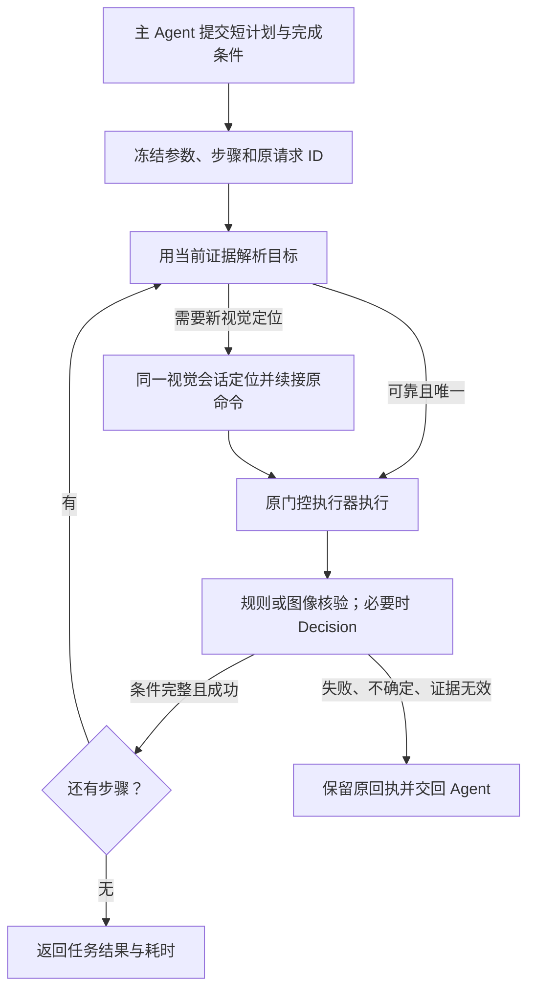

# 连续执行提速设计 / Continuous execution design

日期 / Date: 2026-10-08. 状态 / Status: **源码与相关合同测试已推进，用户已授权测试；真实连续验收进行中，整体设计尚未验收 / Implementation and scoped tests progressed; live continuous acceptance is in progress, not complete.**

本批实现范围以 [TASK_PLAN](../../development/TASK_PLAN.md) 为准：临时线性计划、共用运行器、原生或 Decision 核验、明确 Agent 复核及显式原生目标。动态输出、学习定位引用及完整计时采集仍未实现；搜索框主故障正在按实机证据修复。 / The current slice includes structured native targets but excludes dynamic outputs, learned target references and full timing collection; the primary field failure remains under repair.

## 用户目标 / User outcome

用户给一次任务，主 Agent 一次整理短计划；正常步骤由运行时持续执行、核验和推进。可靠的本地证据或 Decision 结果足够时，不再逐步回到主 Agent 看图。新目标定位、缺少动态数据、失败和不确定状态才交回 Agent。准确性、首次成功率与实际响应时间共同验收。

The user gives one task. The main agent submits a short plan; the runtime executes and verifies normal steps without routine main-agent review. New grounding, missing dynamic data, failures and uncertainty remain explicit handoffs. Measure correctness, first-attempt completion and user-visible latency together.

学习工作台独立安装且可选；临时执行计划不要求先学习、建图或审核成学习资产。可选学习内容只增强定位与图像核验。主会话沿用用户选择的 Astra，现有工作/视觉子 Agent 沿用 Sol Ultra；本轮不以降低推理强度或新购视觉 API 达成速度目标。

The learning workbench remains an optional independent installation. An execution plan requires no learned graph or fabricated learning approval. Optional pinned learned assets improve grounding and image checks. Preserve the user's Astra/Sol Ultra arrangement; do not attribute gains to silently changing effort or buying another vision provider.

## 已知问题与证据 / Evidence and problems

证据根 / Evidence root: `D:/AgentReviewAcceptance/decision-browser-demo-20261008-01`；`demo-report.json`、`search-field-diagnosis.json`、原回执和截图。源码 / Source: `766032860e5d8351b6edd7e3eb862ff9b1f188d7`, execution `0.1.2-preview.2`.

| 观察 / Observation | 实测 / Measurement | 解释 / Interpretation |
| --- | ---: | --- |
| 浏览器启动至首张已播放截图 / Browser launch to first playing frame | 187.321 s | 含首败、恢复及调用方空档，不含此前环境准备 / Includes failure, recovery and caller gaps; excludes earlier setup |
| 打开视频命令 / Open-video command | 48.164 s | 以下三项基本互斥分解 / Decomposed below |
| 视觉交接区间 / Grounding handoff | 40.701 s | 含客户端转交、Agent、回读和续接；不是纯推理 / Includes client orchestration, not pure inference |
| 判断服务记录 / Decision service timer | 2.699 s | 最终加密落盘前结束；包围调用实测 2.715 s / Excludes final commit; enclosing call 2.715 s |
| 其余开销 / Remainder using service timer | 4.764 s | 点击、截图、2 s 渲染等待和调度余量 / Action, capture, render grace and residual overhead |
| 判断 HTTP；服务端 / HTTP; server | 1.636 s; 0.684 s | 包含关系，不相加；仅一次请求 / Nested, not additive; n=1 |
| 搜索框首败 / First search attempt | 47.464 s | 输入前拒绝，零点击、零填写 / Rejected before input |
| 首败内部浏览器准备与绑定 / Browser preparation and binding in failed attempt | 9.273 s / 9.526 s | 精确慢层已知，但可写性误命中的根因未定 / Slow stages known; hit-test root cause unresolved |

Decision 此次只判“播放器已出现”，主 Agent 另外确认播放。因此条件覆盖不足与客户端重复介入同时存在。不可把既往夹具 HTTP 中位数 184 ms 当成真实网页整段耗时。

The predicate covered player presence, while the main agent separately verified playback. Predicate coverage and client orchestration both need work. The earlier fixture's 184 ms median HTTP time is not an end-to-end browser benchmark.

## 方案选择 / Chosen approach

选择：**薄的临时计划接纳层 + 现有 Trial/Runner/队列/输入执行器 + 分级核验**。现有学习工作流已经能在核验成功后连续推进；缺少普通执行模式的临时计划来源、独立接纳及高效客户端交接。

Choose a thin transient-plan admission layer over the existing trial, runner, queue and gated executor, with tiered verification. Learned workflows already advance automatically after verified success; ordinary execution lacks a transient source and efficient client handoff.

不选择盲发多步命令：上一页未完成会导致后续错点。不选择再加常驻自主规划模型：先消除已知多余往返，避免增加新的服务和付费链。暂不大规模搬迁历史目录。

Reject blind batches because later actions depend on verified state. Defer another autonomous planner/service until measured orchestration problems are addressed. No repository-wide cleanup is part of this work.

## 执行循环 / Execution loop

### 临时计划与兼容 / Transient plans and compatibility

- 新增 `task_plan.v1`，公共命令 `kind=task_plan`，动作 `start/status/continue/cancel/review`；开发源码已接线，已发布版本没有该入口。 / Wired in development source; not shipped.
- 首版最多 8 个线性语义步骤；只覆盖 `click/input_sequence/read_text`。窗口通过既有 launch/select 在计划前绑定；跨顶层窗口、任意循环、自动改计划和将 `form_fill` 纳入计划留后续。已有独立 `form_fill` 继续使用。 / Limit v1 to eight linear steps and one selected top-level window; preserve existing batch filling outside the plan.
- 同次提交冻结目标身份、输入参数、步骤、核验条件、来源和内容哈希。参数变化产生新计划；活动计划不静默修改。来源是 `caller_plan` 或 `reviewed_program`，两者不能冒充。 / Pin identity, inputs, steps, predicates, provenance and hash; distinguish caller plans from reviewed programs.
- 首版 `start` 提交的每步动作在执行前仍需当前定位与原门禁；计划接纳不等于输入授权。ID 冲突拒绝；unknown/partial input 不自动重放；取消保留已发生动作；死宿主只读恢复，不承诺自动续跑。 / Admission does not grant input authority. Retain idempotency, partial/unknown input, cancellation and read-only dead-host recovery semantics.
- 复用当前 `runner_state/current_step_id/active_command_id/wait_reason/wait_id` 和原 `execution_request_id`，不另建第二套动作状态机。 / Reuse runner, wait and execution identities.

### 定位与判断分工 / Grounding versus judgment

1. 每步重新绑定现场证据。已审核 recipe 用原 memory resolver；临时任务可用经验证的唯一 UIA 名称、类型和容器关系生成当前候选。语义匹配不唯一就交回识图，不能从“是”推导点击坐标。 / Resolve fresh evidence via pinned recipes or uniquely verified UIA semantics; ambiguity needs grounding.
2. 固定图像规则主要用于核验。不能把“图像相似”或整页像素变化直接当成任意目标的可靠定位；若引入图像定位，必须另有当前候选几何和 freshness 合同，本批不新造。 / Image verification is not a generic coordinate locator; preserve separate grounding provenance.
3. `agent_delegate` 仍由客户端调用同一 Sol worker；宿主不能从 `delegate_profile` 得到 Codex 子 Agent 的调用权。`external_api` 已有独立定位路由，可选且不自动切换；Decision API 不是该定位服务。 / Codex delegation remains client-owned; an optional external vision provider is separate from Decisions.
4. 动态记录号、搜索词等作为本轮参数。需要读出页面新值时使用现有读取/Agent 能力；Decision 不生成变量值。读取后绑定输出来源，再推进依赖它的步骤。 / Bind dynamic parameters and observed output provenance; predicates do not extract values.

### 核验与自动推进 / Verification and advancement

- 已有确切规则或审核图像能证明所需效果时，零 Decision 请求；否则只在步骤里程碑调用显式语义条件。证据坏、错窗、过期时先停止，不能升级到更强模型掩盖。 / Local proof first, explicit semantic checks only where needed; invalid evidence halts.
- `auto` 且命中冻结的完整条件白名单、认证结果有效、概率满足当前阈值、输入回执与窗口/步骤/截图一致，才自动结算并推进。`shadow/off/缺 Key/额度耗尽` 保持原含义；不能用建议当自动通过。 / Adopt only authenticated, bound, allowlisted auto results; other modes retain their semantics.
- 首版每个语义检查默认只发送一次；预算耗尽或超时交回 Agent，不自动重复付费或重做动作。计划可缩小现有宿主 API 额度，不能扩大它。 / One paid request per semantic checkpoint by default; plan budgets can only tighten host limits.
- 目标条件必须覆盖用户结果。视频用例至少包含正确内容/发布者和播放证据；“播放器出现”“点击成功”不能替代。静态截图不能证明时间进度时，读取可靠播放标志或在有界窗口内取第二张原图核验，仍只用一次语义请求。 / Define task-complete predicates; player presence is not playback. Use an explicit control or bounded paired observations when temporal proof is needed.
- 经充分条件证明的 success 不再例行回主 Agent复判；failure 停止后续输入；uncertain 返回已有证据供 Agent 审核。新的用户语义、选项或权限不能由此自动推断。 / No routine duplicate review after sufficient success; failures stop and uncertainty hands off with evidence.

### 本地开销与调用方 / Local and caller overhead

先补搜索框 raw hit、有限祖先链、runtime ID、bbox、DPI、可写性来源的隐私受控诊断，区分提供方尚未发布与本地解析错误；不得放宽 `IsReadOnly=mixed`。同一观察阶段可复用绑定的只读元数据；输入、导航、滚动、窗口或布局变化后失效。禁止跨状态坐标缓存。

Instrument the unresolved text-field hit path before fixing it. Keep mixed-readonly rejection. Reuse evidence only within a validated observation stage; invalidate on state changes and never cache action coordinates across them.

条件就绪可沿用已有条件观察，保留默认 2 s 渲染宽限给没有可靠条件的路径。同步 UIA I/O 可能超过轮询预算，必须如实计时，不把轮询上限说成硬截止。正常动作之间不读源码或倾倒全日志；pending 及时回读，紧凑回执一次带足证据，只有异常才诊断。

Use existing conditional observation where reliable; retain default render grace otherwise. Report synchronous UIA overruns honestly. Keep code search and full-log inspection out of healthy action batches; deliver compact bound evidence promptly.

## 完成标准与边界 / Acceptance and boundaries

- 首先通过搜索框根因回归、原输入门禁、取消/未知结果/竞争输入合同；随后用无学习库、无学习 UI 的真实执行入口跑通至少两个连续步骤。 / Repair and verify the primary field path, then complete a real execution-only plan.
- 有可靠定位和自动核验的正常路线：一次初始计划、零中途主 Agent 复核、自动推进；新视觉路线单列实际 handoff，不宣称零 Agent。 / Deterministic happy path requires no intermediate main review; count actual visual handoffs separately.
- 至少 10 对同任务成功路径的交替对照，另测 3 次冷启动；先各自完成低风险单项和同会话连续/中断/弹窗/收尾，再交 Sol 独立验收同一冻结候选。只用本轮新数据，负例不靠真实误操作制造。 / Paired fresh-data benchmarks follow main single/continuous validation, then independent acceptance of the same candidate.
- 工程目标（未证明）：自动条件充分时，核验终结到下一步入队 p95 ≤ 500 ms；有可靠定位的重复路线端到端中位数较匹配的逐步 Agent 对照下降 ≥ 50%；无错误输入/错误成功结算出现在验收样本中。零样本错误不等于普遍准确率保证；尾延迟和失败必须同时披露。 / Provisional targets: p95 verified-to-next-enqueue ≤500 ms; ≥50% median reduction on matched reusable paths; no wrong input/false-success in the acceptance set, without claiming universal accuracy.
- 原 187 s 失败恢复演示只作问题证据，不能作为唯一性能分母。新 baseline 也必须成功、使用相同模型/强度、网络、核验标准与定位路线；分别记录启动、调用方、视觉、UIA、截图、输入、等待、Decision、收尾与用户等待。 / Do not benchmark solely against a broken baseline; compare equivalent successful paths and separate timing scopes.
- 本轮只交付计划与状态说明；不改产品代码、不再操作桌面、不调用收费 API、不改版本/打包/提交/发布。实施与发布状态分开记录。 / This planning slice changes no product code, desktop state, paid API usage, version or publication.
